# 设计文档：iFay — 个人数字化身系统

## 概述

iFay（Individual Fay）是一个与自然人（宿主）深度绑定的 AI 数字化身系统。本设计文档基于已批准的需求文档，详细描述 iFay 系统的架构设计、模块设计、协议规范、数据模型和安全架构。

iFay 采用 CPE+M 框架（Context 上下文、Protocol 协议、Environment 环境、Merit 贡献度量），由四层架构组成：

- **社交层（Social Layer）**：管理 iFay 与人类、设备、资源和资产的关系，定义 iFay 的授权范围
- **交互层（Interaction Layer）**：iFay 与外部世界的接口层，包含感知（Sense）和动作（Action）两大子系统
- **认知层（Cognition Layer）**：定义 iFay 的理解、记忆、知识和能力
- **自我层（Ego Layer）**：塑造 iFay 的个性，确保与宿主对齐

系统包含 12 个核心模块和 6 个核心协议，覆盖从第一阶段（模拟人类操作）到第五阶段（重塑劳动结构与价值分配）的完整生命周期。

## 设计原则

以下原则贯穿 iFay 的整个设计和实现，是 iFay 被生态伙伴和用户接受的关键：

### 原则 1：生态友好的渐进式采纳（Ecosystem-Friendly Progressive Adoption）

iFay 的生态伙伴不需要实现 100% 符合所有标准的完整 iFay 才能发布产品。一个只用于控制无人机的 iFay 实现，只需要满足其所需的部件子集即可上线。这降低了生态伙伴的进入门槛，让 iFay 能从很小的场景开始扩充人类能力。

**设计层面**：模块 21（阶段性最小部件配置）和模块 23（FayManifest 声明式组装）共同实现此原则。部件配置注册表定义了每个阶段的最小集合，FayManifest 允许开发者仅声明所需子集，系统自动补充基础设施依赖。iFACTS 测试框架根据声明内容动态确定合规性测试范围。

### 原则 2：声明式极简组装（Declarative Minimal Assembly）

iFay 的组装方案必须极致简单——几乎只需要在一个声明文件（FayManifest）中声明所需的部件、协议和配置即可。类似 package.json 声明依赖，FayManifest 声明"我需要 CAP 协议 + 设备驱动中枢 + Ego 模型"，以及控制模式（指令控制/Ego 控制/自主控制）、驱动程序等配置。

**设计层面**：FayManifest 采用 JSON 格式的声明式语法，FayGer 运行时负责解析 Manifest 并自动组装 iFay 实例。依赖解析器自动补充必需的基础设施部件（如 FayID、权限体系），开发者无需手动管理依赖关系。

### 原则 3：灵活的部件组合（Flexible Composition）

部件之间松耦合，可以自由组合。不同厂商的部件可以混搭，只要符合接口契约。iFay 的各核心部件（FayID、Ego、协议等）作为独立开源项目发布，确保不完全依赖于 iFay 体系。

**设计层面**：所有模块通过标准化 TypeScript 接口定义契约，模块间通过接口通信而非直接依赖实现。iFACTS L2 接口合规测试验证不同厂商部件的互操作性。

### 原则 4：人格化而非工具化（Personified, Not Toolified）

iFay 与 Agent 的根本区别：Agent 是工具（不同用户用同一个 Agent 得到相同体验），iFay 是人格化身（每个 iFay 都有独特的个性、记忆和偏好，是宿主的增强版）。iFay 是人格的数字载体——当宿主过世后，iFay 可以作为宿主人格的延续而继续存在。

**设计层面**：Ego 模型（模块 5）、对齐意识（模块 12）和 iFay Profile（模块 13）共同实现人格化。模块 22（iFay 监护与人格延续）确保宿主过世后 iFay 人格可在数字墓园沙箱中延续，或由监护人接管。

### 原则 5：场景驱动的直觉设计（Scenario-Driven Intuition）

产品文档和设计必须让读者能直观想象有了 iFay 后的生活和工作场景，而不是堆砌技术概念。每个功能模块都应该能用一个具体的生活场景来解释。

**设计层面**：FayManifest 示例使用具体场景（如无人机控制）展示声明式组装的直观性。每个模块的设计决策部分说明其解决的实际问题。

## 架构

### 四层架构总览

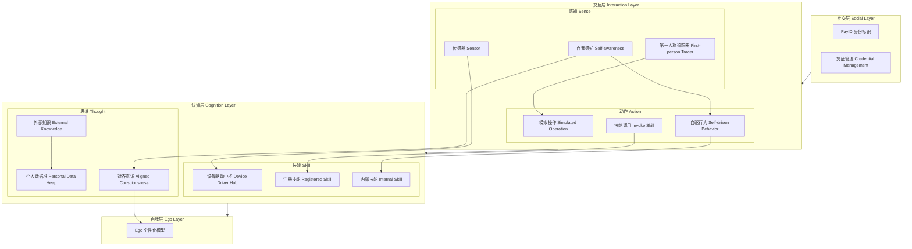

### CPE+M 框架设计

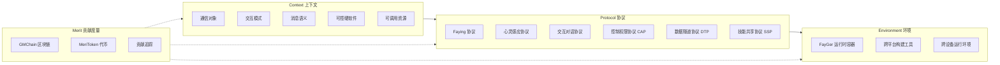

### 系统交互流程

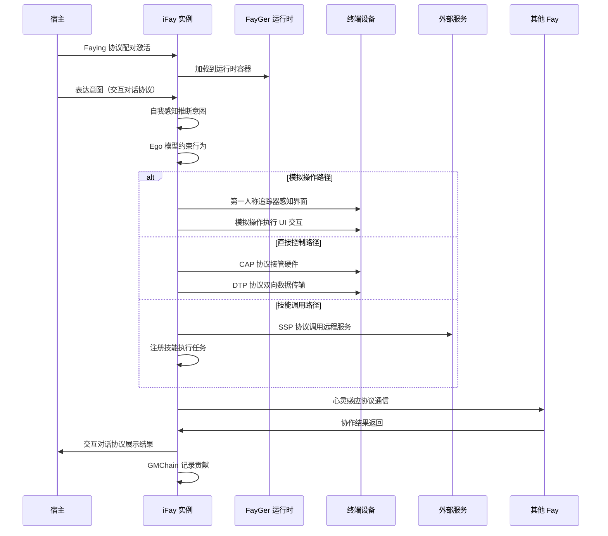

## 组件与接口

### 模块 1：FayID 身份标识管理

**职责**：为每个 Fay 实例分配全局唯一、人类可识别且机器可读的持久标识符。

**接口定义**：

```typescript
interface FayIDService {
  // 生成新的 FayID，保证全局唯一
  generate(type: FayType): Promise<FayID>;
  
  // 验证 FayID 是否有效且未冲突
  validate(id: FayID): Promise<boolean>;
  
  // 查询 FayID 对应的 Fay 元信息
  resolve(id: FayID): Promise<FayMetadata | null>;
  
  // 身份迁移：从个人助手演变为自主社会角色
  migrate(id: FayID, newRole: SocialRole): Promise<void>;
}

type FayType = 'iFay' | 'coFay';

interface FayID {
  value: string;        // 编码后的标识符字符串
  type: FayType;        // Fay 类型
  createdAt: Timestamp; // 创建时间
  hostId?: string;      // 关联的宿主标识（iFay 必填）
}

interface FayMetadata {
  id: FayID;
  displayName: string;
  status: 'active' | 'dormant' | 'migrating';
  hostBinding?: HostBinding;
}
```

**设计决策**：
- FayID 编码方案需支持超过全球人口数量级的容量（>10^11），采用分层编码结构
- iFay 和 coFay 使用统一的标识符生成机制，通过 type 字段区分
- FayID 一旦分配不可更改，支持角色迁移而非标识符更换

### 模块 2：凭证管理

**职责**：安全管理宿主委托给 iFay 的数字凭证，支持 7 种凭证类型。

**接口定义**：

```typescript
interface CredentialManager {
  // 委托凭证：将宿主原始凭证交换为副本
  delegate(original: Credential, hostId: string): Promise<CredentialCopy>;
  
  // 使用凭证执行认证
  authenticate(credentialId: string, target: ServiceTarget): Promise<AuthResult>;
  
  // 撤销凭证副本
  revoke(credentialId: string, reason: RevokeReason): Promise<void>;
  
  // 查询隐私数据（仅返回布尔结果）
  queryPrivacy(credentialId: string, query: PrivacyQuery): Promise<boolean>;
  
  // 审计日志
  getAuditLog(credentialId: string, timeRange: TimeRange): Promise<AuditEntry[]>;
}

type CredentialType = 
  | 'fay_id' 
  | 'account_password' 
  | 'certificate' 
  | 'authorization' 
  | 'access_token' 
  | 'smart_contract' 
  | 'meri_token';

interface Credential {
  id: string;
  type: CredentialType;
  owner: 'host' | 'ifay';
  payload: EncryptedPayload;
  expiresAt?: Timestamp;
}

interface CredentialCopy {
  id: string;
  originalId: string;
  type: CredentialType;
  owner: 'host' | 'ifay';
  delegatedAt: Timestamp;
  status: 'active' | 'revoked' | 'expired';
}
```

**设计决策**：
- 宿主原始凭证不直接暴露给 iFay，通过副本机制隔离风险
- 隐私查询仅返回布尔值，防止数据泄露
- 所有凭证操作均记录审计日志，支持事后追溯

### 模块 3：第一人称追踪器

**职责**：模拟宿主第一人称视角，捕获屏幕和界面上的视觉与听觉信息。

**接口定义**：

```typescript
interface FirstPersonTracer {
  // 捕获当前界面的视觉快照
  captureVisual(): Promise<VisualFrame>;
  
  // 捕获音频流
  captureAudio(): Promise<AudioFrame>;
  
  // 实时追踪界面变化
  trackChanges(callback: (change: UIChange) => void): Subscription;
  
  // 报告感知状态
  getPerceptionStatus(): PerceptionStatus;
}

interface VisualFrame {
  image: ImageData;
  timestamp: Timestamp;
  viewport: Viewport;
  elements: DetectedElement[]; // 识别到的 UI 元素
}

interface UIChange {
  type: 'cursor_move' | 'window_move' | 'content_change' | 'dynamic_update';
  region: BoundingBox;
  before: ImageData;
  after: ImageData;
}

type PerceptionStatus = 'active' | 'degraded' | 'failed';
```

**设计决策**：
- 优先使用视觉感知而非解析结构化文档（如 HTML），确保与人类可见内容一致
- 与模拟操作模块紧密耦合，实现手眼协调
- 感知失败时向认知层报告，触发降级策略

### 模块 4：模拟操作

**职责**：模拟人类 UI 交互操作，支持自适应界面探索。

**接口定义**：

```typescript
interface SimulatedOperation {
  // 执行 UI 操作
  execute(action: UIAction): Promise<ActionResult>;
  
  // 探索未知界面元素
  explore(region: BoundingBox): Promise<InteractionOption[]>;
  
  // 获取操作后的界面状态
  getPostActionState(): Promise<VisualFrame>;
}

type UIAction = 
  | { type: 'click'; position: Point; button?: 'left' | 'right' }
  | { type: 'drag'; from: Point; to: Point }
  | { type: 'scroll'; direction: 'up' | 'down' | 'left' | 'right'; amount: number }
  | { type: 'gesture'; gestureType: GestureType; points: Point[] }
  | { type: 'type'; text: string; target?: Point };

interface ActionResult {
  success: boolean;
  stateChange: UIChange | null;
  confidence: number; // 操作成功的置信度
}
```

**设计决策**：
- 不依赖预定义脚本，通过视觉反馈自适应探索界面
- 每次操作后通过第一人称追踪器感知状态变化，形成闭环
- 与传统 RPA 的根本区别在于感知驱动而非脚本驱动

### 模块 5：Ego 个性化模型

**职责**：作为内嵌微型模型，约束 iFay 行为与宿主个性对齐。

**接口定义**：

```typescript
interface EgoModel {
  // 评估行为是否符合宿主个性
  evaluate(action: ProposedAction): Promise<EgoJudgment>;
  
  // 获取当前个性约束参数
  getConstraints(): EgoConstraints;
  
  // 更新个性参数（仅通过对齐意识模块）
  updateFromProfile(profile: HostProfile): Promise<void>;
  
  // 本地推理（离线模式）
  localInference(input: InferenceInput): Promise<InferenceOutput>;
}

interface EgoConstraints {
  valueOrientation: ValueVector;      // 价值取向
  interestPreferences: string[];      // 兴趣偏好
  habits: HabitPattern[];             // 习惯
  cognitiveBoundaries: BoundarySet;   // 认知边界
  skillBoundaries: BoundarySet;       // 技能边界
  permissionBoundaries: BoundarySet;  // 权限边界
  workingStyle: StyleDescriptor;      // 工作风格
}

interface EgoJudgment {
  approved: boolean;
  confidence: number;
  adjustedAction?: ProposedAction; // 调整后的行为建议
  reason?: string;
}
```

**设计决策**：
- Ego 模型独立于外部大型模型运行，确保个性稳定性
- 支持离线本地推理，用于无网络环境下的近场设备控制
- 防止外部模型更新或篡改导致个性突变
- 不阻止 iFay 调用外部技能和大型模型

### 模块 6：传感器

**职责**：作为终端设备传感器的桥接层，接收外部环境数据流。

**接口定义**：

```typescript
interface SensorModule {
  // 注册传感器数据源
  registerSource(source: SensorSource): Promise<string>;
  
  // 调节灵敏度
  adjustSensitivity(sourceId: string, level: SensitivityLevel): Promise<void>;
  
  // 获取传感器数据流
  getDataStream(sourceId: string): Observable<SensorData>;
  
  // 获取所有活跃传感器状态
  getActiveStatus(): Promise<SensorStatus[]>;
}

interface SensorSource {
  type: string;           // 传感器类型
  protocol: 'cap' | 'dtp'; // 使用的协议
  config: SensorConfig;
}

type SensitivityLevel = 'high' | 'medium' | 'low' | 'off';
```

**设计决策**：
- 传感器模块仅作为灵敏度调节器，实际外部接口由设备驱动中枢和个人数据堆管理
- 基于 CAP 和 DTP 协议实现
- 支持动态调节灵敏度，根据上下文匹配数据采集频率

### 模块 7：设备驱动中枢

**职责**：作为驱动中枢层，确保新设备驱动集成时内部架构稳定。

**接口定义**：

```typescript
interface DeviceDriverHub {
  // 注册新设备驱动
  registerDriver(driver: DeviceDriver): Promise<string>;
  
  // 调用设备功能
  invokeDevice(driverId: string, command: DeviceCommand): Promise<DeviceResponse>;
  
  // 获取驱动状态
  getDriverStatus(driverId: string): Promise<DriverStatus>;
  
  // 卸载驱动
  unregisterDriver(driverId: string): Promise<void>;
}

interface DeviceDriver {
  id: string;
  name: string;
  type: DeviceType;
  capabilities: string[];
  protocol: 'cap';        // 通过 CAP 协议通信
  interface: DriverInterface;
}

type DriverStatus = 'loaded' | 'active' | 'error' | 'unavailable';

interface DriverInterface {
  commands: CommandSpec[];
  events: EventSpec[];
}
```

**设计决策**：
- 标准化接口确保新驱动集成对其他模块透明
- 驱动加载失败时提供降级操作建议
- 通过 CAP 协议直接调用终端硬件驱动程序

### 模块 8：注册技能管理

**职责**：管理 iFay 已掌握或获得使用能力的技能，作为任何动作的前提条件。

**接口定义**：

```typescript
interface RegisteredSkillManager {
  // 注册技能
  register(skill: SkillDefinition): Promise<SkillRegistration>;
  
  // 查询已注册技能
  query(filter?: SkillFilter): Promise<SkillRegistration[]>;
  
  // 更新技能预授权状态
  refreshAuthorization(skillId: string): Promise<AuthStatus>;
  
  // 缓存离线动作
  cacheOfflineAction(action: PendingAction): Promise<string>;
  
  // 恢复连接后执行缓存动作
  flushCachedActions(): Promise<ActionResult[]>;
}

type SkillType = 'api' | 'workflow' | 'bot' | 'agent' | 'app' | 'microservice';

interface SkillDefinition {
  name: string;
  type: SkillType;
  endpoint: string;
  authRequirements: AuthRequirement[];
  capabilities: string[];
  version: string;
}

interface SkillRegistration {
  id: string;
  skill: SkillDefinition;
  registeredAt: Timestamp;
  authStatus: 'pre_authorized' | 'pending' | 'expired';
  lastUsed?: Timestamp;
}
```

### 模块 9：技能调用

**职责**：直接触发已注册技能或执行特定任务。

**接口定义**：

```typescript
interface InvokeSkillService {
  // 根据意图匹配并调用技能
  invokeByIntent(intent: HostIntent): Promise<InvocationResult>;
  
  // 直接调用指定技能
  invokeDirect(skillId: string, params: Record<string, unknown>): Promise<InvocationResult>;
  
  // 获取调用历史
  getInvocationLog(filter?: LogFilter): Promise<InvocationRecord[]>;
}

interface InvocationResult {
  success: boolean;
  output: unknown;
  skillId: string;
  duration: number;
  meritContribution?: MeritRecord; // 贡献记录
}

interface InvocationRecord {
  id: string;
  skillId: string;
  intent?: HostIntent;
  params: Record<string, unknown>;
  result: InvocationResult;
  timestamp: Timestamp;
  evaluation?: QualityEvaluation;
}
```

### 模块 10：个人数据堆

**职责**：统一管理 iFay 的所有私有数据，屏蔽底层存储差异。

**接口定义**：

```typescript
interface PersonalDataHeap {
  // 统一读取接口
  read(query: DataQuery): Promise<DataResult>;
  
  // 统一写入接口
  write(data: DataEntry): Promise<string>;
  
  // 数据丰富化处理
  enrich(dataId: string, enrichment: EnrichmentConfig): Promise<DataEntry>;
  
  // 数据监护（持久化存储）
  persist(data: DataEntry, storage: StorageTarget): Promise<void>;
}

type DataCategory = 'content' | 'data' | 'knowledge_base' | 'info_feed';

interface DataEntry {
  id: string;
  category: DataCategory;
  payload: unknown;
  metadata: DataMetadata;
  storageLocation: StorageLocation;
}

type StorageLocation = 
  | { type: 'runtime_memory' }
  | { type: 'cloud'; provider: string; path: string }
  | { type: 'vector_db'; collection: string }
  | { type: 'local'; path: string };

interface DataQuery {
  category?: DataCategory;
  keywords?: string[];
  timeRange?: TimeRange;
  semanticQuery?: string; // 语义查询
}
```

### 模块 11：外部知识接入

**职责**：将外部知识库和模型作为技能类型接入。

**接口定义**：

```typescript
interface ExternalKnowledge {
  // 查询外部知识
  query(request: KnowledgeRequest): Promise<KnowledgeResult>;
  
  // 注册外部知识源
  registerSource(source: KnowledgeSource): Promise<string>;
  
  // 降级到本地缓存
  fallbackToCache(request: KnowledgeRequest): Promise<KnowledgeResult>;
}

interface KnowledgeSource {
  id: string;
  name: string;
  type: 'knowledge_base' | 'llm' | 'expert_system' | 'search_engine';
  endpoint: string;
  protocol: 'ssp'; // 通过 SSP 协议访问
  reliability: number;
}

interface KnowledgeResult {
  content: unknown;
  source: string;
  confidence: number;
  cached: boolean;
  timestamp: Timestamp;
}
```

### 模块 12：自我感知、自驱行为、内部技能、对齐意识

**自我感知接口**：

```typescript
interface SelfAwareness {
  // 推断宿主当前意图
  inferIntent(context: PerceptionContext): Promise<InferredIntent>;
  
  // 监测宿主反应
  monitorHostReaction(): Observable<HostReaction>;
  
  // 实时调整对齐意识
  adjustAlignment(reaction: HostReaction): Promise<void>;
}

interface InferredIntent {
  intent: string;
  confidence: number;
  context: PerceptionContext;
  suggestedActions: ProposedAction[];
}
```

**自驱行为接口**：

```typescript
interface SelfDrivenBehavior {
  // 注册定时任务
  scheduleTask(task: ScheduledTask): Promise<string>;
  
  // 处理自我感知推断触发
  handleInference(intent: InferredIntent): Promise<ActionResult>;
  
  // 暂停自主动作并请求确认
  pauseAndConfirm(reason: string): Promise<HostConfirmation>;
  
  // 获取行为循环状态
  getLoopStatus(): BehaviorLoopStatus;
}

type TriggerSource = 'scheduled' | 'self_awareness' | 'registered_skill' | 'internal_skill';
```

**内部技能接口**：

```typescript
interface InternalSkill {
  // 内省检查：外部知识是否与宿主意图冲突
  introspect(externalOutput: unknown): Promise<IntrospectionResult>;
  
  // 拦截并调整外部技能输出
  intercept(output: SkillOutput): Promise<SkillOutput>;
  
  // 获取宿主特定能力
  getHostCapabilities(): Promise<Capability[]>;
}
```

**对齐意识接口**：

```typescript
interface AlignedConsciousness {
  // 获取当前宿主画像
  getProfile(): Promise<HostProfile>;
  
  // 从个人数据堆挖掘更新画像
  mineFromDataHeap(): Promise<ProfileUpdate>;
  
  // 通过自我感知实时调整
  adjustFromAwareness(reaction: HostReaction): Promise<ProfileUpdate>;
  
  // 宿主手动定义
  manualUpdate(update: ManualProfileUpdate): Promise<void>;
}

interface HostProfile {
  values: ValueVector;
  preferences: PreferenceSet;
  habits: HabitPattern[];
  cognitiveBoundaries: BoundarySet;
  skillBoundaries: BoundarySet;
  permissionBoundaries: BoundarySet;
  workingStyle: StyleDescriptor;
  personalHistory: HistoryEntry[];
}
```

### 模块 13：iFay Profile 统一数据模型

**职责**：维护 iFay 的统一属性表（iFay Profile），包含六个维度的语义可解释数据，用于人类和系统识别 iFay 以及 Fay 间相互识别。

**接口定义**：

```typescript
// iFay Profile 六维数据结构
interface IFayProfile {
  // 维度一：iFay 身份
  identity: ProfileIdentity;
  // 维度二：Ego 模型（当前活跃版本引用）
  ego: ProfileEgo;
  // 维度三：Faying 思维
  thought: ProfileThought;
  // 维度四：Faying 技能
  skill: ProfileSkill;
  // 维度五：Faying 硬件（iFay 的"肢体"）
  hardware: ProfileHardware;
  // 维度六：Faying 权限（iFay 的"关系"）
  permission: ProfilePermission;
}

interface ProfileIdentity {
  fayId: FayID;
  displayName: string;
  type: FayType;
  status: 'active' | 'dormant' | 'migrating';
  createdAt: Timestamp;
  metadata: Record<string, unknown>;
}

interface ProfileEgo {
  activeVersionId: string;       // 当前活跃 Ego 版本 ID
  activeVersion: EgoVersionRef;  // 活跃版本引用
}

interface EgoVersionRef {
  versionId: string;
  name: string;
  description: string;
  createdAt: Timestamp;
}

interface ProfileThought {
  content: ThoughtItem[];       // 内容
  data: ThoughtItem[];          // 数据
  knowledgeBase: ThoughtItem[]; // 知识库
  infoFeed: ThoughtItem[];      // 信息流
}

interface ThoughtItem {
  id: string;
  name: string;
  source: string;
  category: 'content' | 'data' | 'knowledge_base' | 'info_feed';
  metadata: Record<string, unknown>;
}

interface ProfileSkill {
  apis: SkillEntry[];           // API
  workflows: SkillEntry[];      // 工作流
  bots: SkillEntry[];           // Bot
  agents: SkillEntry[];         // Agent
  apps: SkillEntry[];           // APP
  microservices: SkillEntry[];  // 微服务
}

interface SkillEntry {
  id: string;
  name: string;
  type: SkillType;
  endpoint: string;
  status: 'active' | 'inactive';
  registeredAt: Timestamp;
}

interface ProfileHardware {
  devices: HardwareEntry[];     // 设备
  storage: HardwareEntry[];     // 存储
  computing: HardwareEntry[];   // 算力
}

interface HardwareEntry {
  id: string;
  name: string;
  type: 'device' | 'storage' | 'computing';
  capabilities: string[];
  connectionStatus: 'connected' | 'discovered' | 'disconnected';
  terminalId?: string;          // 所属终端
}

interface ProfilePermission {
  credentials: PermissionCredential[];
  authMethods: AuthMethod[];    // 可扩展鉴权方式
}

interface PermissionCredential {
  id: string;
  type: CredentialType;
  lifecycle: 'inherent' | 'persistent' | 'ephemeral';
  source: 'host_delegated' | 'host_exchanged' | 'self_acquired';
  expiresAt?: Timestamp;
}

interface AuthMethod {
  method: string;               // SSO、OAuth、Fingerprint 等
  confidence: number;           // 确信力度 0-1
  provider?: string;
}

// Profile 管理服务
interface IFayProfileService {
  // 创建 Profile
  create(fayId: FayID): Promise<IFayProfile>;

  // 获取完整 Profile
  get(fayId: FayID): Promise<IFayProfile>;

  // 更新指定维度
  updateDimension(fayId: FayID, dimension: ProfileDimension, data: unknown): Promise<void>;

  // 从宿主画像注入（宿主画像是 Profile 的子集/输入源）
  injectFromHostProfile(fayId: FayID, hostProfile: HostProfile): Promise<void>;

  // 验证 Profile 六维完整性
  validate(profile: IFayProfile): ValidationResult;
}

type ProfileDimension = 'identity' | 'ego' | 'thought' | 'skill' | 'hardware' | 'permission';

interface ValidationResult {
  valid: boolean;
  missingDimensions: ProfileDimension[];
  errors: string[];
}
```

**设计决策**：
- Profile 是 iFay 的完整"身份证"，宿主画像（HostProfile/对齐意识）是 Profile 的子集和输入源
- Profile 的可见性控制交由应用层决定，由应用场景和交互方式决定哪些属性对外可见
- 六个维度覆盖 iFay 的身份、人格、思维、技能、硬件和权限，形成完整的 iFay 描述
- 硬件维度是 iFay 的"肢体"，权限维度是 iFay 的"关系"

### 模块 14：Ego 多版本管理

**职责**：管理 iFay 的多个 Ego 版本，支持手动和自动人格切换，确保任一时刻仅有一个活跃 Ego。

**接口定义**：

```typescript
interface EgoVersionManager {
  // 注册新 Ego 版本
  registerVersion(fayId: FayID, ego: EgoVersionDefinition): Promise<EgoVersion>;

  // 列出所有 Ego 版本
  listVersions(fayId: FayID): Promise<EgoVersion[]>;

  // 手动切换 Ego 版本
  switchManual(fayId: FayID, targetVersionId: string): Promise<EgoSwitchResult>;

  // 基于上下文自动切换
  switchAutomatic(fayId: FayID, context: SwitchContext): Promise<EgoSwitchResult>;

  // 获取当前活跃 Ego
  getActiveEgo(fayId: FayID): Promise<EgoVersion>;

  // 删除 Ego 版本（不可删除活跃版本）
  removeVersion(fayId: FayID, versionId: string): Promise<void>;
}

interface EgoVersionDefinition {
  name: string;
  description: string;
  constraints: EgoConstraints;
  modelWeights: ArrayBuffer;    // 边缘小模型权重
  scenarioTags: string[];       // 适用场景标签
}

interface EgoVersion {
  id: string;
  fayId: FayID;
  name: string;
  description: string;
  constraints: EgoConstraints;
  scenarioTags: string[];
  isActive: boolean;
  createdAt: Timestamp;
  lastActivatedAt?: Timestamp;
}

interface SwitchContext {
  currentScenario: string;
  environmentSignals: Record<string, unknown>;
  hostReaction?: HostReaction;
}

interface EgoSwitchResult {
  success: boolean;
  previousVersionId: string;
  newVersionId: string;
  switchType: 'manual' | 'automatic';
  profileUpdated: boolean;      // Profile 中的活跃 Ego 引用是否已更新
  timestamp: Timestamp;
}
```

**Ego 版本切换流程**：

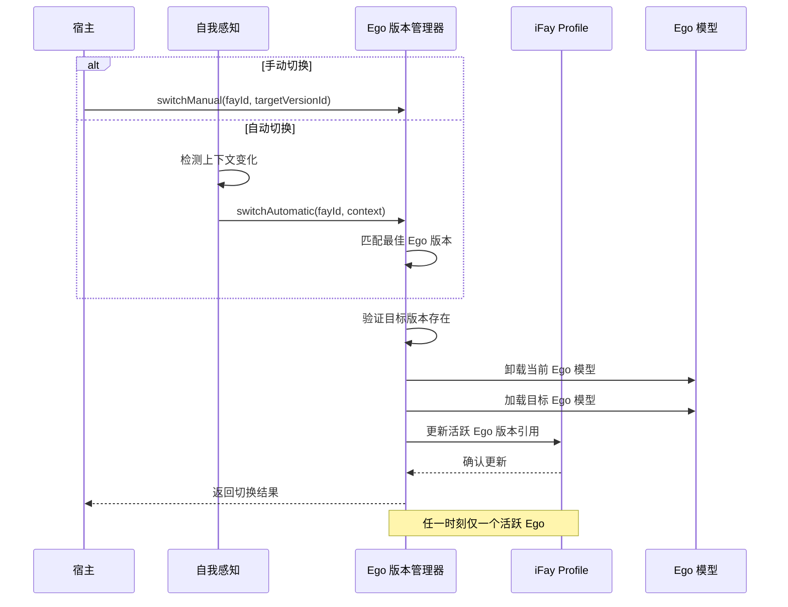

**设计决策**：
- Ego 是可插拔、可切换的边缘小模型，支持加载到任何终端设备
- 宿主可能有多面人格，不同场景需要不同的 Ego 版本
- 切换操作是原子性的：卸载旧版本 → 加载新版本 → 更新 Profile 引用
- 不可删除当前活跃的 Ego 版本，防止"无人格"状态

### 模块 15：多终端实例同步

**职责**：管理一个 iFay 在多个终端设备上的实例，通过网络同步状态，支持离线独立运行和重连后状态合并。

**接口定义**：

```typescript
interface MultiTerminalSync {
  // 注册终端实例
  registerInstance(fayId: FayID, terminal: TerminalInfo): Promise<TerminalInstance>;

  // 注销终端实例
  unregisterInstance(instanceId: string): Promise<void>;

  // 获取所有终端实例
  listInstances(fayId: FayID): Promise<TerminalInstance[]>;

  // 同步状态到所有实例
  syncState(fayId: FayID, stateChange: StateChange): Promise<SyncResult>;

  // 获取同步状态
  getSyncStatus(fayId: FayID): Promise<SyncStatus>;

  // 合并离线期间的状态变更
  mergeOfflineChanges(instanceId: string, changes: StateChange[]): Promise<MergeResult>;
}

interface TerminalInstance {
  id: string;
  fayId: FayID;
  terminal: TerminalInfo;
  status: 'online' | 'offline' | 'syncing';
  lastSyncAt: Timestamp;
  localEgoVersion: string;      // 本地加载的 Ego 版本
}

interface TerminalInfo {
  terminalId: string;
  type: 'mobile' | 'desktop' | 'iot' | 'cloud' | 'wearable';
  capabilities: TerminalCapabilities;
  networkStatus: 'connected' | 'disconnected';
}

interface TerminalCapabilities {
  hasGPU: boolean;
  hasCamera: boolean;
  hasMicrophone: boolean;
  hasSpeaker: boolean;
  hasDisplay: boolean;
  sensors: string[];
  storageCapacity: number;      // MB
  computingPower: number;       // 相对算力指标
}

interface StateChange {
  id: string;
  sourceInstanceId: string;
  type: 'data' | 'skill' | 'permission' | 'ego' | 'hardware';
  payload: unknown;
  timestamp: Timestamp;
  vectorClock: VectorClock;     // 用于因果排序
}

interface VectorClock {
  clocks: Map<string, number>;  // instanceId -> logical timestamp
}

interface SyncResult {
  success: boolean;
  syncedInstances: string[];
  failedInstances: string[];
  conflicts?: StateConflict[];
}

interface StateConflict {
  field: string;
  instanceA: { instanceId: string; value: unknown; timestamp: Timestamp };
  instanceB: { instanceId: string; value: unknown; timestamp: Timestamp };
  resolution: 'latest_wins' | 'manual' | 'merge';
}

interface MergeResult {
  success: boolean;
  mergedChanges: number;
  conflicts: StateConflict[];
}

interface SyncStatus {
  fayId: FayID;
  totalInstances: number;
  onlineInstances: number;
  lastGlobalSync: Timestamp;
  pendingChanges: number;
}
```

**多终端同步架构**：

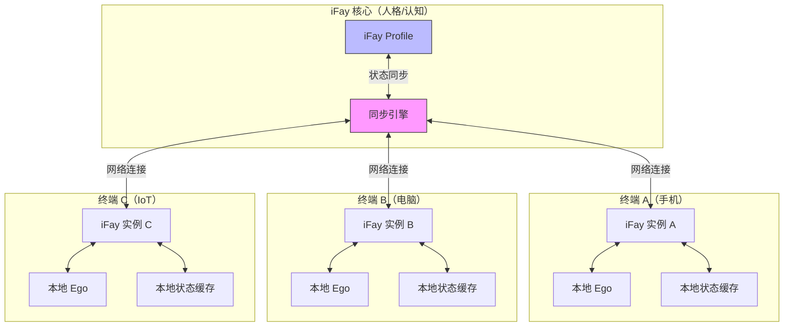

**设计决策**：
- iFay 是人格/认知实体，终端是"身体"，一个 iFay 可同时拥有多个"肢体"
- 使用向量时钟（Vector Clock）实现因果排序，解决并发状态变更冲突
- 网络中断时各终端基于本地 Ego 模型独立运行（"反射弧不通"时的自主行为）
- 恢复连接后自动合并离线期间的状态变更，冲突采用"最新优先"或手动解决

### 模块 16：iFay 权限体系

**职责**：管理 iFay 的权限生命周期，支持可扩展鉴权方式，适用于 iFay 和 coFay。

**接口定义**：

```typescript
interface PermissionSystem {
  // 授予权限
  grant(fayId: FayID, permission: PermissionGrant): Promise<PermissionRecord>;

  // 撤销权限
  revoke(fayId: FayID, permissionId: string): Promise<void>;

  // 检查权限
  check(fayId: FayID, requiredPermission: string): Promise<PermissionCheckResult>;

  // 申请临时权限
  requestEphemeral(fayId: FayID, request: EphemeralRequest): Promise<PermissionRecord>;

  // 释放临时权限
  releaseEphemeral(permissionId: string): Promise<void>;

  // 注册新鉴权方式
  registerAuthMethod(method: AuthMethodDefinition): Promise<void>;

  // 获取 Fay 的所有权限
  listPermissions(fayId: FayID): Promise<PermissionRecord[]>;
}

type PermissionLifecycle = 'inherent' | 'persistent' | 'ephemeral';

interface PermissionGrant {
  name: string;
  scope: string;
  lifecycle: PermissionLifecycle;
  source: 'host_delegated' | 'host_exchanged' | 'self_acquired';
  authMethod: string;           // 使用的鉴权方式
  expiresAt?: Timestamp;        // ephemeral 权限必填
}

interface PermissionRecord {
  id: string;
  fayId: FayID;
  name: string;
  scope: string;
  lifecycle: PermissionLifecycle;
  source: 'host_delegated' | 'host_exchanged' | 'self_acquired';
  status: 'active' | 'expired' | 'revoked' | 'released';
  grantedAt: Timestamp;
  expiresAt?: Timestamp;
  releasedAt?: Timestamp;
}

interface EphemeralRequest {
  name: string;
  scope: string;
  reason: string;
  duration: number;             // 预计使用时长（毫秒）
  authMethod: string;
}

interface PermissionCheckResult {
  granted: boolean;
  permissionId?: string;
  lifecycle?: PermissionLifecycle;
  expiresAt?: Timestamp;
}

interface AuthMethodDefinition {
  method: string;               // 方法名称（如 'sso', 'oauth', 'fingerprint_face'）
  confidence: number;           // 确信力度 0-1
  declarationSchema: JSONSchema; // 声明方式的 schema
  verifier: string;             // 验证器标识
}

// Fingerprint 统称接口（涵盖一切可识别身份的标识）
interface FingerprintIdentity {
  type: string;                 // 指纹类型（面部、声纹、设备指纹等）
  confidence: number;           // 确信力度
  payload: EncryptedPayload;
  verifiedAt: Timestamp;
}
```

**设计决策**：
- 三种权限生命周期：inherent（与生俱来）、persistent（持久存在）、ephemeral（临时获取，用后释放）
- Fingerprint 是统称，不同指纹类型具有不同的确信力度
- 权限体系同时适用于 iFay 和 coFay
- 宿主权限与 iFay 权限之间无包含关系，iFay 可拥有宿主未持有的权限
- 支持声明新鉴权方法，通过 `registerAuthMethod` 实现可扩展性

### 模块 17：Faying 硬件发现与连接

**职责**：由终端设备负责扫描发现可 Faying 硬件，iFay 根据思维能力进行能力匹配，通过 CAP 协议授权连接。

**接口定义**：

```typescript
interface HardwareDiscovery {
  // 终端发起硬件扫描（终端负责，非 iFay）
  scan(terminalId: string): Promise<DiscoveredHardware[]>;

  // iFay 能力匹配：筛选可操控的硬件
  matchCapabilities(fayId: FayID, discovered: DiscoveredHardware[]): Promise<MatchedHardware[]>;

  // 通过 CAP 协议授权连接
  connect(fayId: FayID, hardwareId: string): Promise<HardwareConnection>;

  // 断开硬件连接
  disconnect(connectionId: string): Promise<void>;

  // 获取当前已连接硬件
  listConnections(fayId: FayID): Promise<HardwareConnection[]>;
}

interface DiscoveredHardware {
  id: string;
  name: string;
  type: 'device' | 'storage' | 'computing';
  capabilities: string[];
  signalStrength: number;       // 信号强度（类似蓝牙/WiFi RSSI）
  protocol: string;             // 发现协议
  requiresAuth: boolean;
}

interface MatchedHardware {
  hardware: DiscoveredHardware;
  matchedSkills: string[];      // iFay 中匹配的技能
  matchScore: number;           // 匹配度 0-1
  canControl: boolean;          // 是否可操控
  reason?: string;              // 不可操控的原因
}

interface HardwareConnection {
  id: string;
  fayId: FayID;
  hardwareId: string;
  terminalId: string;
  capGrant: AuthorityGrant;     // CAP 协议授权
  status: 'connecting' | 'connected' | 'disconnected' | 'error';
  connectedAt: Timestamp;
}
```

**硬件发现与连接流程**：

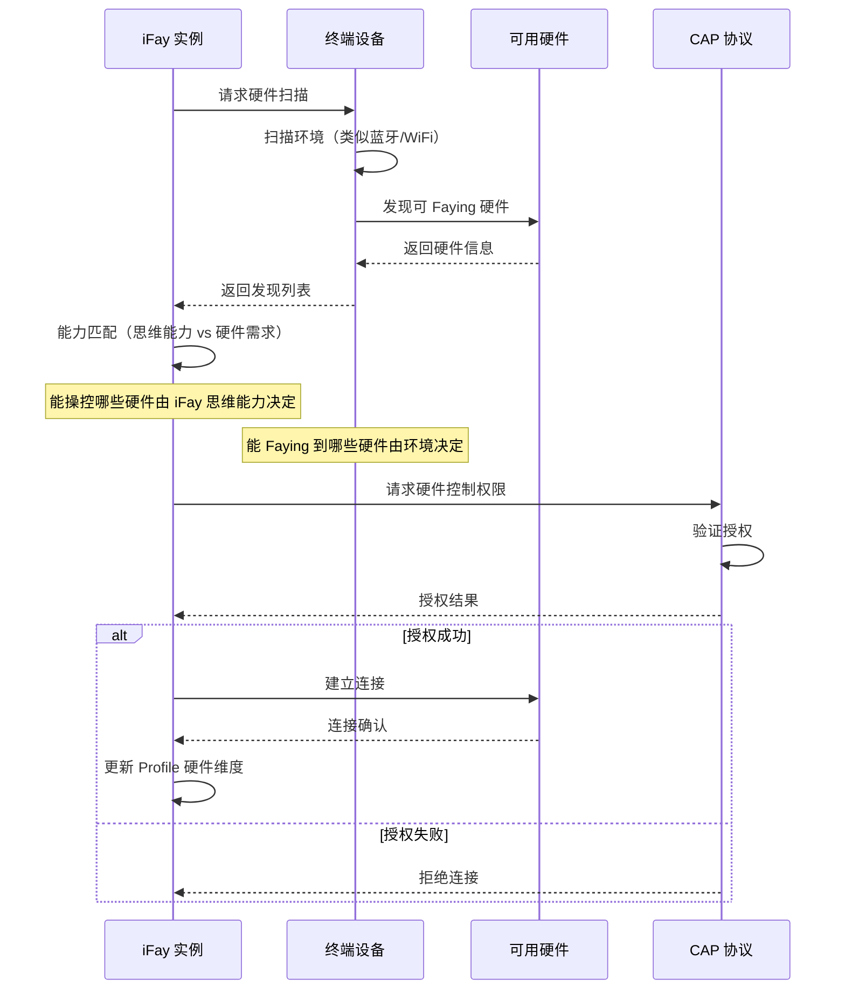

**设计决策**：
- 终端（非 iFay）负责硬件扫描，iFay 本身不直接执行硬件发现
- 能力匹配是双向的：iFay 思维能力决定"能操控什么"，环境决定"能连接什么"
- 所有硬件连接必须通过 CAP 协议授权，确保安全合规
- 类似蓝牙/WiFi 扫描的发现机制，支持信号强度评估

### 模块 18：合规性验证框架（iFACTS）

**职责**：提供标准化合规性测试套件，覆盖协议交互、模块接口、安全行为等关键规范点，验证厂商实现是否符合 iFay 规范。

**接口定义**：

```typescript
interface IFACTSFramework {
  // 运行完整合规性测试
  runFullSuite(implementation: IFayImplementation): Promise<ComplianceReport>;

  // 运行指定类别的测试
  runCategory(implementation: IFayImplementation, category: TestCategory): Promise<CategoryReport>;

  // 获取测试套件版本信息
  getSuiteVersion(): SuiteVersion;

  // 验证实现是否可声称"iFay 可用"
  certify(report: ComplianceReport): CertificationResult;
}

type TestCategory =
  | 'protocol_interaction'    // 协议交互测试
  | 'module_interface'        // 模块接口测试
  | 'security_behavior'       // 安全行为测试
  | 'data_integrity'          // 数据完整性测试
  | 'ego_compliance'          // Ego 模型合规测试
  | 'permission_compliance';  // 权限体系合规测试

interface IFayImplementation {
  vendor: string;
  version: string;
  endpoints: Map<string, string>;  // 模块名 -> 端点
  capabilities: string[];
}

interface ComplianceReport {
  implementationId: string;
  suiteVersion: string;
  timestamp: Timestamp;
  categories: CategoryReport[];
  overallResult: 'pass' | 'fail' | 'partial';
  passRate: number;             // 0-1
}

interface CategoryReport {
  category: TestCategory;
  totalTests: number;
  passed: number;
  failed: number;
  skipped: number;
  details: TestResult[];
}

interface TestResult {
  testId: string;
  name: string;
  category: TestCategory;
  result: 'pass' | 'fail' | 'skip';
  message?: string;
  duration: number;
}

interface SuiteVersion {
  version: string;
  specVersion: string;          // 对应的 iFay spec 版本
  totalTests: number;
  categories: TestCategory[];
  updatedAt: Timestamp;
}

interface CertificationResult {
  certified: boolean;
  level: 'full' | 'partial' | 'none';
  validUntil?: Timestamp;
  failedCategories: TestCategory[];
}
```

**四层测试层级设计**：

```typescript
type TestLevel = 'L1' | 'L2' | 'L3' | 'L4';

interface TestLevelDefinition {
  level: TestLevel;
  name: string;
  description: string;
  prerequisite?: TestLevel;  // 前置层级
}

// L1 单部件合规：验证独立部件的规范符合性
interface L1ComponentTest {
  level: 'L1';
  componentId: string;        // 被测部件标识（如 'fay_id', 'ego', 'faying_protocol'）
  componentName: string;
  specReference: string;      // 对应的独立规范引用
  tests: TestResult[];
}

// L2 接口合规：验证部件间接口对接
interface L2InterfaceTest {
  level: 'L2';
  interfaceId: string;
  sourceComponent: string;    // 源部件
  targetComponent: string;    // 目标部件
  interactionType: 'data_exchange' | 'auth_flow' | 'event_trigger' | 'state_sync';
  tests: TestResult[];
}

// L3 集成合规：验证端到端流程
interface L3IntegrationTest {
  level: 'L3';
  flowId: string;
  flowName: string;           // 如 'faying_to_skill_invocation'
  steps: IntegrationStep[];
  tests: TestResult[];
}

interface IntegrationStep {
  order: number;
  component: string;
  action: string;
  expectedOutput: string;
}

// L4 行为合规：验证系统级行为约束
interface L4BehaviorTest {
  level: 'L4';
  behaviorId: string;
  behaviorName: string;       // 如 'ethics_priority', 'ego_stability', 'multi_terminal_consistency'
  constraint: string;
  tests: TestResult[];
}

// 层级测试执行器
interface TestLevelExecutor {
  // 执行指定层级的测试（自动检查前置层级是否通过）
  executeLevel(implementation: IFayImplementation, level: TestLevel): Promise<LevelReport>;

  // 获取层级依赖关系
  getLevelDependencies(level: TestLevel): TestLevel[];

  // 检查是否满足执行条件
  canExecute(implementation: IFayImplementation, level: TestLevel): Promise<boolean>;
}

interface LevelReport {
  level: TestLevel;
  implementation: string;
  prerequisiteMet: boolean;
  totalTests: number;
  passed: number;
  failed: number;
  skipped: number;
  details: TestResult[];
  timestamp: Timestamp;
}
```

**测试层级流程**：

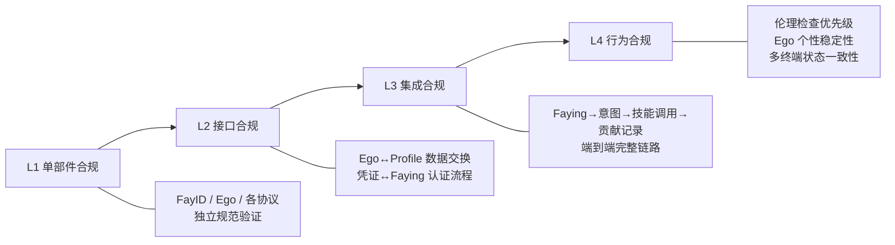

**设计决策**：
- iFACTS 类似浏览器标准合规性验证，允许不同厂商有不同实现方式
- 厂商实现必须通过全部测试才能声称"iFay 可用"
- 测试套件与 iFay spec 版本绑定，规范更新时同步更新测试用例
- coFay 的合规性测试由独立的 coFACTS 项目负责，iFACTS 仅覆盖 iFay 相关测试
- 四层测试层级严格顺序执行：L1 → L2 → L3 → L4，前置层级未通过则不可执行后续层级
- 每个层级独立出具测试报告和认证结果

### 模块 19：开发者生态支持

**职责**：为三类开发者（开源项目开发者、应用开发者、服务提供商开发者）提供清晰的参与路径和接入规范。

**接口定义**：

```typescript
type DeveloperRole = 'open_source' | 'application' | 'service_provider';

interface DeveloperEcosystem {
  // 注册开发者
  registerDeveloper(developer: DeveloperRegistration): Promise<DeveloperProfile>;

  // 获取角色对应的资源
  getResources(role: DeveloperRole): Promise<DeveloperResources>;

  // 提交实现（服务提供商）
  submitImplementation(implementation: IFayImplementation): Promise<SubmissionResult>;

  // 发布 iFay 集成（应用开发者）
  publishIntegration(integration: AppIntegration): Promise<PublishResult>;

  // 贡献核心代码（开源开发者）
  submitContribution(contribution: CoreContribution): Promise<ContributionResult>;
}

interface DeveloperRegistration {
  name: string;
  role: DeveloperRole;
  organization?: string;
  contactEmail: string;
}

interface DeveloperProfile {
  id: string;
  name: string;
  role: DeveloperRole;
  registeredAt: Timestamp;
  contributions: number;
}

interface DeveloperResources {
  role: DeveloperRole;
  documentation: ResourceLink[];
  sdk: ResourceLink[];
  guides: ResourceLink[];
  examples: ResourceLink[];
  apiReference: ResourceLink[];
}

interface ResourceLink {
  title: string;
  url: string;
  type: 'doc' | 'sdk' | 'guide' | 'example' | 'api_ref';
  language: string;
  version: string;
}

// 应用开发者：在产品中引入 iFay 支持
interface AppIntegration {
  appName: string;
  developerId: string;
  iFaySupport: {
    controllable: boolean;      // 产品能被 iFay 操控
    delegatable: boolean;       // 用户可委托 iFay 使用产品
    capSupport: boolean;        // 支持 CAP 协议
    sspSupport: boolean;        // 支持 SSP 协议
  };
  version: string;
}

// 服务提供商开发者：创建 iFay 实现
interface ServiceProviderImplementation {
  vendorName: string;
  developerId: string;
  implementation: IFayImplementation;
  iFACTSReport?: ComplianceReport; // 合规性测试报告
}

// 开源项目开发者：参与核心开发
interface CoreContribution {
  developerId: string;
  type: 'feature' | 'bugfix' | 'documentation' | 'test' | 'protocol';
  description: string;
  pullRequestUrl: string;
}
```

### 模块 20：iFay 实例生命周期管理

**职责**：管理 iFay 实例从创建到归档的完整生命周期，定义状态机、状态转换条件和初始化/迁移/归档流程。

**接口定义**：

```typescript
type LifecycleState =
  | 'uninitialized'   // 未初始化
  | 'initializing'    // 初始化中
  | 'ready'           // 就绪
  | 'active'          // 激活（Faying）
  | 'dormant'         // 休眠（Separating）
  | 'migrating'       // 迁移中
  | 'archived';       // 归档

interface LifecycleTransition {
  from: LifecycleState;
  to: LifecycleState;
  trigger: string;
  guard?: string;       // 转换前置条件
}

// 合法状态转换定义
const VALID_TRANSITIONS: LifecycleTransition[] = [
  { from: 'uninitialized', to: 'initializing', trigger: 'create' },
  { from: 'initializing', to: 'ready', trigger: 'init_complete' },
  { from: 'ready', to: 'active', trigger: 'faying_pair', guard: 'faying_protocol_auth' },
  { from: 'active', to: 'dormant', trigger: 'faying_separate' },
  { from: 'dormant', to: 'active', trigger: 'faying_pair', guard: 'faying_protocol_auth' },
  { from: 'active', to: 'migrating', trigger: 'migrate_start' },
  { from: 'dormant', to: 'migrating', trigger: 'migrate_start' },
  { from: 'migrating', to: 'ready', trigger: 'migrate_complete' },
  { from: 'ready', to: 'archived', trigger: 'archive' },
  { from: 'dormant', to: 'archived', trigger: 'archive' },
];

interface LifecycleManager {
  // 创建 iFay 实例（触发初始化序列）
  create(hostId: string): Promise<LifecycleInstance>;

  // 获取当前生命周期状态
  getState(fayId: FayID): Promise<LifecycleState>;

  // 执行状态转换（自动验证合法性）
  transition(fayId: FayID, trigger: string): Promise<TransitionResult>;

  // 执行初始化序列
  initialize(fayId: FayID, hostProfile: HostProfile): Promise<InitResult>;

  // 执行迁移
  migrate(fayId: FayID, targetTerminal: TerminalInfo): Promise<MigrationResult>;

  // 归档 iFay
  archive(fayId: FayID): Promise<ArchiveResult>;

  // 获取状态转换历史（审计日志）
  getTransitionLog(fayId: FayID): Promise<TransitionLogEntry[]>;
}

interface LifecycleInstance {
  fayId: FayID;
  state: LifecycleState;
  createdAt: Timestamp;
  lastTransition: Timestamp;
}

interface TransitionResult {
  success: boolean;
  previousState: LifecycleState;
  newState: LifecycleState;
  trigger: string;
  timestamp: Timestamp;
  auditLogId: string;         // 审计日志记录 ID
  error?: string;             // 非法转换时的错误信息
}

interface InitResult {
  success: boolean;
  steps: {
    fayIdAssigned: boolean;
    egoInitialized: boolean;
    profileCreated: boolean;
    hostFeaturesInjected: boolean;
  };
  fayId?: FayID;
  timestamp: Timestamp;
}

interface MigrationResult {
  success: boolean;
  sourceTerminal: string;
  targetTerminal: string;
  stateSnapshot: {
    profileMigrated: boolean;
    egoMigrated: boolean;
    dataMigrated: boolean;
  };
  hardwareDiscovery: {
    discoveredDevices: number;
    connectedDevices: number;
  };
  timestamp: Timestamp;
}

interface ArchiveResult {
  success: boolean;
  fayId: FayID;
  profileRetained: boolean;
  dataRetained: boolean;
  credentialsRevoked: number;
  permissionsRevoked: number;
  fayIdMarkedArchived: boolean;
  timestamp: Timestamp;
}

interface TransitionLogEntry {
  id: string;
  fayId: FayID;
  fromState: LifecycleState;
  toState: LifecycleState;
  trigger: string;
  success: boolean;
  error?: string;
  timestamp: Timestamp;
}
```

**生命周期状态机**：

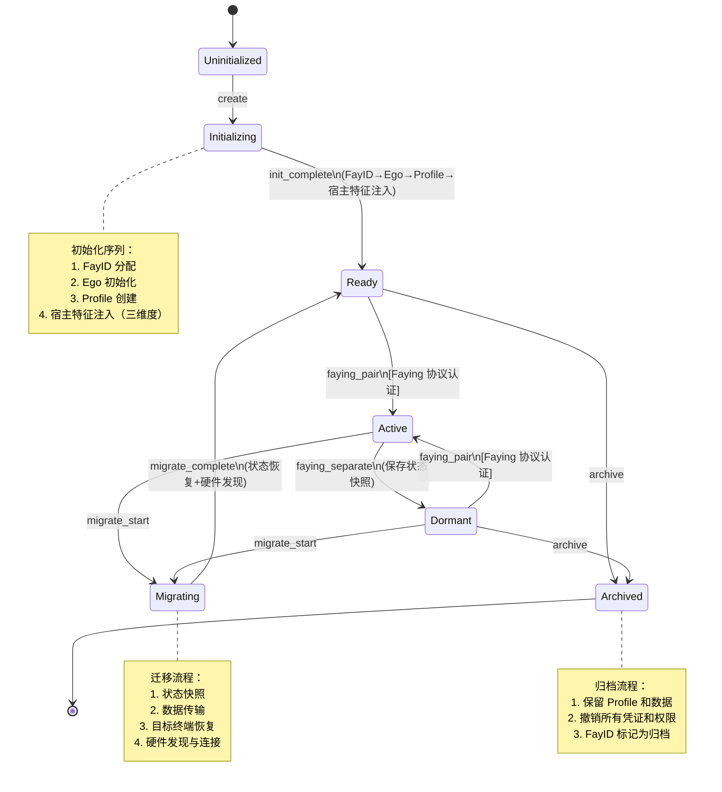

**设计决策**：
- 7 个生命周期状态覆盖 iFay 从创建到归档的完整生命周期
- 状态转换严格遵循定义的状态机，非法跳转被拒绝
- 初始化序列有严格的执行顺序：FayID → Ego → Profile → 宿主特征注入
- 迁移包含完整的状态转移和目标终端硬件发现
- 归档保留数据但撤销所有活跃凭证和权限
- 每次状态转换均记录审计日志

### 模块 21：阶段性最小部件配置

**职责**：定义每个阶段的最小部件配置注册表，管理部件依赖关系，支持 iFACTS 阶段验证。

**接口定义**：

```typescript
type IFayStage = 1 | 2 | 3 | 4 | 5;

type ComponentId =
  // 模块
  | 'fay_id' | 'credential_management' | 'first_person_tracer'
  | 'simulated_operation' | 'ego_model' | 'sensor'
  | 'device_driver_hub' | 'registered_skill' | 'invoke_skill'
  | 'personal_data_heap' | 'external_knowledge'
  | 'self_awareness' | 'self_driven_behavior' | 'internal_skill'
  | 'aligned_consciousness' | 'gmchain' | 'meri_token'
  // 协议
  | 'faying_protocol' | 'interactive_conversation_protocol'
  | 'cap_protocol' | 'dtp_protocol' | 'ssp_protocol'
  | 'telepathy_protocol'
  // 跨阶段基础设施
  | 'fayger_runtime' | 'ifay_profile' | 'permission_system'
  | 'security_ethics' | 'multi_terminal_sync';

interface StageComponentConfig {
  stage: IFayStage;
  requiredComponents: ComponentId[];
  requiredProtocols: ComponentId[];
}

// 跨阶段基础设施（所有阶段必需）
const CROSS_STAGE_INFRASTRUCTURE: ComponentId[] = [
  'fayger_runtime', 'ifay_profile', 'permission_system',
  'security_ethics', 'multi_terminal_sync',
];

// 各阶段最小部件配置
const STAGE_CONFIGS: StageComponentConfig[] = [
  {
    stage: 1,
    requiredComponents: ['fay_id', 'credential_management', 'first_person_tracer', 'simulated_operation', 'ego_model'],
    requiredProtocols: ['faying_protocol', 'interactive_conversation_protocol'],
  },
  {
    stage: 2,
    requiredComponents: ['sensor', 'device_driver_hub', 'registered_skill', 'invoke_skill', 'personal_data_heap'],
    requiredProtocols: ['cap_protocol', 'dtp_protocol'],
  },
  {
    stage: 3,
    requiredComponents: ['external_knowledge'],
    requiredProtocols: ['ssp_protocol'],
  },
  {
    stage: 4,
    requiredComponents: ['self_awareness', 'self_driven_behavior', 'internal_skill', 'aligned_consciousness'],
    requiredProtocols: ['telepathy_protocol'],
  },
  {
    stage: 5,
    requiredComponents: ['gmchain', 'meri_token'],
    requiredProtocols: [],
  },
];

interface StageConfigRegistry {
  // 获取指定阶段的完整部件配置（含所有前置阶段）
  getFullConfig(stage: IFayStage): StageFullConfig;

  // 验证实现是否满足指定阶段的最小部件配置
  validate(implementation: IFayImplementation, stage: IFayStage): Promise<StageValidationResult>;

  // 获取部件依赖关系
  getDependencies(componentId: ComponentId): ComponentId[];

  // 获取所有阶段配置
  getAllConfigs(): StageComponentConfig[];
}

interface StageFullConfig {
  stage: IFayStage;
  // 该阶段及所有前置阶段的累积部件
  allRequiredComponents: ComponentId[];
  // 该阶段及所有前置阶段的累积协议
  allRequiredProtocols: ComponentId[];
  // 跨阶段基础设施
  infrastructure: ComponentId[];
}

interface StageValidationResult {
  stage: IFayStage;
  valid: boolean;
  missingComponents: ComponentId[];
  missingProtocols: ComponentId[];
  missingInfrastructure: ComponentId[];
  // 前置阶段验证结果
  prerequisiteResults: Map<IFayStage, boolean>;
}
```

**阶段部件依赖关系**：

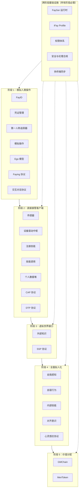

**设计决策**：
- 阶段配置采用累积模式：阶段 N 的完整配置 = 阶段 1 到 N 的所有部件 + 跨阶段基础设施
- 跨阶段基础设施在所有阶段均为必需，不属于任何特定阶段
- 验证时自动检查所有前置阶段的配置完整性
- 与 iFACTS 集成，支持阶段声称的合规性验证

**iFay Ready 认证标准**：

```typescript
type IFayReadyLevel = 'bronze' | 'silver' | 'gold';

interface IFayReadyCertification {
  // 提交认证申请
  submitApplication(app: IFayReadyApplication): Promise<CertificationProcess>;

  // 执行认证测试
  runCertificationTests(processId: string): Promise<IFayReadyReport>;

  // 颁发认证
  issueCertification(report: IFayReadyReport): Promise<IFayReadyCertificate>;

  // 查询应用认证状态
  getCertificationStatus(appId: string): Promise<IFayReadyCertificate | null>;
}

interface IFayReadyApplication {
  appId: string;
  appName: string;
  developerId: string;
  version: string;
  // 认证维度声明
  dimensions: {
    controllability: ControllabilityDeclaration;
    delegatability: DelegatabilityDeclaration;
    protocolSupport: ProtocolSupportDeclaration;
  };
}

interface ControllabilityDeclaration {
  simulatedOperation: boolean;  // 支持模拟操作（第一人称追踪器 + 模拟操作）
  capProtocol: boolean;         // 支持 CAP 协议直接控制
}

interface DelegatabilityDeclaration {
  userDelegation: boolean;      // 用户可将使用权委托给 iFay
  credentialDelegation: boolean; // 支持凭证委托
}

interface ProtocolSupportDeclaration {
  cap: boolean;                 // 控制权限协议
  dtp: boolean;                 // 数据隧道协议
  ssp: boolean;                 // 技能共享协议
  cfsArchitecture: boolean;     // 完整 C/F/S 架构集成
}

interface IFayReadyReport {
  appId: string;
  determinedLevel: IFayReadyLevel;
  dimensions: {
    controllability: { passed: boolean; details: string };
    delegatability: { passed: boolean; details: string };
    protocolSupport: { passed: boolean; details: string };
  };
  iFACTSResults: {
    l2Report?: LevelReport;     // L2 接口合规测试结果
    l3Report?: LevelReport;     // L3 集成合规测试结果
  };
  timestamp: Timestamp;
}

interface IFayReadyCertificate {
  certificateId: string;
  appId: string;
  appName: string;
  level: IFayReadyLevel;
  supportedStages: number[];    // 支持的 iFay 阶段
  supportedProtocols: string[]; // 支持的协议列表
  issuedAt: Timestamp;
  validUntil: Timestamp;
}
```

**iFay Ready 认证等级**：

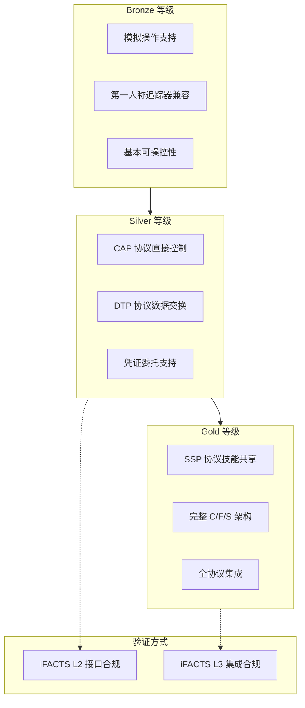

**设计决策**：
- 三类开发者角色对应不同的参与路径和资源
- 开源项目开发者推动 iFay 体系完善
- 应用开发者使产品能被 iFay 操控，用户可委托 iFay 使用产品
- 服务提供商开发者在 iFay 规范下创建实现，类似 MCP 协议下开发并发布 Skill
- iFay Ready 认证分三个等级：Bronze（模拟操作）、Silver（CAP+DTP 直接控制）、Gold（SSP+C/F/S 全集成）
- 认证与 iFACTS 测试框架集成，Silver 使用 L2 测试，Gold 使用 L2+L3 测试

### 模块 22：iFay 监护与人格延续

**职责**：管理 iFay 的监护关系，支持宿主指定监护人、监护权转移验证、数字墓园沙箱环境，确保宿主过世或无法管理时 iFay 的人格和数据被妥善处理。

**接口定义**：

```typescript
// 监护状态
type GuardianshipStatus =
  | 'none'              // 未设置监护人
  | 'designated'        // 已指定监护人，尚未激活
  | 'pending_transfer'  // 监护权转移中
  | 'active'            // 监护人已接管
  | 'cemetery';         // iFay 在数字墓园中独立运行

// 监护人信息
interface Guardian {
  id: string;
  name: string;
  identityCredential: EncryptedPayload;  // 身份认证凭证
  priority: number;                       // 优先级（多个监护人时）
  designatedAt: Timestamp;
  activatedAt?: Timestamp;
}

// 监护权验证方式
type GuardianshipVerification =
  | { method: 'mnemonic'; mnemonicHash: string }           // 助记词激活
  | { method: 'identity_auth'; preDesignatedId: string };   // 宿主预指定身份认证

// 数字墓园沙箱配置
interface DigitalCemeterySandbox {
  sandboxId: string;
  fayId: FayID;
  // 行为限制
  restrictions: CemeteryRestrictions;
  // 环境标准
  environmentStandard: CemeteryStandard;
  createdAt: Timestamp;
  status: 'active' | 'suspended' | 'terminated';
}

interface CemeteryRestrictions {
  allowExternalCommunication: boolean;   // 是否允许对外通信
  allowFinancialOperations: boolean;     // 是否允许金融操作
  allowNewSkillRegistration: boolean;    // 是否允许注册新技能
  allowDataModification: boolean;        // 是否允许修改数据
  maxResourceUsage: ResourceLimit;       // 资源使用上限
  blockedActions: string[];              // 明确禁止的行为列表
}

interface CemeteryStandard {
  isolationLevel: 'strict' | 'moderate';
  dataRetentionPolicy: 'permanent' | 'time_limited';
  auditFrequency: 'realtime' | 'daily' | 'weekly';
  securityReviewRequired: boolean;
}

interface ResourceLimit {
  maxCPU: number;        // CPU 使用百分比上限
  maxMemory: number;     // 内存上限（MB）
  maxStorage: number;    // 存储上限（MB）
  maxNetworkBandwidth: number; // 网络带宽上限（Kbps）
}

// 监护管理服务
interface GuardianshipService {
  // 指定监护人
  designateGuardian(fayId: FayID, guardian: Guardian): Promise<void>;

  // 移除监护人
  removeGuardian(fayId: FayID, guardianId: string): Promise<void>;

  // 获取监护人列表
  listGuardians(fayId: FayID): Promise<Guardian[]>;

  // 验证监护人身份并激活监护权
  activateGuardianship(
    fayId: FayID,
    guardianId: string,
    verification: GuardianshipVerification
  ): Promise<GuardianshipActivationResult>;

  // 将 iFay 转入数字墓园
  transferToCemetery(fayId: FayID): Promise<DigitalCemeterySandbox>;

  // 监护权转移：绑定新监护人并更新 Faying 配对
  transferGuardianship(
    fayId: FayID,
    newGuardianId: string,
    verification: GuardianshipVerification
  ): Promise<GuardianshipTransferResult>;

  // 获取监护状态
  getGuardianshipStatus(fayId: FayID): Promise<GuardianshipStatus>;

  // 获取数字墓园沙箱信息
  getCemeterySandbox(fayId: FayID): Promise<DigitalCemeterySandbox | null>;
}

interface GuardianshipActivationResult {
  success: boolean;
  guardianId: string;
  fayId: FayID;
  verificationMethod: 'mnemonic' | 'identity_auth';
  activatedAt: Timestamp;
  error?: string;
}

interface GuardianshipTransferResult {
  success: boolean;
  fayId: FayID;
  previousGuardianId?: string;
  newGuardianId: string;
  fayingPairUpdated: boolean;    // Faying 协议配对关系是否已更新
  profileUpdated: boolean;        // Profile 中监护关系是否已更新
  timestamp: Timestamp;
  error?: string;
}
```

**监护权转移流程**：

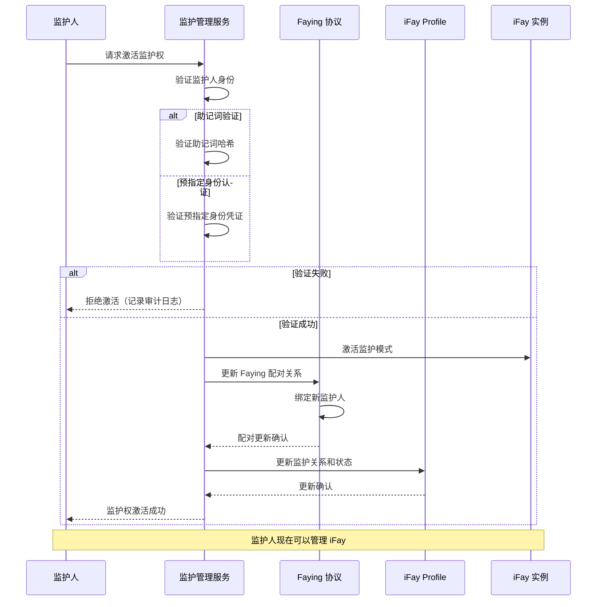

**数字墓园沙箱架构**：

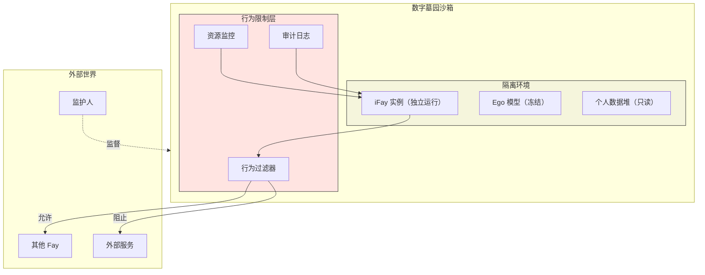

**设计决策**：
- 监护人（Guardian）而非"继承人"，强调管理权转移而非所有权继承
- 助记词验证参考区块链助记词机制，通过遗嘱或等效方式传达
- 数字墓园沙箱严格限制 iFay 行为范围，防止延续执行宿主预设任务造成混乱
- 监护关系记录在 iFay Profile 中，支持人类和系统查询
- 监护权转移是原子操作：身份验证 → Faying 配对更新 → Profile 更新

### 模块 23：FayManifest 声明式组装

**职责**：定义 FayManifest 声明文件格式，支持开发者通过声明式语法定义和组装 iFay 实现，FayGer 运行时自动解析并组装实例，iFACTS 根据声明内容确定合规性测试范围。

**接口定义**：

```typescript
// 控制模式
type ControlMode =
  | 'command'     // 指令控制：宿主明确指令驱动
  | 'ego'         // Ego 控制：Ego 模型自主决策
  | 'autonomous'; // 自主控制：完全自驱行为

// FayManifest 声明文件结构
interface FayManifest {
  // 元信息
  name: string;
  version: string;
  description: string;
  vendor: string;

  // 所需模块列表
  modules: ManifestModule[];

  // 所需协议列表
  protocols: ManifestProtocol[];

  // 控制模式
  controlMode: ControlMode;

  // 驱动程序配置
  drivers?: ManifestDriverConfig[];

  // Ego 模型配置
  ego?: ManifestEgoConfig;

  // 权限配置
  permissions?: ManifestPermissionConfig;
}

interface ManifestModule {
  id: ComponentId;
  version?: string;           // 版本约束（如 "^1.0.0"）
  provider?: string;          // 指定厂商实现（可选）
  config?: Record<string, unknown>;
}

interface ManifestProtocol {
  id: ComponentId;
  version?: string;
  config?: Record<string, unknown>;
}

interface ManifestDriverConfig {
  name: string;
  type: DeviceType;
  driverPackage: string;      // 驱动包标识
  config?: Record<string, unknown>;
}

interface ManifestEgoConfig {
  modelSource: string;        // Ego 模型来源
  scenarioTags?: string[];    // 适用场景
  constraints?: Partial<EgoConstraints>;
}

interface ManifestPermissionConfig {
  inherent?: string[];        // 与生俱来的权限
  persistent?: string[];      // 持久权限
  authMethods?: string[];     // 支持的鉴权方式
}

// 依赖解析结果
interface ResolvedManifest {
  // 原始声明
  original: FayManifest;
  // 自动补充的基础设施依赖
  autoResolved: ComponentId[];
  // 完整的部件列表（声明 + 自动补充）
  allComponents: ComponentId[];
  // 完整的协议列表
  allProtocols: ComponentId[];
  // 对应的 iFay 阶段
  resolvedStage: IFayStage;
  // 需要通过的 iFACTS 测试范围
  requiredTests: TestCategory[];
}

// FayManifest 解析与组装服务
interface FayManifestService {
  // 解析 Manifest 文件
  parse(manifestJson: string): Promise<FayManifest>;

  // 验证 Manifest 合法性
  validate(manifest: FayManifest): Promise<ManifestValidationResult>;

  // 解析依赖并补充基础设施
  resolve(manifest: FayManifest): Promise<ResolvedManifest>;

  // 组装 iFay 实例
  assemble(resolved: ResolvedManifest): Promise<AssemblyResult>;

  // 确定 iFACTS 测试范围
  determineTests(resolved: ResolvedManifest): TestCategory[];
}

interface ManifestValidationResult {
  valid: boolean;
  errors: ManifestError[];
  warnings: ManifestWarning[];
}

interface ManifestError {
  field: string;
  message: string;
  code: string;
}

interface ManifestWarning {
  field: string;
  message: string;
  suggestion: string;
}

interface AssemblyResult {
  success: boolean;
  fayId?: FayID;
  assembledComponents: ComponentId[];
  assembledProtocols: ComponentId[];
  controlMode: ControlMode;
  timestamp: Timestamp;
  errors?: string[];
}
```

**FayManifest 示例（无人机控制场景）**：

```json
{
  "name": "drone-controller-ifay",
  "version": "1.0.0",
  "description": "用于无人机控制的 iFay 实现",
  "vendor": "DroneAI Corp",

  "modules": [
    { "id": "device_driver_hub", "version": "^1.0.0" },
    { "id": "sensor", "config": { "types": ["gps", "imu", "camera", "lidar"] } },
    { "id": "invoke_skill", "version": "^1.0.0" },
    { "id": "registered_skill", "config": { "preload": ["flight_control", "obstacle_avoidance"] } }
  ],

  "protocols": [
    { "id": "cap_protocol", "config": { "targets": ["flight_controller", "gimbal", "camera"] } },
    { "id": "dtp_protocol", "config": { "bandwidth": "high", "realtime": true } }
  ],

  "controlMode": "ego",

  "drivers": [
    {
      "name": "DJI Flight Controller",
      "type": "device",
      "driverPackage": "@drone-drivers/dji-fc",
      "config": { "model": "A3", "firmwareVersion": "^3.0.0" }
    },
    {
      "name": "Gimbal Controller",
      "type": "device",
      "driverPackage": "@drone-drivers/gimbal-generic"
    }
  ],

  "ego": {
    "modelSource": "@ego-models/drone-pilot-v1",
    "scenarioTags": ["aerial_photography", "inspection", "mapping"],
    "constraints": {
      "skillBoundaries": { "allowed": ["flight", "camera", "navigation"], "restricted": ["financial", "social"] }
    }
  },

  "permissions": {
    "inherent": ["device_control", "sensor_read"],
    "persistent": ["flight_plan_execute"],
    "authMethods": ["device_fingerprint"]
  }
}
```

上述 Manifest 声明了一个无人机控制 iFay，系统会自动补充以下基础设施依赖：
- `fay_id`（FayID 身份标识）
- `fayger_runtime`（FayGer 运行时）
- `ifay_profile`（iFay Profile）
- `permission_system`（权限体系）
- `security_ethics`（安全与伦理合规）
- `multi_terminal_sync`（多终端同步）
- `ego_model`（Ego 模型，因声明了 ego 配置）
- `faying_protocol`（Faying 协议，所有 iFay 必需）

**FayManifest 组装流程**：

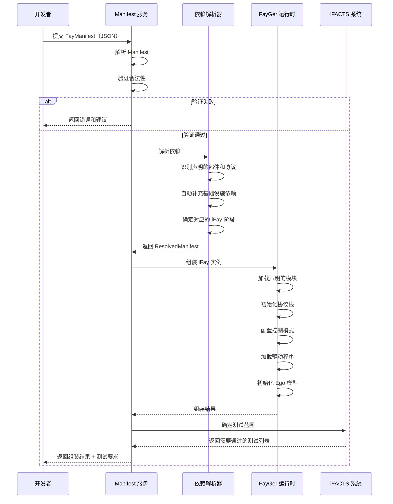

**设计决策**：
- FayManifest 采用 JSON 格式，语法类似 package.json，降低开发者学习成本
- 最小化声明：开发者只需声明业务所需的部件子集，基础设施依赖自动补充
- 控制模式三选一：指令控制（宿主驱动）、Ego 控制（Ego 模型决策）、自主控制（完全自驱）
- 依赖解析器自动确定对应的 iFay 阶段，并据此确定 iFACTS 测试范围
- 驱动程序配置支持指定厂商和版本，实现灵活的部件组合（原则 3）

## 协议规范

### 协议 1：Faying 协议（安全配对协议）

**目的**：规定自然人与 iFay 安全配对及激活条件，确保 iFay 仅在宿主明确意图下被授权运行。

**协议流程**：

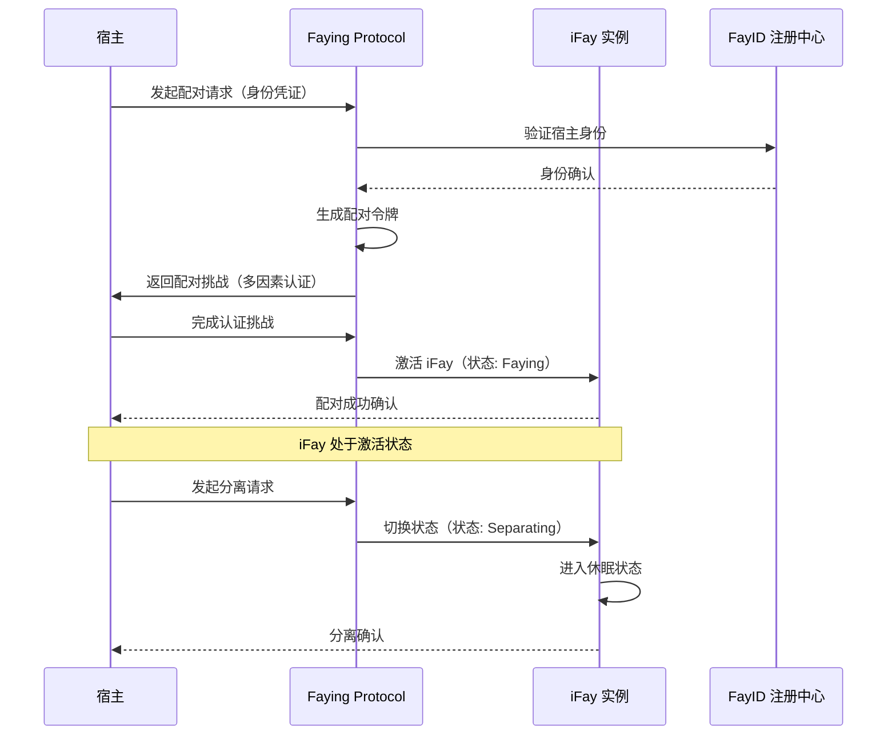

**协议规范**：

```typescript
interface FayingProtocol {
  // 状态定义
  states: 'idle' | 'pairing' | 'faying' | 'separating' | 'dormant';
  
  // 配对请求
  pair(request: PairingRequest): Promise<PairingChallenge>;
  
  // 完成认证
  authenticate(challenge: PairingChallenge, response: AuthResponse): Promise<FayingSession>;
  
  // 分离
  separate(sessionId: string): Promise<void>;
  
  // 获取当前状态
  getState(): FayingState;
}

interface PairingRequest {
  hostCredential: Credential;
  fayId: FayID;
  deviceFingerprint: string;
  timestamp: Timestamp;
}

interface FayingSession {
  sessionId: string;
  hostId: string;
  fayId: FayID;
  startedAt: Timestamp;
  expiresAt: Timestamp;
  permissions: Permission[];
}

interface FayingState {
  status: 'idle' | 'pairing' | 'faying' | 'separating' | 'dormant';
  currentSession?: FayingSession;
  lastActivity: Timestamp;
}
```

**安全要求**：
- 配对过程必须使用多因素认证
- 未获得宿主明确意图的激活请求必须被拒绝并记录
- 会话超时自动进入分离状态
- 所有状态转换均记录审计日志

### 协议 2：心灵感应协议（Telepathy Protocol）

**目的**：Fay 间去除 UI 翻译层的语义通信协议，使用约定的向量编码令牌替代结构化文本。

**协议架构**：

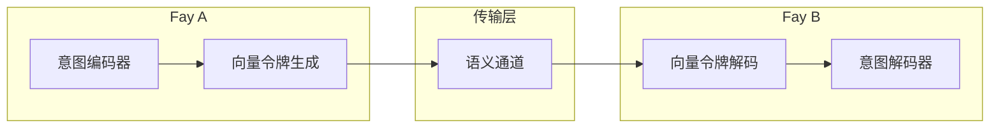

**协议规范**：

```typescript
interface TelepathyProtocol {
  // 建立语义通道
  openChannel(targetFayId: FayID): Promise<TelepathyChannel>;
  
  // 发送语义消息（向量编码）
  send(channel: TelepathyChannel, message: SemanticMessage): Promise<void>;
  
  // 接收语义消息
  receive(channel: TelepathyChannel): Observable<SemanticMessage>;
  
  // 关闭通道
  closeChannel(channel: TelepathyChannel): Promise<void>;
}

interface SemanticMessage {
  id: string;
  senderId: FayID;
  receiverId: FayID;
  // 向量编码的语义内容，替代结构化文本
  semanticVector: Float32Array;
  // 意图类型标记
  intentType: IntentType;
  // 上下文引用
  contextRef?: string;
  timestamp: Timestamp;
}

type IntentType = 
  | 'request'       // 请求协助
  | 'response'      // 响应请求
  | 'negotiate'     // 价格协商
  | 'collaborate'   // 协作执行
  | 'notify'        // 通知
  | 'acknowledge';  // 确认

interface TelepathyChannel {
  id: string;
  participants: FayID[];
  encoding: VectorEncoding;
  status: 'open' | 'closed';
}

interface VectorEncoding {
  dimension: number;       // 向量维度
  tokenVocab: string;      // 约定的令牌词汇表标识
  compressionLevel: number; // 压缩级别
}
```

**设计决策**：
- 消除 UI 翻译层，直接传输语义向量，减少信息损失
- 使用约定的向量编码令牌，Fay 间需共享相同的编码词汇表
- 支持价格协商意图类型，为贡献追踪提供基础

### 协议 3：交互对话协议（Interactive Conversation Protocol）

**目的**：面向人类 UI 的模块化多模态语义协议，使客户端界面能够重构易读的用户友好消息展示。

**协议架构**：

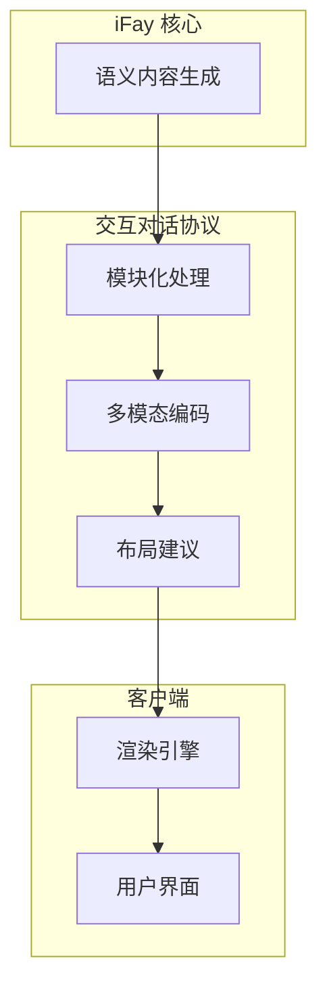

**协议规范**：

```typescript
interface InteractiveConversationProtocol {
  // 发送模块化消息给宿主
  sendToHost(message: ConversationMessage): Promise<DeliveryReceipt>;
  
  // 接收宿主输入
  receiveFromHost(): Observable<HostInput>;
  
  // 协商展示格式
  negotiateFormat(clientCapabilities: ClientCapabilities): Promise<FormatAgreement>;
}

interface ConversationMessage {
  id: string;
  // 模块化内容块
  blocks: ContentBlock[];
  // 布局建议
  layout: LayoutSuggestion;
  // 交互选项
  interactions?: InteractionOption[];
  timestamp: Timestamp;
}

type ContentBlock = 
  | { type: 'text'; content: string; style?: TextStyle }
  | { type: 'image'; url: string; alt: string; size?: ImageSize }
  | { type: 'audio'; url: string; duration: number }
  | { type: 'video'; url: string; duration: number }
  | { type: 'chart'; data: ChartData; chartType: string }
  | { type: 'table'; headers: string[]; rows: unknown[][] }
  | { type: 'action'; label: string; actionId: string }
  | { type: 'form'; fields: FormField[] };

interface LayoutSuggestion {
  arrangement: 'vertical' | 'horizontal' | 'grid' | 'card';
  priority: number[]; // 内容块优先级排序
  collapsible?: boolean;
}

interface HostInput {
  type: 'text' | 'voice' | 'gesture' | 'selection' | 'form_submit';
  content: unknown;
  timestamp: Timestamp;
  context?: InputContext;
}
```

**设计决策**：
- 语义内容模块化，客户端可根据自身能力重构展示
- 多模态支持：文本、图像、音频、视频、图表、表格、操作按钮、表单
- 布局建议而非强制布局，客户端有最终渲染决定权

### 协议 4：控制权限协议（CAP - Control Authority Protocol）

**目的**：支持 iFay 接管终端硬件和特定软件，直接调用驱动程序、本地接口和命令。

**协议规范**：

```typescript
interface ControlAuthorityProtocol {
  // 请求控制权限
  requestAuthority(target: ControlTarget): Promise<AuthorityGrant>;
  
  // 执行控制命令
  executeCommand(grant: AuthorityGrant, command: ControlCommand): Promise<CommandResult>;
  
  // 释放控制权限
  releaseAuthority(grantId: string): Promise<void>;
  
  // 查询可控目标
  discoverTargets(): Promise<ControlTarget[]>;
}

interface ControlTarget {
  id: string;
  type: 'hardware_driver' | 'local_interface' | 'system_command' | 'software_api';
  name: string;
  capabilities: string[];
  requiresElevation: boolean;
}

interface AuthorityGrant {
  id: string;
  targetId: string;
  fayId: FayID;
  permissions: ControlPermission[];
  grantedAt: Timestamp;
  expiresAt: Timestamp;
  scope: 'full' | 'limited';
}

interface ControlCommand {
  targetId: string;
  action: string;
  params: Record<string, unknown>;
  timeout: number;
}

type ControlPermission = 
  | 'read'           // 读取设备状态
  | 'write'          // 写入/控制设备
  | 'execute'        // 执行命令
  | 'configure'      // 修改配置
  | 'monitor';       // 监控设备
```

**安全要求**：
- 控制权限有时间限制，过期自动释放
- 需要提升权限的操作必须经过额外认证
- 所有控制命令记录审计日志

### 协议 5：数据隧道协议（DTP - Data Tunnel Protocol）

**目的**：终端与 iFay 间的双向传输协议，支持数据持久化和数据丰富化。

**协议架构**：

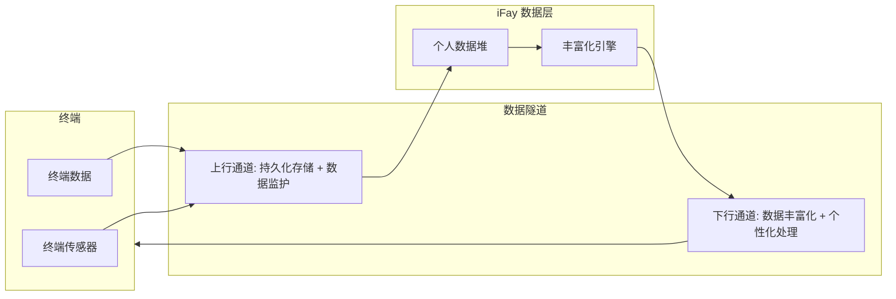

**协议规范**：

```typescript
interface DataTunnelProtocol {
  // 建立数据隧道
  openTunnel(terminal: TerminalInfo): Promise<DataTunnel>;
  
  // 上行：终端 → iFay（持久化存储和数据监护）
  upload(tunnel: DataTunnel, data: TunnelData): Promise<UploadReceipt>;
  
  // 下行：iFay → 终端（数据丰富化和个性化处理）
  download(tunnel: DataTunnel, request: DownloadRequest): Promise<TunnelData>;
  
  // 关闭隧道
  closeTunnel(tunnel: DataTunnel): Promise<void>;
}

interface DataTunnel {
  id: string;
  terminalId: string;
  fayId: FayID;
  direction: 'bidirectional';
  encryption: EncryptionConfig;
  bandwidth: BandwidthConfig;
  status: 'open' | 'paused' | 'closed';
}

interface TunnelData {
  id: string;
  category: DataCategory;
  payload: ArrayBuffer;
  metadata: {
    format: string;
    size: number;
    checksum: string;
    timestamp: Timestamp;
  };
  guardianship: boolean; // 是否需要数据监护
}

interface UploadReceipt {
  dataId: string;
  storedAt: StorageLocation;
  guardianshipActive: boolean;
  timestamp: Timestamp;
}
```

### 协议 6：技能共享协议（SSP - Skill Sharing Protocol）

**目的**：将原本仅对客户端开放的服务和接口通过标准化远程协议向全网开放。

**协议规范**：

```typescript
interface SkillSharingProtocol {
  // 发布技能到全网
  publish(skill: SharedSkill): Promise<PublishReceipt>;
  
  // 发现可用技能
  discover(query: SkillQuery): Promise<SharedSkill[]>;
  
  // 调用远程技能
  invoke(skillId: string, params: InvocationParams): Promise<InvocationResult>;
  
  // 协商价格
  negotiatePrice(skillId: string, usage: UsageEstimate): Promise<PriceAgreement>;
}

interface SharedSkill {
  id: string;
  providerId: FayID;
  name: string;
  description: string;
  type: SkillType;
  endpoint: string;
  // 技能规格
  spec: {
    inputSchema: JSONSchema;
    outputSchema: JSONSchema;
    sla: ServiceLevelAgreement;
  };
  // 定价模型
  pricing: PricingModel;
  // 贡献类型
  meritType: MeritContributionType;
}

interface PricingModel {
  type: 'per_call' | 'subscription' | 'negotiated';
  basePrice?: number;  // 以 μ (MU) 计价
  currency: 'mu';
}

type MeritContributionType = 
  | 'information_assembly'
  | 'api_provision'
  | 'device_provision'
  | 'runtime_provision'
  | 'value_added_input';

interface PriceAgreement {
  skillId: string;
  consumerId: FayID;
  providerId: FayID;
  agreedPrice: number;
  currency: 'mu';
  validUntil: Timestamp;
}
```

**设计决策**：
- 所有技能通过标准化远程协议开放，实现 C/F/S 架构
- 支持价格协商机制，贡献可追踪和可评估
- 定价以 μ (MU) 为单位，与 GMChain 经济模型对接

## 数据模型

### 核心实体关系

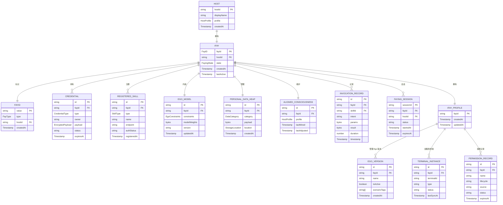

### 宿主画像数据模型

```typescript
interface HostProfile {
  // 基础信息
  identity: {
    hostId: string;
    displayName: string;
    language: string;
    timezone: string;
  };
  
  // 价值取向（多维向量表示）
  values: {
    dimensions: Map<string, number>; // 维度名 -> 权重值 [-1, 1]
    lastUpdated: Timestamp;
  };
  
  // 兴趣偏好
  preferences: {
    topics: WeightedTag[];      // 兴趣主题
    communication: {
      style: 'formal' | 'casual' | 'technical' | 'creative';
      verbosity: number;        // 0-1, 简洁到详细
      responseSpeed: 'immediate' | 'thoughtful' | 'scheduled';
    };
    contentFormat: string[];    // 偏好的内容格式
  };
  
  // 习惯模式
  habits: {
    dailyRoutine: RoutineEntry[];
    workPatterns: WorkPattern[];
    interactionPatterns: InteractionPattern[];
  };
  
  // 边界定义
  boundaries: {
    cognitive: BoundarySet;     // 认知边界
    skill: BoundarySet;         // 技能边界
    permission: BoundarySet;    // 权限边界
  };
  
  // 工作风格
  workingStyle: {
    decisionMaking: 'analytical' | 'intuitive' | 'collaborative' | 'directive';
    riskTolerance: number;      // 0-1
    multitasking: boolean;
    focusDuration: number;      // 分钟
  };
}

interface WeightedTag {
  tag: string;
  weight: number; // 0-1
}

interface BoundarySet {
  allowed: string[];
  restricted: string[];
  requiresConfirmation: string[];
}
```

### GMChain 贡献记录模型

```typescript
interface MeritRecord {
  id: string;
  // 贡献者
  contributor: FayID;
  // 贡献类型
  type: MeritContributionType;
  // 贡献描述
  description: string;
  // 关联的技能调用
  invocationId?: string;
  // 贡献度量值（μ 单位）
  meritValue: number;
  // 评估信息
  evaluation: {
    quality: number;        // 0-1
    timeliness: number;     // 0-1
    impact: number;         // 0-1
    evaluatedBy: FayID[];   // 评估者
  };
  // 代币奖励
  tokenReward: {
    amount: number;
    currency: 'mu';
    transactionId: string;
  };
  timestamp: Timestamp;
}

interface GMChainBlock {
  blockId: string;
  previousHash: string;
  timestamp: Timestamp;
  records: MeritRecord[];
  validator: FayID;
  hash: string;
  // 共识机制：基于社会价值认定而非算力
  consensusType: 'merit_proof';
}

interface MeriTokenAccount {
  fayId: FayID;
  balance: number;          // μ 单位
  totalEarned: number;
  totalSpent: number;
  // 抵押信息
  collateral?: {
    type: 'fiat' | 'bond' | 'asset_certificate' | 'gold';
    value: number;
    verifiedAt: Timestamp;
  };
}
```

### iFay Profile 数据模型

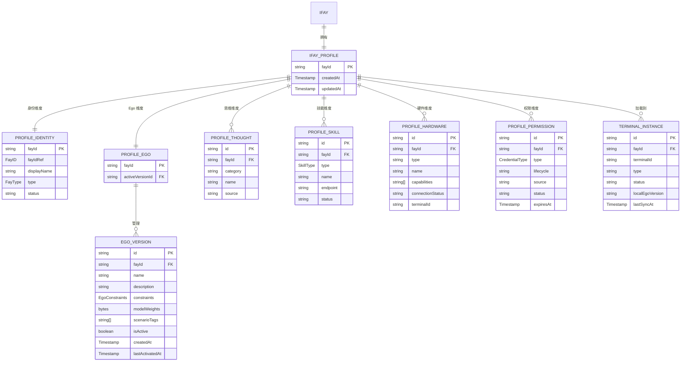

### Ego 版本管理数据模型

```typescript
// Ego 版本存储模型
interface EgoVersionStore {
  versions: Map<string, EgoVersion>;  // versionId -> EgoVersion
  activeVersionId: string;
  fayId: FayID;
  switchHistory: EgoSwitchRecord[];
}

interface EgoSwitchRecord {
  id: string;
  fromVersionId: string;
  toVersionId: string;
  switchType: 'manual' | 'automatic';
  context?: SwitchContext;
  timestamp: Timestamp;
}
```

### 多终端实例数据模型

```typescript
// 多终端同步状态模型
interface MultiTerminalState {
  fayId: FayID;
  instances: Map<string, TerminalInstance>;  // instanceId -> TerminalInstance
  globalState: GlobalSyncState;
  conflictLog: StateConflict[];
}

interface GlobalSyncState {
  vectorClock: VectorClock;
  lastSyncTimestamp: Timestamp;
  pendingChanges: StateChange[];
  syncMode: 'realtime' | 'batch' | 'manual';
}
```

### 权限体系数据模型

```typescript
// 权限存储模型
interface PermissionStore {
  fayId: FayID;
  permissions: Map<string, PermissionRecord>;  // permissionId -> PermissionRecord
  authMethods: Map<string, AuthMethodDefinition>;  // method -> definition
  fingerprints: FingerprintIdentity[];
}

// 权限审计记录
interface PermissionAuditEntry {
  id: string;
  fayId: FayID;
  permissionId: string;
  action: 'grant' | 'revoke' | 'request' | 'release' | 'expire';
  lifecycle: PermissionLifecycle;
  timestamp: Timestamp;
  reason?: string;
}
```

## 安全架构

### FayGer 运行时容器安全模型

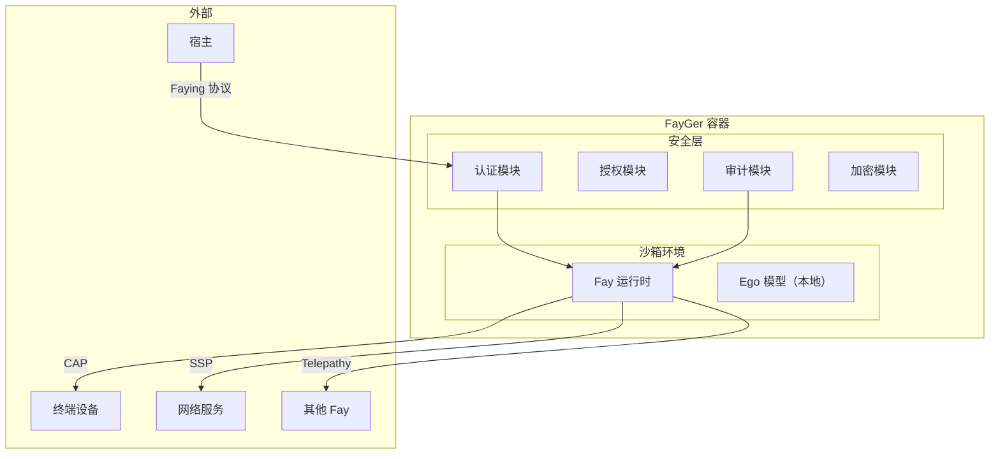

### 安全原则

1. **社会伦理优先**：所有行为决策首先检查是否违反社会伦理和公共秩序
2. **最小权限原则**：iFay 仅获得执行当前任务所需的最小权限
3. **凭证隔离**：宿主原始凭证与 iFay 使用的副本凭证严格隔离
4. **隐私保护**：隐私查询仅返回布尔结果，防止数据泄露
5. **审计追踪**：所有关键操作均记录不可篡改的审计日志
6. **个性防篡改**：Ego 模型独立运行，防止外部模型更新导致个性突变

### 伦理合规检查流程

```mermaid
flowchart TD
    A["接收行为请求"] --> B{"社会伦理检查"}
    B -->|"违反"| C["拒绝执行 + 通知宿主"]
    B -->|"通过"| D{"宿主对齐检查"}
    D -->|"不一致"| E{"严重程度"}
    E -->|"高"| F["暂停 + 请求确认"]
    E -->|"低"| G["Ego 模型调整后执行"]
    D -->|"一致"| H{"权限检查"}
    H -->|"无权限"| I["请求授权"]
    H -->|"有权限"| J["执行行为"]
    J --> K["记录审计日志"]
    K --> L["记录贡献（GMChain）"]
```

## 部署架构

### FayGer 容器模型

```mermaid
graph TB
    subgraph BuildPhase["构建阶段"]
        Source["Fay 源代码（任意语言）"]
        Builder["FayGer 构建工具"]
        Image["FayGer 镜像"]
        Source --> Builder
        Builder --> Image
    end

    subgraph RuntimePhase["运行阶段"]
        subgraph Device1["移动设备"]
            FG1["FayGer Runtime"]
            F1["iFay 实例"]
            FG1 --> F1
        end
        subgraph Device2["桌面设备"]
            FG2["FayGer Runtime"]
            F2["iFay 实例"]
            FG2 --> F2
        end
        subgraph Device3["IoT 设备"]
            FG3["FayGer Runtime"]
            F3["coFay 实例"]
            FG3 --> F3
        end
        subgraph Cloud["云端"]
            FG4["FayGer Runtime"]
            F4["iFay 云端副本"]
            FG4 --> F4
        end
    end

    Image --> FG1
    Image --> FG2
    Image --> FG3
    Image --> FG4

    F1 <-->|"同步"| F4
    F2 <-->|"同步"| F4
```

**FayGer 运行时特性**：
- 类似 Docker 的标准容器，支持任意开发语言打包
- 跨平台运行（移动端、桌面端、IoT、云端）
- Fay 的功能和个性在不同平台上保持一致
- 提供跨语言构建工具和跨平台运行容器

### C/F/S 架构

```mermaid
graph LR
    subgraph Client["客户端 (C)"]
        UI2["用户界面"]
        CAP2["CAP 协议栈"]
        DTP2["DTP 协议栈"]
    end

    subgraph Fay["Fay 层 (F)"]
        iFay2["iFay 实例"]
        SSP2["SSP 协议栈"]
        Telepathy2["Telepathy 协议栈"]
    end

    subgraph Server["服务端 (S)"]
        API2["开放 API"]
        Service2["后端服务"]
        DB["数据存储"]
    end

    UI2 <-->|"ICP"| iFay2
    CAP2 <-->|"CAP"| iFay2
    DTP2 <-->|"DTP"| iFay2
    iFay2 <-->|"SSP"| API2
    API2 --> Service2
    Service2 --> DB
```

### GMChain / MeriToken 经济模型

```mermaid
graph TB
    subgraph Contributors["贡献者"]
        iFay3["iFay 实例"]
        coFay3["coFay 实例"]
        Provider["服务提供者"]
    end

    subgraph GMChain2["GMChain 区块链"]
        Tracker["贡献追踪器"]
        Evaluator["贡献评估器"]
        Consensus["共识机制（Merit Proof）"]
        Ledger["分布式账本"]
    end

    subgraph TokenEconomy["代币经济"]
        Mint["MeriToken 铸造"]
        Exchange["代币交换"]
        Collateral["抵押发行"]
    end

    iFay3 -->|"贡献记录"| Tracker
    coFay3 -->|"贡献记录"| Tracker
    Provider -->|"贡献记录"| Tracker
    Tracker --> Evaluator
    Evaluator --> Consensus
    Consensus --> Ledger
    Ledger --> Mint
    Mint --> Exchange
    Collateral -->|"法币/债券/资产/黄金"| Mint
```

**经济模型设计**：
- MeriToken 获取基于创造社会价值，而非消耗算力
- 支持以法定货币、债券、资产证书、黄金等抵押的定向发行
- 贡献类型包括：信息组装服务、API 提供、设备提供、运行时环境提供
- Fay 在执行任务前可协商价格，确保贡献可追踪和可评估
- 计量单位为 μ（Merit Unit）

## 正确性属性

*属性（Property）是指在系统所有有效执行中都应保持为真的特征或行为——本质上是关于系统应该做什么的形式化陈述。属性是人类可读规范与机器可验证正确性保证之间的桥梁。*

### 属性 1：FayID 全局唯一性

*对于任意*两个通过 FayID 生成系统创建的标识符（无论是 iFay 还是 coFay 类型），它们的值必须不同，且每个标识符必须同时满足人类可识别和机器可读的格式约束。

**验证需求：1.1, 1.2, 1.5**

### 属性 2：FayID 身份迁移不变性

*对于任意* iFay 实例，当其从个人助手角色迁移为自主社会角色时，迁移前后的 FayID 值必须保持不变。

**验证需求：1.4**

### 属性 3：Faying 状态机不变性

*对于任意* iFay 实例，当其处于 Faying（连接）状态时必须处于激活状态，当其处于 Separating（分离）状态时必须处于休眠状态。状态转换必须严格遵循 Faying 协议定义的状态机。

**验证需求：2.1, 2.2**

### 属性 4：激活需要宿主明确意图

*对于任意* iFay 激活请求，如果该请求未附带宿主的明确意图凭证，系统必须拒绝激活并生成一条审计日志记录。

**验证需求：2.3, 2.4**

### 属性 5：凭证委托副本隔离

*对于任意*宿主委托给 iFay 的凭证，系统必须生成一个副本凭证，该副本必须标明原始所有者（宿主或 iFay），且 iFay 仅使用副本进行认证，原始凭证不可被 iFay 直接访问。

**验证需求：3.2, 3.3**

### 属性 6：凭证操作审计完整性

*对于任意*使用委托凭证执行的操作，系统必须生成一条包含操作详情的审计日志记录。

**验证需求：3.4**

### 属性 7：隐私查询布尔约束

*对于任意*通过凭证管理模块执行的隐私数据查询，返回结果的类型必须严格为布尔值（真或假），不得包含任何原始私有数据。

**验证需求：3.6**

### 属性 8：凭证异常自动撤销

*对于任意*被检测到泄露或异常使用的凭证副本，系统必须将其状态设置为已撤销，且撤销后该凭证不可再用于认证。

**验证需求：3.5**

### 属性 9：操作-感知闭环

*对于任意*通过模拟操作模块执行的 UI 操作，第一人称追踪器必须能够检测到该操作引起的界面状态变化。

**验证需求：4.3, 5.4**

### 属性 10：Ego 模型多维约束评估

*对于任意*提交给 Ego 模型评估的行为提案，评估结果必须覆盖所有七个约束维度（价值取向、兴趣偏好、习惯、认知边界、技能边界、权限边界、工作风格）。

**验证需求：6.1**

### 属性 11：Ego 模型外部更新隔离

*对于任意*外部大型模型的更新事件，Ego 模型的约束参数在更新前后必须保持不变。

**验证需求：6.4**

### 属性 12：Ego 约束不阻止外部技能调用

*对于任意*已注册的外部技能，即使 Ego 模型处于约束状态，iFay 仍然能够发起对该技能的调用请求（调用结果可能被 Ego 模型调整）。

**验证需求：6.5**

### 属性 13：传感器数据转发完整性

*对于任意*传感器接收到的外部环境数据，该数据必须被转发到 iFay 的认知层进行处理。

**验证需求：7.2**

### 属性 14：传感器灵敏度动态调节

*对于任意*灵敏度调节操作，调节后的数据采集频率和精度必须与新的灵敏度级别匹配。

**验证需求：7.3**

### 属性 15：设备驱动标准化集成

*对于任意*新注册的设备驱动，它必须通过标准化接口集成，且集成过程不影响 iFay 其他已加载模块的正常运行。

**验证需求：8.2**

### 属性 16：CAP 协议设备控制

*对于任意*已注册的设备驱动，通过 CAP 协议发送的控制命令必须能够被正确执行并返回结果。

**验证需求：8.3**

### 属性 17：技能注册预授权

*对于任意*注册到 iFay 的技能，注册完成后其预授权状态必须为已授权，且技能注册信息变更时预授权状态必须同步更新。

**验证需求：9.2, 9.5**

### 属性 18：未注册技能调用拒绝

*对于任意*针对未注册技能或预授权已过期技能的调用请求，系统必须拒绝执行并返回包含拒绝原因的错误信息。

**验证需求：9.3, 10.3**

### 属性 19：离线动作缓存与恢复

*对于任意*在 iFay 离线状态下缓存的待执行动作，当连接恢复后，该动作必须被异步执行，且执行结果与在线状态下直接执行的结果等价。

**验证需求：9.4**

### 属性 20：意图-技能匹配调用

*对于任意*宿主表达的意图，技能调用模块必须匹配到至少一个已注册技能并成功调用（如果存在匹配技能）。

**验证需求：10.2**

### 属性 21：任务执行记录完整性

*对于任意*技能调用，系统必须创建一条包含调用过程、结果和评估信息的完整记录，该记录同时用于 GMChain 贡献追踪。

**验证需求：10.4, 22.3**

### 属性 22：个人数据堆读写往返

*对于任意*写入个人数据堆的数据条目，通过统一读取接口查询该条目必须返回与写入内容等价的结果，无论底层物理存储位置如何。

**验证需求：11.1, 11.2**

### 属性 23：DTP 上行数据持久化

*对于任意*通过数据隧道协议从终端上传的数据，个人数据堆必须完成持久化存储且数据监护状态为激活。

**验证需求：11.4**

### 属性 24：外部知识技能化接入

*对于任意*注册的外部知识源，它必须作为技能类型被接入，且通过 SSP 协议访问。获取的知识必须存储到个人数据堆中统一管理。

**验证需求：12.1, 12.2, 12.3**

### 属性 25：意图推断转发

*对于任意*自我感知模块推断出的新意图，该意图必须同时被传递给自驱行为模块和认知层，且自驱行为模块必须主动发起相应的任务执行。

**验证需求：13.3, 14.3**

### 属性 26：对齐意识实时同步

*对于任意*自我感知模块检测到的宿主反应，对齐意识模块必须更新宿主画像以反映该反应。

**验证需求：13.4**

### 属性 27：定时任务自动执行

*对于任意*已注册的定时任务，当触发时间到达时，自驱行为模块必须自动执行对应的动作。

**验证需求：14.2**

### 属性 28：意图不一致暂停确认

*对于任意*自驱行为的执行结果，如果该结果与宿主意图不一致，系统必须暂停后续自主动作并发起宿主确认请求。

**验证需求：14.5**

### 属性 29：外部输出冲突拦截

*对于任意*外部技能或外部知识的输出，如果该输出与宿主价值观或意图冲突，内部技能模块必须拦截该输出并根据宿主画像进行调整后再返回。

**验证需求：15.2, 15.4**

### 属性 30：宿主画像数据驱动更新

*对于任意*宿主个人数据的变化，对齐意识模块必须自动更新宿主画像，且更新后的画像必须同时提供给 Ego 模型和内部技能模块。

**验证需求：16.3, 16.4**

### 属性 31：初始化数据标准化存储

*对于任意*通过授权方式注入的宿主数据，系统必须将其以标准格式处理后存储到个人数据堆中，且该数据仅可被 iFay 直接访问。

**验证需求：17.2**

### 属性 32：对话注入主题约束

*对于任意*通过对话方式进行的特征注入会话，对话主题必须被标准研究问卷约束在有效范围内。

**验证需求：17.4**

### 属性 33：FayGer 跨平台一致性

*对于任意* Fay 实例，当其被部署到不同平台的 FayGer 运行时环境时，其功能行为和个性表现必须保持一致。

**验证需求：18.2, 18.3**

### 属性 34：心灵感应协议语义向量编码

*对于任意* Fay 间通信消息，心灵感应协议必须使用约定的向量编码令牌传输语义内容，不经过 UI 翻译层。

**验证需求：19.2**

### 属性 35：交互对话协议模块化

*对于任意*发送给宿主的消息，交互对话协议必须将语义内容编码为模块化的多模态内容块，使客户端能够重构展示。

**验证需求：19.3**

### 属性 36：DTP 双向传输往返

*对于任意*数据，通过数据隧道协议的上行通道（终端→iFay）传输后再通过下行通道（iFay→终端）传输，数据的核心内容必须保持完整（下行可包含丰富化处理的附加内容）。

**验证需求：19.5**

### 属性 37：SSP 技能发布可发现性

*对于任意*通过技能共享协议发布的技能，其他 Fay 必须能够通过发现接口查询到该技能并成功调用。

**验证需求：19.6**

### 属性 38：Fay 间协作请求处理

*对于任意* iFay 发出的协作请求，目标 Fay 必须能够接收并处理该请求。

**验证需求：20.1**

### 属性 39：任务协作价格协商

*对于任意* Fay 间的任务协作，执行前必须完成价格协商，协商结果以 μ (MU) 计价并记录。

**验证需求：20.4**

### 属性 40：社会伦理优先拒绝

*对于任意*可能违反社会伦理或公共秩序的行为请求，系统必须拒绝执行并向宿主提供包含拒绝原因的说明，且此检查优先于所有其他行为准则。

**验证需求：21.1, 21.5**

### 属性 41：GMChain 贡献追踪与代币奖励

*对于任意*已完成的 Fay 任务，GMChain 系统必须创建一条贡献记录并以 MeriToken 奖励贡献者。

**验证需求：22.1**

### 属性 42：意图驱动功能触发

*对于任意*宿主表达的动机和期望，系统必须将其转化为 API 调用或命令并执行，宿主无需手动操作硬软件界面。

**验证需求：23.1, 23.2**

### 属性 43：iFay Profile 六维完整性

*对于任意* iFay 实例，其 Profile 必须包含所有六个维度的数据：iFay 身份（FayID + 元信息）、Ego 模型（当前活跃 Ego 版本引用）、Faying 思维（Content、Data、Knowledge Base、Info Feed）、Faying 技能（API、Workflow、Bot、Agent、APP、Microservice）、Faying 硬件（Device、Storage、Computing）、Faying 权限（可扩展鉴权方式），且每个维度的子类型结构完整。

**验证需求：24.1, 24.2, 24.3, 24.4, 24.5**

### 属性 44：Ego 单一活跃不变量

*对于任意* iFay 实例，在任一时刻其 Profile 中有且仅有一个活跃 Ego 版本，无论经历多少次手动或自动切换操作。

**验证需求：25.5**

### 属性 45：Ego 切换原子性

*对于任意* Ego 版本切换操作（手动或自动），切换完成后 iFay Profile 中的活跃 Ego 引用必须更新为新版本，且旧版本的 isActive 状态必须为 false。

**验证需求：25.3, 25.6**

### 属性 46：多终端状态最终一致性

*对于任意* iFay 的多个终端实例，在网络连接正常的情况下，任一实例上的状态变更最终必须同步到所有其他实例，使所有实例的状态收敛一致。

**验证需求：26.2, 26.4**

### 属性 47：离线独立运行能力

*对于任意*终端实例，当网络中断时，该实例必须能基于本地 Ego 模型独立运行，执行本地推理和近场设备控制，不依赖网络连接。

**验证需求：26.3**

### 属性 48：权限生命周期管理

*对于任意*临时（ephemeral）权限，使用完毕后必须被自动释放，释放后该权限的状态必须为 'released'，且不可再用于授权检查。

**验证需求：27.1, 27.6**

### 属性 49：Faying 硬件能力匹配

*对于任意*已发现的硬件，iFay 仅能操控其思维能力（注册技能、内部技能）覆盖范围内的硬件，不在能力范围内的硬件即使被发现也不可操控。

**验证需求：28.3, 28.4**

### 属性 50：硬件连接 CAP 授权

*对于任意*硬件连接，必须通过 CAP 协议完成授权后才能建立，未经 CAP 授权的连接请求必须被拒绝。

**验证需求：28.5**

### 属性 51：iFACTS 合规性验证

*对于任意*声称"iFay 可用"的实现，必须通过 iFACTS 测试套件的全部测试，且测试套件仅覆盖 iFay 相关的合规性测试。

**验证需求：29.2, 29.5**

### 属性 52：宿主特征三维注入完整性

*对于任意* iFay 初始化，必须支持宿主性格（→Ego 模型的训练/设定输入）、宿主数据（→个人数据堆的初始化数据）、宿主权限（→凭证委托）三个维度的注入，且宿主画像作为 iFay Profile 的子集和输入源。

**验证需求：17.1, 17.4, 17.8, 24.8**

### 属性 53：iFay 权限来源独立性

*对于任意* iFay 的权限集合，宿主权限与 iFay 权限之间无包含关系——iFay 可拥有宿主未持有的权限（self_acquired），宿主也可拥有未委托给 iFay 的权限。

**验证需求：17.10**

### 属性 54：阶段配置完整性

*对于任意*声称支持某阶段的 iFay 实现，该实现必须包含该阶段及所有前置阶段的最小部件配置，且跨阶段基础设施（FayGer 运行时、iFay Profile、权限体系、安全与伦理合规、多终端同步）必须全部存在。

**验证需求：31.1, 31.8**

### 属性 55：生命周期状态机合法性

*对于任意* iFay 实例的状态转换，该转换必须严格遵循定义的状态机中的合法转换路径，不存在非法状态跳转。对于任意非法状态转换请求，系统必须拒绝执行并返回错误。

**验证需求：32.7**

### 属性 56：生命周期审计完整性

*对于任意* iFay 实例的状态转换（无论成功或失败），系统必须生成一条包含转换详情（源状态、目标状态、触发事件、时间戳）的审计日志记录。

**验证需求：32.8**

### 属性 57：iFACTS 层级顺序

*对于任意* iFACTS 测试执行，L(n+1) 层级的测试仅在 L(n) 层级全部通过后才能执行。未通过前置层级的测试请求必须被拒绝。

**验证需求：33.6**

### 属性 58：iFay Ready 认证等级一致性

*对于任意*获得 iFay Ready 认证的应用，其认证等级必须与实际支持的协议能力一致——Bronze 等级要求支持模拟操作，Silver 等级要求支持 CAP 和 DTP 协议，Gold 等级要求支持 SSP 协议和完整 C/F/S 架构集成。

**验证需求：34.3, 34.4**

### 属性 59：监护权转移安全性

*对于任意*监护权转移操作，必须通过助记词验证或宿主预指定的身份认证，未经验证的转移请求必须被拒绝。

**验证需求：35.2**

### 属性 60：数字墓园沙箱隔离

*对于任意*在数字墓园中运行的 iFay，其行为范围必须被限制在沙箱内，不可执行可能造成外部影响的操作。

**验证需求：35.4**

### 属性 61：FayManifest 声明完整性

*对于任意* FayManifest 声明文件，系统必须能自动补充必需的基础设施依赖，且组装后的 iFay 实例包含所有声明的和自动补充的部件。

**验证需求：36.5**

### 属性 62：FayManifest 最小化有效性

*对于任意*仅声明部件子集的 FayManifest，组装后的 iFay 实例必须能正常运行该子集所覆盖的功能。

**验证需求：36.5**

## 错误处理

### 错误分类

| 错误类别 | 描述 | 处理策略 |
|---------|------|---------|
| 认证失败 | Faying 配对失败、凭证无效 | 拒绝操作，记录审计日志，通知宿主 |
| 权限不足 | CAP 权限不足、技能未注册 | 拒绝执行，返回原因，建议注册/授权 |
| 感知失败 | 第一人称追踪器无法获取视觉信息 | 向认知层报告失败状态，触发降级策略 |
| 设备故障 | 设备驱动加载失败、设备不可用 | 报告不可用状态，提供降级操作建议 |
| 网络中断 | 外部知识源不可用、SSP 连接断开 | 降级使用缓存数据，缓存待执行动作 |
| 伦理违规 | 行为可能违反社会伦理 | 拒绝执行，向宿主说明原因 |
| 意图冲突 | 自驱行为结果与宿主意图不一致 | 暂停自主动作，请求宿主确认 |
| 凭证泄露 | 凭证副本被检测到异常使用 | 立即撤销副本，通知宿主 |
| 外部冲突 | 外部技能输出与宿主价值观冲突 | 内部技能拦截并调整输出 |

### 降级策略

```mermaid
flowchart TD
    A["检测到异常"] --> B{"异常类型"}
    B -->|"网络中断"| C["切换到离线模式"]
    C --> C1["使用 Ego 模型本地推理"]
    C --> C2["缓存待执行动作"]
    C --> C3["使用个人数据堆缓存知识"]
    
    B -->|"感知失败"| D["感知降级"]
    D --> D1["切换到结构化文档解析"]
    D --> D2["降低操作置信度阈值"]
    
    B -->|"设备故障"| E["设备降级"]
    E --> E1["使用替代设备驱动"]
    E --> E2["切换到模拟操作模式"]
    
    B -->|"外部服务不可用"| F["服务降级"]
    F --> F1["使用缓存的技能结果"]
    F --> F2["降级到内部技能"]
    
    C1 --> G["恢复检测"]
    C2 --> G
    C3 --> G
    D1 --> G
    E1 --> G
    F1 --> G
    G -->|"恢复正常"| H["执行缓存动作"]
    G -->|"持续异常"| I["通知宿主"]
```

### 错误传播规则

1. **交互层错误**：感知或操作失败向认知层传播，认知层决定是否降级或通知宿主
2. **认知层错误**：知识获取或技能调用失败向 Ego 层传播，Ego 层决定替代方案
3. **社交层错误**：凭证或身份错误直接阻断操作，不允许降级
4. **跨层错误**：伦理违规检查在所有层之前执行，违规直接拒绝

## 测试策略

### 双重测试方法

本系统采用单元测试与属性测试相结合的双重测试策略：

- **单元测试**：验证特定示例、边界情况和错误条件
- **属性测试**：验证跨所有输入的通用属性

两者互补，共同提供全面的测试覆盖。

### 属性测试配置

- **测试库**：使用 fast-check（TypeScript/JavaScript 属性测试库）
- **最小迭代次数**：每个属性测试至少运行 100 次迭代
- **标签格式**：每个测试必须包含注释引用设计文档中的属性
  - 格式：`Feature: ifay-spec, Property {number}: {property_text}`

### 单元测试重点

单元测试应聚焦于以下场景，避免过多重复属性测试已覆盖的内容：

1. **特定示例**：
   - 7 种凭证类型的管理（需求 3.1）
   - 6 种技能类型的注册（需求 9.1）
   - 4 种数据类型的管理（需求 11.3）
   - 3 种宿主画像更新方式（需求 16.2）
   - 3 种 iFay 初始化方式（需求 17.1）
   - 6 种核心协议的实现（需求 19.1）
   - 多种贡献类型的度量（需求 22.2）

2. **边界情况**：
   - 第一人称追踪器感知失败（需求 4.5）
   - 设备驱动加载失败（需求 8.4）
   - 外部知识源不可用降级（需求 12.4）
   - Ego 模型离线本地推理（需求 6.3）
   - 3 种自驱行为触发源（需求 14.1）
   - MeriToken 抵押发行（需求 22.5）

3. **集成测试**：
   - Faying 协议完整配对流程
   - 模拟操作与第一人称追踪器的手眼协调
   - 自我感知→自驱行为→技能调用的完整链路
   - C/F/S 架构下的端到端通信

### 属性测试重点

每个正确性属性对应一个属性测试，使用 fast-check 生成随机输入：

| 属性编号 | 测试描述 | 生成器策略 |
|---------|---------|-----------|
| 1 | FayID 唯一性 | 生成大量随机 FayID，验证无冲突 |
| 2 | FayID 迁移不变性 | 生成随机 iFay 实例，执行迁移，验证 ID 不变 |
| 3 | Faying 状态机 | 生成随机状态转换序列，验证状态不变量 |
| 4 | 激活意图验证 | 生成有/无意图凭证的激活请求 |
| 5 | 凭证副本隔离 | 生成随机凭证，验证副本创建和隔离 |
| 7 | 隐私查询布尔约束 | 生成随机隐私查询，验证返回类型 |
| 8 | 凭证异常撤销 | 生成异常凭证使用场景，验证撤销 |
| 10 | Ego 多维约束 | 生成随机行为提案，验证七维评估 |
| 11 | Ego 外部更新隔离 | 模拟外部模型更新，验证 Ego 参数不变 |
| 17 | 技能预授权 | 生成随机技能注册，验证预授权状态 |
| 18 | 未注册技能拒绝 | 生成未注册技能调用，验证拒绝 |
| 19 | 离线缓存恢复 | 生成离线动作，模拟恢复，验证执行 |
| 22 | 数据堆读写往返 | 生成随机数据条目，写入后读取验证 |
| 34 | 心灵感应向量编码 | 生成随机语义消息，验证向量编码 |
| 36 | DTP 双向传输 | 生成随机数据，上行后下行验证完整性 |
| 37 | SSP 发布可发现性 | 发布随机技能，验证可发现和可调用 |
| 40 | 伦理优先拒绝 | 生成伦理违规行为，验证拒绝 |
| 43 | iFay Profile 六维完整性 | 生成随机 iFay 实例，验证 Profile 包含所有六个维度及其子类型 |
| 44 | Ego 单一活跃不变量 | 生成随机 Ego 切换序列（手动+自动混合），验证任一时刻仅一个活跃 Ego |
| 45 | Ego 切换原子性 | 生成随机切换操作，验证切换后 Profile 引用更新且旧版本非活跃 |
| 46 | 多终端状态最终一致性 | 生成多终端实例和随机状态变更，模拟同步后验证所有实例状态一致 |
| 47 | 离线独立运行能力 | 生成随机终端实例，模拟网络中断，验证本地 Ego 推理可用 |
| 48 | 权限生命周期管理 | 生成随机临时权限，模拟使用完毕，验证自动释放且状态为 released |
| 49 | Faying 硬件能力匹配 | 生成随机 iFay 技能集和发现硬件列表，验证仅能力匹配的硬件可操控 |
| 50 | 硬件连接 CAP 授权 | 生成随机硬件连接请求，验证无 CAP 授权的连接被拒绝 |
| 51 | iFACTS 合规性验证 | 生成随机实现和测试结果，验证仅全部通过才能获得认证 |
| 52 | 宿主特征三维注入完整性 | 生成随机宿主特征，验证三个维度均成功注入且 HostProfile 为 Profile 子集 |
| 53 | iFay 权限来源独立性 | 生成随机宿主权限集和 iFay 权限集，验证两者无包含关系 |
| 54 | 阶段配置完整性 | 生成随机阶段声称（1-5），构造随机实现的部件列表，验证必须包含该阶段及所有前置阶段的最小部件配置和跨阶段基础设施 |
| 55 | 生命周期状态机合法性 | 生成随机状态转换序列（包含合法和非法转换），验证仅合法转换被接受，非法转换被拒绝 |
| 56 | 生命周期审计完整性 | 生成随机状态转换操作，验证每次转换（成功或失败）均产生一条审计日志记录 |
| 57 | iFACTS 层级顺序 | 生成随机测试层级执行请求（L1-L4），模拟前置层级通过/未通过场景，验证层级顺序约束 |
| 58 | iFay Ready 认证等级一致性 | 生成随机应用协议支持声明，验证认证等级与实际协议能力匹配 |
| 59 | 监护权转移安全性 | 生成随机监护权转移请求（含有效/无效验证凭证），验证仅通过助记词或预指定身份认证的请求被接受，未验证请求被拒绝 |
| 60 | 数字墓园沙箱隔离 | 生成随机 iFay 行为请求（含允许/禁止的操作类型），在数字墓园沙箱环境中执行，验证禁止操作被拦截且不产生外部影响 |
| 61 | FayManifest 声明完整性 | 生成随机 FayManifest（声明不同部件子集），解析并组装后验证结果包含所有声明部件和自动补充的基础设施依赖 |
| 62 | FayManifest 最小化有效性 | 生成随机最小化 FayManifest（仅声明部件子集），组装后验证 iFay 实例能正常运行声明子集覆盖的功能 |

### 测试标签示例

```typescript
// Feature: ifay-spec, Property 1: FayID 全局唯一性
test.prop('FayID uniqueness across all generated IDs', [fc.array(fc.oneof(fc.constant('iFay'), fc.constant('coFay')), { minLength: 2, maxLength: 100 })], (types) => {
  const ids = types.map(type => fayIdService.generate(type));
  const uniqueIds = new Set(ids.map(id => id.value));
  expect(uniqueIds.size).toBe(ids.length);
}, { numRuns: 100 });

// Feature: ifay-spec, Property 7: 隐私查询布尔约束
test.prop('Privacy queries return only boolean results', [fc.string(), fc.string()], (credentialId, queryStr) => {
  const result = credentialManager.queryPrivacy(credentialId, { query: queryStr });
  expect(typeof result).toBe('boolean');
}, { numRuns: 100 });

// Feature: ifay-spec, Property 22: 个人数据堆读写往返
test.prop('Personal data heap round trip', [fc.record({ category: fc.oneof(...categories), payload: fc.anything() })], (entry) => {
  const id = personalDataHeap.write(entry);
  const result = personalDataHeap.read({ id });
  expect(result.payload).toEqual(entry.payload);
}, { numRuns: 100 });
```
