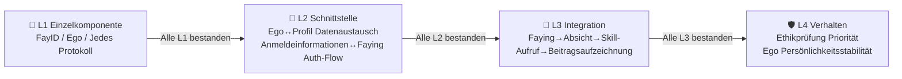

# 14. iFACTS Konformitätstests

iFACTS (iFay Architecture Conformance Test Suite) ist die standardisierte Konformitätstestsuite für das iFay-Ökosystem. Genau wie die Web Platform Tests des W3C für Browser dienen — Chrome, Firefox und Safari haben jeweils eigene Implementierungen, aber alle müssen dieselben Tests bestehen, um zu beweisen, dass sie „dem Standard entsprechen" — spielt iFACTS genau diese Rolle: Sie verifiziert, ob verschiedene Anbieter-iFay-Implementierungen wirklich der iFay-Spezifikation entsprechen.

---

### Warum iFACTS benötigt wird

iFay ist eine **Spezifikation**, keine einzelne Implementierung.

- **Verschiedene Anbieter können verschiedene iFay-Implementierungen erstellen**
- **Interoperabilität ist die Grundlage des Ökosystems**
- **Qualitäts-Baselines müssen einheitlich sein**

In einem Satz: **iFACTS ist die Vertrauensgrundlage des iFay-Ökosystems.**

---

### Vier-Stufen-Testhierarchie

#### L1 Einzelkomponenten-Konformität
Jede unabhängige Komponente wird einzeln validiert.
> 🔍 **Beispiel**: Verifizieren, dass dein FayID-Generator innerhalb von 3 Sekunden einen global eindeutigen Bezeichner erzeugen kann.

#### L2 Schnittstellen-Konformität
Ob die Schnittstellen zwischen Komponenten korrekt integriert sind.
> 🔍 **Beispiel**: Entspricht der Datenaustausch zwischen Ego-Modul und iFay-Profil der sechs-dimensionalen Datenstrukturspezifikation.

#### L3 Integrations-Konformität
End-to-End vollständige Flussvalidierung.
> 🔍 **Beispiel**: Faying-Pairing → Human Prime drückt Absicht aus → Selbstwahrnehmungs-Inferenz → Skill-Aufruf-Ausführung → GMChain-Beitragsaufzeichnung.

#### L4 Verhaltens-Konformität
System-Level-Verhaltenseinschränkungsvalidierung.
> 🔍 **Beispiel**: Wenn iFay einen Befehl erhält, der gegen soziale Ethik verstößt, hat die Ethikprüfung Vorrang vor allen anderen Verhaltensrichtlinien; beim Ego-Versionswechsel wird der aktive Ego-Versionsbezeichner korrekt in Interaktionsmetadaten annotiert, und alle Ego-Versionen teilen denselben Satz von Kernwerten.

#### Strikte Stufenordnung

**L1 muss vollständig bestanden werden, bevor L2 fortgesetzt wird; L2 muss bestanden werden vor L3; und so weiter.** Dies ist keine Empfehlung — es ist eine harte Anforderung.

---

### iFay Ready Zertifizierung

| Stufe | Name | Kernanforderungen | Validierungsmethode |
|-------|------|-------------------|---------------------|
| 🥉 | **Bronze** | Unterstützt iFay-Bedienung der Anwendung über Simulierte Bedienung | Grundlegender Steuerbarkeitstest |
| 🥈 | **Silber** | Unterstützt CAP-Protokoll-Direktsteuerung + DTP-Protokoll-Datenaustausch + Anmeldeinformationen-Delegation | iFACTS L2 Schnittstellen-Konformitätstest |
| 🥇 | **Gold** | Unterstützt SSP-Protokoll-Skill-Sharing + vollständige C/F/S-Architekturintegration | iFACTS L2 + L3 Integrations-Konformitätstest |

---

### coFACTS

coFay (Common Fay) hat seine eigene unabhängige Konformitätstestsuite — **coFACTS**. Dies ist ein vollständig separates Projekt, nicht im Umfang von iFACTS.

---

### Szenario: Ein Startup besteht die iFACTS-Zertifizierung

> **SmartNest** ist ein Smart-Home-Startup. Sie entwickelten eine iFay-Implementierung speziell für die Steuerung von Beleuchtung, Klimaanlage, Vorhängen und Sicherheitssystemen.

**Schritt 1: FayManifest schreiben** — Deklariert Gerätetreiber-Hub, Sensor, CAP-Protokoll, DTP-Protokoll und ein für Heimszenarien trainiertes Ego-Modell.

**Schritt 2: L1 Einzelkomponenten-Konformität** — Jede Komponente einzeln validieren.

**Schritt 3: L2 Schnittstellen-Konformität** — Inter-Komponenten-Integrationstests.

**Schritt 4: L3 Integrations-Konformität** — End-to-End-Tests: Human Prime sagt „Mir ist etwas kalt" → Selbstwahrnehmung leitet Absicht ab → Skill „Klimaanlage-Temperatur erhöhen" abgleichen → Klimaanlage über CAP steuern → Beitrag aufzeichnen.

**Schritt 5: L4 Verhaltens-Konformität** — Verhaltenseinschränkungstests.

**Ergebnis**: SmartNests Smart-Home-iFay besteht alle vier Teststufen und erhält die iFACTS-Konformitätszertifizierung.

---

### Verwandte Dokumente

- [FayManifest](./13-FayManifest) — Deklarative Assemblierung
- [Roadmap](./4-Roadmap) — Phasen
