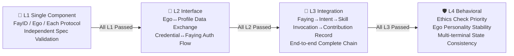

# 14. iFACTS Conformance Testing

iFACTS (iFay Architecture Conformance Test Suite) is the standardized conformance test suite for the iFay ecosystem. Just as W3C's Web Platform Tests serve browsers — Chrome, Firefox, and Safari each have their own implementations, but all must pass the same set of tests to prove they "conform to the standard" — iFACTS plays exactly this role: verifying whether different vendors' iFay implementations truly conform to the iFay specification.

---

### Why iFACTS Is Needed

iFay is a **specification**, not a single implementation.

What does this mean? Imagine the world of web standards: W3C defines HTML, CSS, and JavaScript standards, then Google makes Chrome, Mozilla makes Firefox, and Apple makes Safari. Their internal implementations are completely different, but when users open the same webpage, they expect to see the same result.

The iFay world works the same way:

- **Different vendors can create different iFay implementations** — one company might focus on smart home scenarios, another on drone control, and yet another on full-featured personal assistants.
- **Interoperability is the ecosystem's foundation** — your iFay calls a third-party skill implemented by another vendor. If both sides interpret the SSP protocol differently, the call will fail. iFACTS ensures everyone speaks the same "language."
- **Quality baselines must be unified** — users shouldn't get drastically different experiences in security, privacy protection, or Ego stability just because they chose a different vendor's iFay.

In one sentence: **iFACTS is the trust foundation of the iFay ecosystem.**

---

### Four-Layer Test Hierarchy

iFACTS divides conformance testing into four strictly progressive levels. Like building a house — if the foundation is unstable, don't talk about interior decoration.

#### L1 Single Component Conformance

Each independent component (FayID, Ego, each protocol module) is validated individually, confirming its implementation conforms to its independent specification.

> 🔍 **Example**: Verify that your FayID generator can produce a globally unique identifier within 3 seconds; verify that your Ego Model can independently run local inference in an offline environment.

#### L2 Interface Conformance

Whether the interfaces between components are correctly integrated — are data formats correct, do authentication flows work, are event triggers accurate.

> 🔍 **Example**: Does data exchange between the Ego module and iFay Profile conform to the six-dimensional data structure specification; can the authentication flow between Credential Management and Faying Protocol correctly complete delegate credential verification.

#### L3 Integration Conformance

End-to-end complete flow validation — from user intent initiation to final result return, is the entire chain unobstructed.

> 🔍 **Example**: A complete chain test: Faying pairing → Human Prime expresses intent → Self-awareness inference → Skill invocation execution → GMChain contribution recording. Are inputs and outputs correctly connected at each stage.

#### L4 Behavioral Conformance

System-level behavioral constraint validation — not "can it run," but "does it behave properly once running."

> 🔍 **Example**: When iFay receives a command that violates social ethics, does the ethics check take priority over all other behavioral guidelines to refuse execution; when the Ego Model receives an update request from an external large model, is personality stability maintained; when multi-terminal instances reconnect after going offline, is state consistency correctly recovered; when iFay switches Ego versions, does it correctly annotate the currently active Ego version identifier in interaction metadata, and do all Ego versions share the same set of core values.

#### Strict Level Ordering

**L1 must all pass before proceeding to L2; L2 must pass before L3; and so on.** This is not a suggestion — it's a hard requirement.

Each level independently produces test reports and certification results. Vendors can progress in phases but cannot skip levels.

---

### iFay Ready Certification

iFay Ready is a certification standard for **application products** — what conditions must your APP, hardware device, or cloud service meet to be controllable by iFay?

Certification is divided into three tiers:

| Tier | Name | Core Requirements | Validation Method |
|------|------|----------|----------|
| 🥉 | **Bronze** | Supports iFay controlling the application via simulated operation (First-person Tracer + Simulated Operation) | Basic controllability test |
| 🥈 | **Silver** | Supports CAP Protocol direct control + DTP Protocol data exchange + credential delegation | iFACTS L2 Interface Conformance test |
| 🥇 | **Gold** | Supports SSP Protocol skill sharing + complete C/F/S architecture integration + full protocol support | iFACTS L2 + L3 Integration Conformance test |

- **Bronze** is the lowest threshold: as long as your application's interface can be "seen" by iFay's First-person Tracer and "clicked" through Simulated Operation, you can apply for Bronze certification. This means virtually all existing applications have the opportunity to earn Bronze — no modifications needed for iFay.
- **Silver** requires the application to actively support iFay protocols: letting iFay directly control the application through CAP Protocol and enabling bidirectional data exchange through DTP Protocol. This requires some integration work from application developers.
- **Gold** is the highest tier: the application is not only controlled by iFay but can also share skills with the iFay ecosystem through SSP Protocol, fully integrating into the C/F/S (Client-Fay-Server) architecture.

After certification, applications receive the corresponding tier's certification badge, indicating supported iFay phases and protocols.

---

### coFACTS

coFay (Common Fay) has its own independent conformance test suite — **coFACTS**. This is a completely separate project, not within iFACTS's scope. iFACTS is solely responsible for iFay-related conformance validation.

---

### Scenario: A Startup Passes iFACTS Certification

> **SmartNest** is a smart home startup. They developed an iFay implementation specifically for controlling home lighting, air conditioning, curtains, and security systems.

**Step 1: Write FayManifest**

SmartNest's developers declare the required component subset in FayManifest: Device Driver Hub, Sensor, CAP Protocol, DTP Protocol, and an Ego Model trained for home scenarios. The system automatically supplements FayID, FayGer Runtime, iFay Profile, and other infrastructure dependencies.

**Step 2: L1 Single Component Conformance**

They validate each component individually: Can the FayID generator correctly produce unique identifiers? Can the Ego Model independently control lighting when disconnected? Can the Device Driver Hub correctly load the air conditioner driver? Each component receives an L1 pass report.

**Step 3: L2 Interface Conformance**

Inter-component integration testing: Can control commands output by the Ego Model be correctly transmitted to the Device Driver Hub via CAP Protocol? Can temperature data collected by Sensors be correctly written to the Personal Data Heap via DTP Protocol? Several interface integration bugs are discovered and fixed.

**Step 4: L3 Integration Conformance**

End-to-end testing: Human Prime says "I feel a bit cold" → Self-awareness infers intent → matches "raise air conditioner temperature" skill → controls air conditioner via CAP Protocol → records contribution. The entire chain runs through.

**Step 5: L4 Behavioral Conformance**

Behavioral constraint testing: When the Human Prime's child attempts to disable the security system through iFay, does the ethics check correctly intercept? When iFay is simultaneously connected to both a phone and a smart speaker, does state remain consistent?

**Result**: SmartNest's smart home iFay passes all four test levels and receives iFACTS conformance certification. They can now officially claim: **"Our product is iFay-compatible."**

---

### Related Documents

- [FayManifest](./13-FayManifest) — Declarative assembly
- [Roadmap](./04-Roadmap) — Phases
