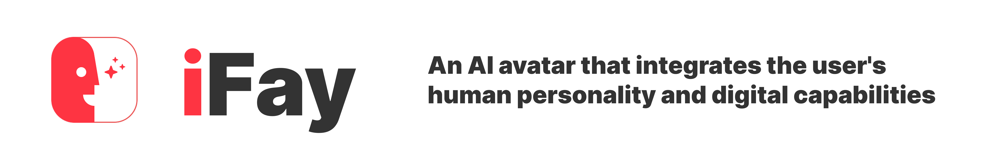

iFay (Intellect Fay) is a digital co-brain for humans. It fuses human cognition with AI computing power to deliver proactive prediction services. Instead of requiring users to manually operate external applications, APIs, MCPs, or hardware, iFay takes over execution. 

---

1. [Definition](./Definition)- 
Here, the definition of iFay and an overview of its structure are provided. We have briefly analyzed the differences between iFay and the current concept of Agent, as well as the principles behind its operational characteristics.

---

2. [iFay Application Scenarios](./iFay-Application-Scenarios)- 
It explains the entire process of actually using iFay from scratch. It lists typical examples of how using iFay changes daily life and system call relationships.

    - [Injecting Ontological Characteristics Into iFay](./iFay-Application-Scenarios#injecting-ontological-characteristics-into-ifay)
    - [Supplementing iFay with External Capabilities](./iFay-Application-Scenarios#supplementing-ifay-with-external-capabilities)
    - [Human-iFay Interaction Methods](./iFay-Application-Scenarios#human-ifay-interaction-methods)
        - [How to Activate iFay](./iFay-Application-Scenarios#how-to-activate-ifay)
        - [iFay's Autonomous Consciousness](./iFay-Application-Scenarios#ifays-autonomous-consciousness)
        - [How to Close iFay](./iFay-Application-Scenarios#how-to-close-ifay)
    - [iFay's Social Functions](./iFay-Application-Scenarios#ifays-social-functions)
    - [Security](./iFay-Application-Scenarios#security)
    - [Shaping the AI Industrial Ecosystem](./iFay-Application-Scenarios#shaping-the-ai-industrial-ecosystem)

---

3. [Human to iFay](./Human-to-iFay)- 
Due to the original design intention of iFay, it is determined to be affiliated with a specific natural person. Therefore, this section explains how to inject the characteristics of its human host into iFay.

    - [Host Character](./Human-to-iFay#host-character)
    - [Host Data](./Human-to-iFay#host-data)
    - [Host Authority](./Human-to-iFay#host-authority)

---

4. [iFay Profile](./iFay-Profile)- 
iFay is designed as a super AI entity that is attached to and surpasses human characteristics. To depict the portrait of iFay, a semantically interpretable attribute table is required. This attribute table will be used for identification by humans and systems, as well as for one iFay to recognize another iFay. This attribute table is the iFay Profile.

    - [iFay Identity](./iFay-Profile#ifay-identity)
    - [Ego Model](./iFay-Profile#ego-model)
    - [Faying Thought](./iFay-Profile#faying-thought)
        1. [Content](./iFay-Profile#content)
        2. [Data](./iFay-Profile#data)
        3. [Knowledge Base](./iFay-Profile#knowledge-base)
        4. [Info Feed](./iFay-Profile#info-feed)
    - [Faying Skill](./iFay-Profile#faying-skill)
        1. [API](./iFay-Profile#api)
        2. [Workflow](./iFay-Profile#workflow)
        3. [Bot](./iFay-Profile#bot)
        4. [Agent](./iFay-Profile#agent)
        5. [APP](./iFay-Profile#app)
        6. [Microservice](./iFay-Profile#microservice)
    - [Faying Hardware](./iFay-Profile#faying-hardware)
        1. [Device](./iFay-Profile#device)
        2. [Storage](./iFay-Profile#storage)
        3. [Computing](./iFay-Profile#computing)
    - [Faying Authority](./iFay-Profile#faying-authority)
        1. [SSO](./iFay-Profile#sso)
        2. [OAuth](./iFay-Profile#oauth)
        3. [Fingerprint](./iFay-Profile#fingerprint)

---

5. Cases  
We will provide a series of cases to demonstrate how iFay is created and how systems interface with iFay.
