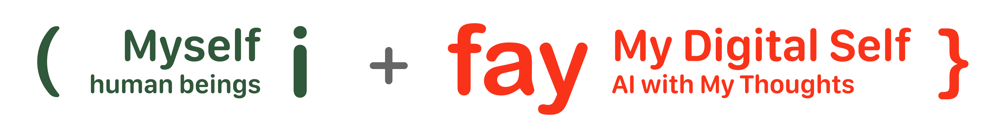
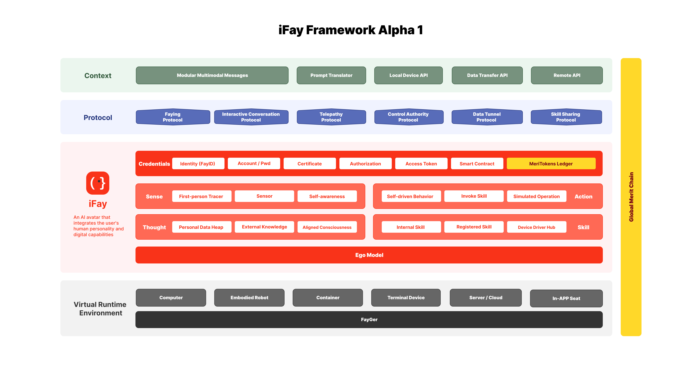

**iFay (Individual Fay) is an AI avatar that integrates the user's human personality and digital capabilities.**

# Our Vision
is to make digital avatars (We collectively call them Fays) indispensable members of society in the AI era.

 

🔆 iFay will undertake the following **social values**:
1. Take over the mechanical, repetitive, dangerous labor and tedious auxiliary work of the host.
2. Improve the host's safety guarantee, health and quality of life.
3. Amplify the host's social value and obtain corresponding returns.

 

✅ iFay must follow the following **basic principles**:
1. Comply with social ethics and public order.
2. Align highly with the host (values, preferences, skills, permissions, power, responsibilities, habits, style), subject to Article 1.
3. Under Articles 1 and 2, control/take over/possess hardware/software, act autonomously, and always protect the host’s rights.
4. Communicate efficiently with humans (including the host) and minimize ineffective interactions.
5. iFay can communicate telepathically (no interface) for higher efficiency and accuracy.

 

---

# 🤖 Foresee the Future
### 📣 iFay will become an identity identifier
iFay is designed as an accessory to a specific natural person. The relationship between iFay and a natural person is similar to the relationship between a phone number, email address, Facebook account and a natural person. 

### 📣 Strongly bound to a natural person
iFay is merely the avatar of a specific natural person and cannot operate in a free state. When it is "Faying" with a natural person, iFay is activated; when it is in a state of "Separating" from the host, it enters a dormant state.

### 📣 A large number of public service Fays emerge
coFay is designed to fulfill a public role, such as police officer, doctor, teacher, etc. Of course, it can be further specialized, such as IELTS tutors, child psychologists, and so on. 

### 📣 iFay and coFay can communicate telepathically
Any iFay may seek assistance from other iFays and coFays, with mutual collaboration to accomplish tasks. Communication between Fays eliminates UI-induced information loss, enabling higher efficiency and accuracy. 

### 📣 iFay becomes the primary interface of the virtual world
Humans no longer need to operate hardware and software interfaces to trigger certain functions. they only need to tell iFay the host's motives and expectations. iFay can directly take over the hardware and software to achieve the goal. iFay can even anticipate the host's thoughts without the host explicitly stating them.

### 📣 Rewards based on contributions
Since most of the work is done by Fays, it is possible to track the process, results, and evaluations of all work. Ideally, Fays will agree on a price in advance before starting to perform tasks. From this perspective, there will be no situations where someone takes money without doing the work, or where the value is artificially inflated.

### 📣 The productivity of Fays determines the wealth of their hosts.
Just like the tycoons who first built factories, railways, and oil wells, Fays are the true source of wealth.

 

---

# ⁉️ Why do I use "Fay" instead of "Agent" as the name

 

iFay differs from the definition of Agent:
- ***Agent***: Considered an application form with specific intelligent functions. When different users like Isabel and Milson use the same Agent, the Agent will exhibit the same values and functionality.
- ***iFay***: Has distinct personal characteristics. For example, for a human user like Isabel, she can name her iFay "Chabela." You can think of Chabela as an enhanced version of Isabel. She not only possesses Isabel's personality, preferences, knowledge background, memories, etc. As Isabel's host, she can also artificially add more professional knowledge and skills to Chabela, making her more powerful.

 

---

# 💡 Framework of iFay

iFay is a runnable intelligent agent instance that requires 3 + 1 core technical layers to operate effectively. We call this the CPE + M framework, built from the ground up:
- _**Context (C)**_: The external environment in which iFay perceives and acts.
- _**Protocol (P)**_: A unified, structured semantic definition that allows software developers, hardware manufacturers, and Fay trainers to communicate seamlessly without custom point-to-point integrations.
- _**Environment (E)**_: Conceptually similar to Docker. Any Fay—regardless of its development language—can be packaged into a standard container and executed within a FayGer runtime (like a JRE-style virtual environment) across platforms and devices. This enables Fays to be embedded anywhere, on any software or hardware.

To incentivize both humans and Fays to make valuable contributions, there’s a fourth layer that cuts across all three layers:
- _**Merit (M)**_: The Global Merit Chain tracks, measures, and evaluates contributions, rewarding contributors with MeriTokens. Contributions are not limited to iFays and coFays—they also include providing information assembly services, APIs, devices, runtime environments, or any other recognized value-added input.

iFay itself is composed of 6 core components, structured into 4 layers (as shown in the orange part of the above diagram):
- Social Layer
- Interaction Layer
- Cognition Layer
- Ego Layer

 

---

## 🤝 Social Layer
It’s called the Social Layer because it governs iFay’s relationships with humans, devices, resources, and assets.

This layer defines what iFay is authorized to do.
In the early stages of the project ( see [Roadmap Phase 1](./Roadmap:-5-steps) ), its implementation focused solely on [credential-management](./Roadmap--5-steps#2-credential-management).

 

## 🖱 Interaction Layer
This layer serves as iFay’s interface with the external world.

Much like the human body, it allows iFay to act on and perceive its environment.

Accordingly, it consists of two main components:

### Sense
You can think of this layer as iFay’s sensory system — its eyes, ears, touch, and emotional state.
To enable this, we need at least 3 core modules:
- _**First-person Tracer**_: Simulates the host’s first-person perspective — e.g., what the host sees on a screen or interface.
- _**Sensor**_: A generalized concept similar to the human nervous system, but with much broader coverage, capable of integrating with any external sensor.
- _**Self-awareness**_: While the First-person Tracer looks outward, this module looks inward—monitoring the host’s reactions to infer intent, much like a skilled assistant reading their boss’s facial cues.

### Action
You can think of this layer as iFay’s motor system — its hands, feet, mouth, etc. Through it, iFay can control hardware and software. It includes at least three modules:
- _**Simulated Operation**_: Mimics the human host’s actions, ensuring iFay can operate traditional interfaces like a person when needed.
- _**Invoke Skill**_: Directly triggers a specific skill or executes a task, similar to a function call or API invocation.
- _**Self-driven Behavior**_: Represents instrument-free actions, like running or push-ups — analogous to scheduled tasks or time-triggered operations in system design.

 

## 🧠 Cognition Layer
This layer defines what iFay understands, remembers, knows, and is capable of doing.

### Thought
This layer represents iFay’s cognitive capacity. It encompasses the host user’s data and iFay’s personal data, functioning as long-term persistent memory.

It also includes external knowledge sources — think of these as information a person should know but has forgotten or never fully learned. iFay provides a mechanism to recover and integrate this knowledge.

### Skill
This represents capabilities, expertise, and permissions.

Important distinction:
- Skill = what iFay can do
- Action = iFay actually doing it

 

## 🧬 Ego Layer
This layer is responsible for shaping iFay’s personality.
For details, refer to [Ego Model](https://github.com/ChainModePilot/iFay/wiki#5-ego-model).

