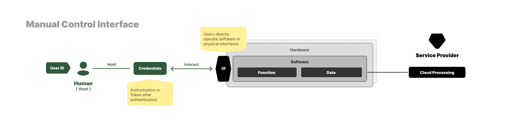
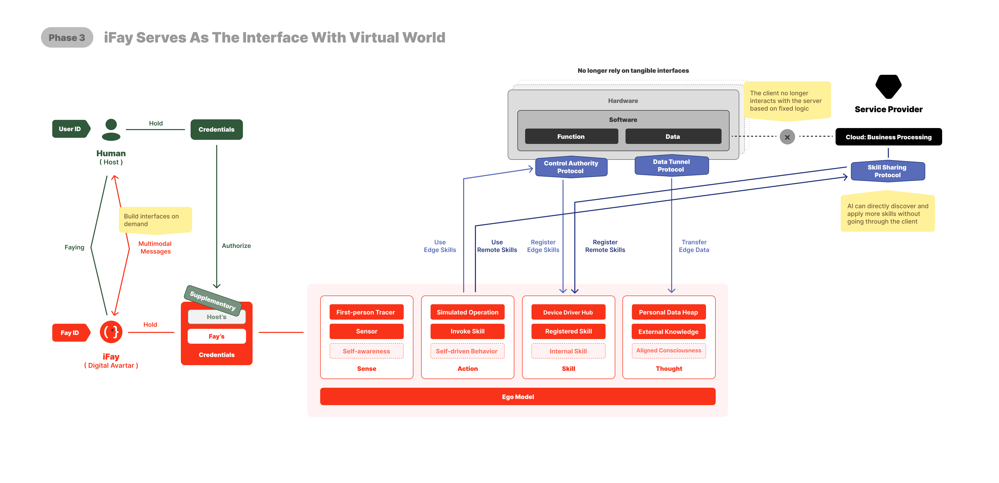

We are still in the “human-operated era” — where both hardware and software rely on people interacting through interfaces to drive devices and execute functions.

Currently, the relationship between humans, devices, and service providers looks exactly like the diagram above.

 

---

## 1️⃣ Phase I ：Simulate Human Operations
On top of the existing software and hardware architecture, we enable iFay to mimic human UI operations. 

To make this work, we need to achieve at least 2 things:
1. Credential Delegation: Human users must be able to securely authorize iFay to use their [credentials](./Definition-and-Concept#clarification-of-general-concepts) (accounts, passwords, certificates, access permissions, contracts, etc.) through a controlled and auditable delegation mechanism.
2. Interaction with iFay: Primarily through conversational interfaces. However, careful design is required—when tasks involve higher interaction complexity or precision, structured interfaces may be more efficient than pure chat.

 

Based on the above ideas, when we release iFay v1.0, it will include the following 5 modules(that is, the orange part in the figure below):

### 1. FayID
This is the unique identifier of an iFay. In fact, both iFay and [coFay](https://github.com/ChainModePilot/coFay/wiki) are assigned a unified unique ID.

The purpose of this is to ensure a smooth identity transition when a personal iFay eventually takes on meaningful social roles—much like how some individual YouTubers evolve to play significant roles in public discourse and civic education.

Here we address two core issues:
- _**FayID Generation & Management**_: Fays will scale exponentially, eventually surpassing the number of human users. This requires a scalable, user-friendly, and easily recognizable ID generation and management mechanism.
- _**Activation State**_: To ensure iFays never operate outside their human host’s awareness or intent, we define strict activation rules. No iFay should act autonomously without explicit intent. This is governed by the open-source [Faying Protocol](https://github.com/ChainModePilot/Faying-Protocol/wiki), which specifies how a natural person and an iFay are securely paired, and under what conditions an iFay is authorized to operate in an active state.

### 2. Credential Management
Here, "Credential" is a generalized concept. For a natural person user, most of the time, the user must hold one or more tickets to have the right to use hardware or software. The following 7 types are collectively referred to as credentials (more types may be added with iterations):
- Identity（FayID）
- Account / Password
- Certificate
- Authorization
- Access Token
- Smart Contract
- Digital tokens ([MeriTokens](https://github.com/ChainModePilot/Global-Merit-Chain/wiki))

Attention: Initially, all these tickets come from the host user. For greater security and easier management, all credentials from the host will be exchanged for a copy corresponding to the original credential. iFay uses this copy for login and authentication.

Of course, we do not believe that iFay cannot have its own credentials while the host cannot use them. Therefore, each type of credential will indicate whether its original owner is the host or iFay itself.

For example: When we need to verify the authenticity of personal information provided by someone, we may authorize iFay to directly log into the database for inquiry. To prevent the leakage of private data, iFay only needs to feedback whether it is true or false. 

### 3. First-Person Tracer
To enable iFay to work directly with existing software—without waiting for every application to be redesigned for AI must have at least visual and auditory capabilities.

We emphasize vision over parsing structured documents (e.g., HTML) because many document elements are not perceptible to humans. Hidden elements, such as SEO keyword stuffing, often add no real value to the user experience.

By aligning its sensory perception with that of its human host, iFay can make judgments and decisions that closely mirror human intent.

The key challenge lies in enabling hand–eye coordination for iFay. Visual and auditory perception must go beyond passively processing software feedback — iFay also needs to track changes resulting from its own actions.

For example, it must follow cursor movements, detect newly exposed areas after a window is moved, and adapt to dynamic interface shifts. This requires first-person perspective tracking tightly coupled with simulated interactions, ensuring iFay perceives and reacts to the environment as a human operator would.

### 4. Simulated Operation
Here, we specifically refer to simulating human-like interactions with the UI. iFay doesn’t just click—it may drag, scroll, perform edge gestures, or multi-finger gestures, depending on the interface components.

The core challenge is that customizing an operation sequence for every interface is infeasible. Instead, iFay’s simulated interactions must also emulate human exploration of the interface, using feedback from first-person perspective tracing to determine which actions are possible or effective. This approach differs fundamentally from traditional RPA implementations, which rely on pre-defined scripts rather than adaptive, perception-driven exploration.

### 5. Ego Model
We call it **[Ego](https://github.com/ChainModePilot/Ego/wiki)**, emphasizing that it is not a large AGI model. Ego is aligned with the profile of a specific individual or role.

Many ultra-large models aiming for AGI face a key limitation: no matter how broad their knowledge and skills, they cannot fully satisfy the unique preferences and context of every person or scenario.

Ego provides a baseline paradigm, constraining (but not limited to) the following dimensions:
- Value orientation
- Interest preferences
- Habits
- Cognitive boundaries
- Skill boundaries
- Permission boundaries
- Working style

It should be noted that embedding the Ego Model does not prevent iFay from leveraging external skills or other large models. The decision to include a mini model internally is based on two considerations:
1. _**Offline device control**_: In scenarios where terminal devices are not connected to the internet, the embedded mini model enables local, near-field device control.
2. _**Personality stability**_: It prevents sudden personality shifts in iFay caused by large model updates or deliberate tampering, ensuring the Ego remains consistent.

 

---

## 2️⃣ Phase II ：Direct Takeover Client
While AI simulation of UI operations boosts efficiency, visual interfaces remain limiting:

- 😖 _**Information loss**_: Limited views and static elements hinder effective communication.
- 😤 _**High learning cost**_: Inconsistent interfaces across providers force users to learn multiple interaction patterns.
- 😣 _**Interface rigidity**_: Once hardware or software designs a UI, it is fixed in the current version. Users must re-learn the interface when using different devices or applications.
- 😰 _**Low information transfer efficiency**_: Intent must be translated into a visual interface before being fed back to the machine through user actions.
- 🙄 _**High development cost**_: Building functional UIs requires cross-disciplinary(e.g., PMs, UI/UE, frontend R&D) coordination.

In contrast, if terminal devices support a client protocol (as shown above), iFay can directly control the hardware or software. This approach addresses all five issues above:
- 😜 _**Unlimited output**_: Information is no longer constrained by UI display limitations.
- 😍 _**Intent-based interaction**_: Users express intent, and iFay translates it into API calls or commands.
- 🤣 _**Rich data, concise delivery**_: Terminals can output rich, structured data, which iFay filters and summarizes into clear, essential information.
- 😇 _**Direct transmission**_: No visual rendering required, enabling more efficient data flow.
- 😘 _**No frontend needed**_: UI design and development can be minimized or even eliminated.

I did set two protocols here that apply to terminals:
- [Control Authority Protocol(CAP)](https://github.com/ChainModePilot/Control-Authority-Protocol/wiki):It is used to take over the hardware and specific software of the terminal, directly call drivers, local interfaces, and commands, with the purpose of enabling iFay to control the terminal.
- [Data Tunnel Protocol(DTP)](https://github.com/ChainModePilot/Data-Tunnel-Protocol/wiki): This is a bidirectional transmission protocol:
  - _**Terminal → iFay**_: Persistent user data storage and data guardianship.
  - _**iFay → Terminal**_: Data enrichment and personalized processing.

In the diagram below, the blue sections correspond to these two protocols, targeting device functionality and data respectively.

Compared to [Phase I](https://github.com/ChainModePilot/iFay/wiki#1%EF%B8%8F%E2%83%A3-phase-i-simulate-human-operations), iFay has added five new internal modules, starting with:

 

### Sense → Sensor
The Sensor must be implemented on top of the Authority Protocol and Data Tunnel Protocol. It serves as the bridge to terminal device sensors, receiving data streams from the external environment — which is why we call it iFay’s nervous system.

Crucially, iFay doesn’t need to process all incoming data at all times. The Sensor can dynamically adjust its sensitivity to better match the surrounding context.

Think of the Sensor as a sensitivity regulator. The actual interface to the outside world is managed by Device Driver Hub and Personal Data Heap.

 

### Skill → Device Driver Hub
To clarify, this is not a single device driver nor a collection of drivers.

It functions as a driver hub layer, ensuring that as new device drivers are continuously integrated, iFay’s internal architecture remains stable and does not require modification with each update.

 

### Skill → Registered Skill
Registration is a prerequisite for any iFay Action.

When a Skill is registered with iFay, it means iFay can invoke it at any time. Registration goes beyond simple record-keeping — it often serves as a pre-authorization step, ensuring that no extra authentication is needed during execution, thus reducing latency.

Another key benefit is offline resilience: when iFay is offline, it can cache pending Actions and execute them asynchronously once the connection is restored.

 

### Thought → Personal Data Heap
This component is responsible for managing all of iFay’s private data in a unified way. It supports multiple storage formats and locations — for example, part of the data may reside in iFay’s runtime memory, part in Google Drive, and part in a dedicated vector database.

From iFay’s internal perspective, it only needs to read from and write to the Heap, regardless of where or how the data is physically stored.

 

### Action → Invoke Skill
This is iFay’s primary Action — essentially, you can think of it as a call or invocation behavior.

 

---

## 3️⃣ Phase III ：iFay Serves As The Interface With Virtual World

With iFay taking over, the client–server (C/S) architecture evolves into a client–Fay–server (C/F/S) model.
Users no longer need to operate the client manually to access backend services — instead, iFay can directly capture and utilize open services over the Internet.

To achieve this goal, the services and interfaces that were previously exposed only to clients should be made accessible to the entire network through a standardized Remote Protocol. 

This Remote Protocol is exactly the [Skill Sharing Protocol](https://github.com/ChainModePilot/Skill-Sharing-Protocol/wiki) shown in the diagram below.

As shown in the diagram, iFay takes control of both the client side (edge devices) and the server side (or cloud services). 

The host only needs to communicate with their own iFay, which then invokes the required services based on the host’s intent.

Since the interface through which the host views information is composed and rendered by iFay, it effectively plays the role of a browser.

Since the core motivation for introducing iFay is to make it an intelligent extension beyond the host, its enhanced capabilities are achieved through Registered Skills.
In the realm of Thought, we introduce the following module:

 

### Thought → External Knowledge

From an implementation perspective, we treat external knowledge bases and models as a type of Skill, enabling iFay to access external intelligence as if it were consulting a knowledge hub or an expert advisor.
Knowledge and information acquired through this Skill are managed together with iFay’s Personal Data, ultimately enabling intelligence that surpasses the host’s own capabilities.

 

---

## 4️⃣ Phase IV ：iFay + coFay - Comprehensive Personification of Software

At this stage, the embodiment of Fays is essentially complete.
However, they still lack the ability to act autonomously like real members of society.
To enable iFay to operate independently and effectively, 2 key conditions must be met:
- Internal: iFay must develop self-driven dynamics — a continuous Action → Feedback → Re-action loop.
- External: iFay and coFay must be widely adopted and capable of communicating in a shared language.
With this foundation, an iFay can collaborate with humans, other iFays, or its dedicated coFay to autonomously execute predefined tasks.

To achieve this, we need to embed self-driving capabilities into the four core modules — Sense, Action, Skill, and Thought.

 

### Sense → Self-awareness
A true living being doesn’t just sense—it feels.
Unlike machines, iFay itself cannot possess real emotions. But by observing its host and the surrounding context, it can infer feelings from perception.
This is the core strategy behind building iFay Self-awareness.

 

### Action → Self-driver Behavior
Since iFay needs to handle tasks autonomously, it must have its own behavior-triggering mechanism.
These triggers can originate from:
- Scheduled tasks
- Self-awareness inferences
- Persistent Skills, including both Registered and Internal Skills.

 

### Skill → Internal Skill
We introduce an Internal Skill module for three main purposes:
- To establish habits aligned with the host’s personality, including potential restrictions or governance over external Skills.
- To provide an introspection mechanism that ensures external knowledge never conflicts with the host’s intent.
- To embed fixed, host-specific capabilities such as professional expertise.

 

### Thought → Aligned Consciousness
In essence, this represents a complete description of the host’s personal profile.
It can be established through three main approaches (with potential for more):
- Mining data from the Personal Data Heap.
- Real-time adjustment through Self-awareness.
- Manual definition by the host.

 

However, this alone isn’t enough for iFay to integrate into social relationships.
To achieve that, we need to equip iFay with communication capabilities, which involve two core protocols:
- [Telepathy Protocol](https://github.com/ChainModePilot/Telepathy-Protocol/wiki) — A Fay-friendly semantic communication protocol that removes the UI translation layer, allowing meaning and intent to be transmitted directly between iFay and coFay. Instead of structured text, it uses agreed-upon tokens encoded as vectors.
- [Interactive Conversation Protocol](https://github.com/ChainModePilot/Interactive-Conversation-Protocol/wiki) — A human-UI-friendly protocol that modularizes and multimodalizes semantic content, enabling client interfaces to reconstruct easily readable, user-friendly message presentations.

 

---

## 5️⃣ Phase V ：Fays Transforms The Labor Structure And Value Distribution Model

Ultimately, our goal is to build an ecosystem with strong social attributes, rather than treating AI as a more advanced tool.
This new form of society will inevitably differ from human society as we know it today.
We can foresee at least 5 fundamental shifts:
1. _**Human labor withdrawal**_ — Programmatic work will be fully taken over by AI and robots, driving human resource costs toward zero.
2. _**Knowledge flattening**_ — Professional knowledge and expertise will be equalized by AI, making the supply chain radically flatter.
3. _**Universal survival security**_ — Everyone will have access to basic living resources, removing the need to work for survival.
4. _**New value creation**_ — Human participation will be concentrated in meaning-making, human-centric craftsmanship, and the AI + robotics production ecosystem.
5. _**New social stratification**_ — Ownership of autonomous productive resources will become the new driver of wealth and class divisions.

This will fundamentally reshape the economic ecosystem built on the ownership of physical resources (i.e., the means of production).
From an economic perspective, 2 major shifts will emerge:
- _**Minimal human involvement in the physical economy**_ — very few people will directly participate in traditional production activities.
- _**A sharp increase in the unit value of human labor**_ — unless human work is highly valued, humans will completely withdraw from physical labor.

When the majority of people are immersed in virtual work, traditional metrics of value — such as working hours, monetary income, or physical quantity of goods — become insufficient.
Measuring social value therefore requires a consensus mechanism, similar to how auctions determine the value of art or stocks. Auctions are just one way to establish consensus.

To maintain this consensus, a dedicated platform is needed. Currently, blockchain is a suitable choice, with years of accumulated experience.

We quantify social merits in a unified unit(μ, Merit Uni) and issue corresponding digital tokens(MeriToken) on the blockchain, forming what we call the [Global Merit Chain](https://github.com/ChainModePilot/Global-Merit-Chain).

In the future, the way to obtain MeriTokens will not rely on burning computing power to complete the technical work of the blockchain, but on creating social value.

---