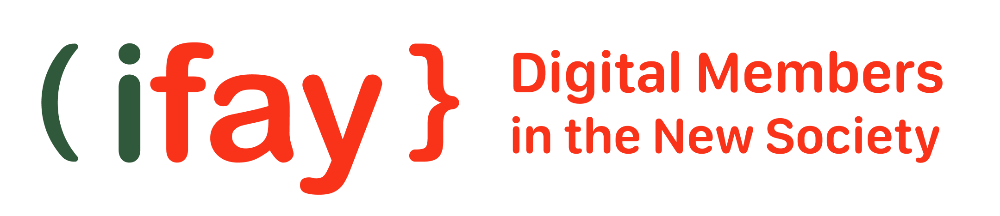

iFay (Individual Fay) is an AI avatar that integrates the user's human personality and digital capabilities.

- #### Overview

  - [Our Vision](https://github.com/ChainModePilot/iFay/wiki#our-vision)
  - [Foresee the Future](https://github.com/ChainModePilot/iFay/wiki#-foresee-the-future)
  - [Vocabulary: Definition & Concept](./Definition-and-Concept)
  - [Why is "Fay"](https://github.com/ChainModePilot/iFay/wiki#%EF%B8%8F-why-do-i-use-fay-instead-of-agent-as-the-name)
  - [Framework of iFay](https://github.com/ChainModePilot/iFay/wiki#-framework-of-ifay)
  - [Roadmap: 5 steps](./Roadmap--5-steps)
    - [Phase 1：Simulate Human Operations](./Roadmap--5-steps)
    - [Phase 2：Direct Takeover Client](./Roadmap--5-steps#2%EF%B8%8F%E2%83%A3-phase-ii-direct-takeover-client)
    - [Phase 3：iFay Serves As The Interface With Virtual World](./Roadmap--5-steps#3%EF%B8%8F%E2%83%A3-phase-iii-ifay-serves-as-the-interface-with-virtual-world)
    - [Phase 4：iFay + coFay - Comprehensive Personification of Software](./Roadmap--5-steps#4%EF%B8%8F%E2%83%A3-phase-iv-ifay--cofay---comprehensive-personification-of-software)
    - [Phase 5：Fays Transforms The Labor Structure And Value Distribution Model](./Roadmap--5-steps#5%EF%B8%8F%E2%83%A3-phase-v-fays-transforms-the-labor-structure-and-value-distribution-model)

- #### iFay Entity

  - Social Layer
    - [Credentials Management](./Credentials-Management)
  - Interaction Layer
    - Sense Organ
      - [First-person Tracer](./First%E2%80%90person-Tracer)
      - [Sensor](./Sensor)
      - [Self-awareness](./Self%E2%80%90awareness)
    - Action Organ
      - [Simulated Operation](./Simulated-Operation)
      - [Invoke Skill](./Invoke-Skill)
      - [Self-driven Behavior](./Self%E2%80%90driven-Behavior)
  - Cognition Layer
    - Thought Region
      - [Personal Data Heap](./Personal-Data-Heap)
      - [External Knowledge](./External-Knowledge)
      - [Aligned Consciousness](./Aligned-Consciousness)
    - Skill Region
      - [Device Driver Hub](./Device-Driver-Hub)
      - [Registered Skill](./Registered-Skill)
      - [Internal Skill](./Internal-Skill)
  - Ego Layer
    - [Ego Mini Model](https://github.com/ChainModePilot/Ego/wiki)

- #### Developer Guide
  - Open source project Developer
    - Data Model
    - FayGer( Virtual Runtime Environment )
      - Cross-language build tool
      - Cross-platform runtime container
    - Protocols
      - [Faying Protocol](https://github.com/ChainModePilot/Faying-Protocol/wiki)
      - [Interactive Conversation Protocol](https://github.com/ChainModePilot/Interactive-Conversation-Protocol/wiki)
      - [Telepathy Protocol](https://github.com/ChainModePilot/Telepathy-Protocol/wiki)
      - [Control Authority Protocol](https://github.com/ChainModePilot/Control-Authority-Protocol/wiki)
      - [Data Tunnel Protocol](https://github.com/ChainModePilot/Data-Tunnel-Protocol/wiki)
      - [Skill Sharing Protocol](https://github.com/ChainModePilot/Skill-Sharing-Protocol/wiki)
  - Application Developer
    - APP support Fayling with iFay
    - Hardware Device support Fayling with iFay
    - Cloud deploy FayGer runtime environments
    - Share Skills with iFay
    - Modular Multimodal Messages
  - Service Provider Developers
    - Develop and build iFay Entities

- #### [iFay Application](./iFay-Application-Scenarios)
  - Obtain your own iFay
  - Faying: Connect with iFay
  - Interact with iFay
  - Use iFay to operate UI
    - Configure iFay’s attention
    - Teach iFay interface operations using natural language
    - Let iFay act autonomously
  - Take over client
    - Control hardware devices
    - Control software

