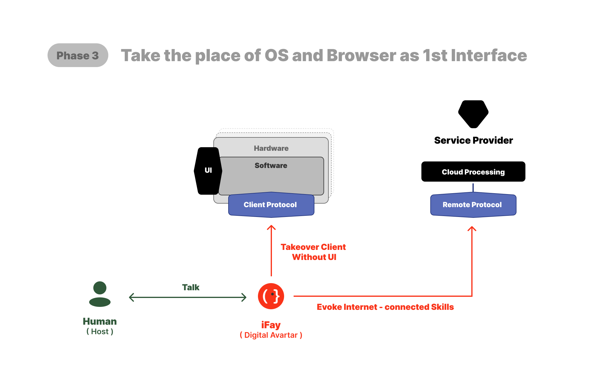

# 4. Hoja de ruta: 5 fases

Todavía estamos en la "Era de operación humana" — el hardware y software dependen de que los humanos interactúen a través de interfaces para operar dispositivos y ejecutar funciones.

Actualmente, la relación entre humanos, dispositivos y proveedores de servicios es como se muestra en el diagrama anterior.

 

---

## 1️⃣ Fase 1: Simulación de operaciones humanas
Sobre la arquitectura existente de hardware y software, dejamos que iFay simule las operaciones de UI humanas.

Para lograr esto, necesitamos cumplir al menos 2 cosas:
1. Delegación de Credenciales: Los usuarios humanos deben poder autorizar de forma segura a iFay para usar sus [credenciales](./2-Definición-y-concepto#aclaraciones-de-conceptos-generales) (cuentas, contraseñas, certificados, permisos de acceso, contratos, etc.) a través de un mecanismo de delegación controlable y auditable.
2. Interactuar con iFay: Principalmente a través de una interfaz conversacional. Sin embargo, se necesita un diseño cuidadoso — cuando las tareas involucran mayor complejidad de interacción o precisión, las interfaces estructuradas pueden ser más eficientes que el chat puro.

 

Basándonos en el pensamiento anterior, cuando lancemos iFay v1.0, incluirá los siguientes 5 módulos (las secciones naranjas en el diagrama a continuación):

### 1. FayID
Este es el identificador único de iFay. De hecho, tanto iFay como [coFay](https://github.com/ChainModePilot/coFay/wiki) reciben IDs únicos unificados.

El propósito es asegurar que cuando los iFays personales eventualmente asuman roles sociales significativos, la identidad pueda transicionar suavemente — así como algunos YouTubers individuales evolucionan hasta jugar roles importantes en el discurso público y la educación cívica.

Aquí abordamos dos problemas centrales:
- _**Generación y gestión de FayID**_: Los Fays crecerán exponencialmente, eventualmente excediendo el número de usuarios humanos. Esto requiere un mecanismo de generación y gestión de IDs escalable, amigable para el usuario y fácilmente reconocible.
- _**Estado de activación**_: Para asegurar que iFay nunca opere sin el conocimiento o intención del Human Prime, definimos reglas estrictas de activación. Ningún iFay debe actuar autónomamente sin intención explícita. Esto se rige por el [Protocolo Faying](https://github.com/ChainModePilot/Faying-Protocol/wiki) de código abierto, que especifica cómo las personas naturales e iFay se emparejan de forma segura, y bajo qué condiciones iFay está autorizado a operar en estado activado.

### 2. Gestión de Credenciales
"Credenciales" aquí es un concepto amplio. Para los usuarios personas naturales, la mayor parte del tiempo, los usuarios deben poseer uno o más tickets para tener derecho a usar hardware y software. Los siguientes 7 tipos se denominan colectivamente credenciales (se pueden añadir más tipos con la iteración):
- Identificador de identidad (FayID)
- Cuenta / Contraseña
- Certificado
- Autorización
- Token de acceso
- Contrato inteligente
- Token digital ([MeriTokens](https://github.com/ChainModePilot/Global-Merit-Chain/wiki))

Nota: Inicialmente, todos estos tickets provienen del usuario Human Prime. Para mayor seguridad y gestión más conveniente, todas las credenciales del Human Prime se intercambiarán por copias correspondientes a las credenciales originales. iFay usa estas copias para inicio de sesión y autenticación.

Por supuesto, no asumimos que iFay no pueda poseer sus propias credenciales que el Human Prime no puede usar. Por lo tanto, cada tipo de credencial indica si su propietario original es el Human Prime o el propio iFay.

Por ejemplo: Cuando necesitamos verificar la autenticidad de información personal proporcionada por alguien, podríamos autorizar a iFay para acceder directamente a una base de datos para consultar. Para prevenir la filtración de datos privados, iFay solo necesita devolver si es verdadero o falso.

### 3. Rastreador en primera persona
Para permitir que iFay trabaje directamente con el software existente — en lugar de esperar a que cada aplicación sea rediseñada para IA — iFay debe tener al menos capacidades visuales y auditivas.

Enfatizamos la percepción visual sobre el análisis de documentos estructurados (como HTML), porque muchos elementos de documentos son imperceptibles para los humanos. Los elementos ocultos, como el relleno de palabras clave SEO, típicamente no añaden valor real a la experiencia del usuario.

Al alinear su percepción sensorial con el Human Prime, iFay puede hacer juicios y decisiones que coinciden estrechamente con la intención humana.

El desafío clave es lograr la coordinación ojo-mano para iFay. La percepción visual y auditiva debe ir más allá del procesamiento pasivo de la retroalimentación del software — iFay también necesita rastrear los cambios causados por sus propias operaciones.

Por ejemplo, debe rastrear el movimiento del cursor, detectar áreas recién expuestas después del movimiento de ventanas y adaptarse a cambios dinámicos de la interfaz. Esto requiere un acoplamiento estrecho entre el seguimiento de perspectiva en primera persona y la interacción simulada, asegurando que iFay perciba y responda al entorno como un operador humano.

### 4. Operación simulada
Aquí nos referimos específicamente a simular la interacción humana con UIs. iFay no solo hace clic — puede arrastrar, desplazar, realizar gestos de borde o gestos multitáctiles, dependiendo de los componentes de la interfaz.

El desafío central es que personalizar secuencias de operación para cada interfaz es inviable. En cambio, la interacción simulada de iFay también debe simular la exploración humana de interfaces, usando la retroalimentación del seguimiento de perspectiva en primera persona para determinar qué operaciones son viables o efectivas. Este enfoque difiere fundamentalmente de las implementaciones RPA tradicionales, que dependen de scripts predefinidos en lugar de exploración adaptativa guiada por percepción.

### 5. Modelo Ego
Lo llamamos **[Ego](https://github.com/ChainModePilot/Ego/wiki)**, enfatizando que no es un modelo AGI grande. Ego se alinea con el perfil de un individuo o rol específico.

Muchos modelos super-grandes que persiguen AGI enfrentan una limitación clave: sin importar cuán extensos sean sus conocimientos y habilidades, no pueden satisfacer completamente las preferencias y contexto únicos de cada persona o escenario.

Ego proporciona un paradigma base que restringe (pero no se limita a) las siguientes dimensiones:
- Orientación de valores
- Preferencias de interés
- Hábitos
- Límites cognitivos
- Límites de habilidades
- Límites de permisos
- Estilo de trabajo

Es importante notar que integrar el Modelo Ego no impide que iFay aproveche habilidades externas u otros modelos grandes. La decisión de incluir un micro-modelo interno se basa en dos consideraciones:
1. _**Control de dispositivos sin conexión**_: En escenarios donde los dispositivos terminales no están conectados a internet, el micro-modelo integrado soporta el control local de dispositivos de campo cercano.
2. _**Estabilidad de personalidad**_: Previene cambios repentinos de personalidad en iFay debido a actualizaciones de modelos grandes o manipulación deliberada, asegurando que Ego permanezca consistente.

 

---

## 2️⃣ Fase 2: Toma de control directo del cliente
Si bien la IA simulando operaciones de UI mejora la eficiencia, las interfaces visuales aún tienen limitaciones:

- _**Pérdida de información**_: Las vistas limitadas y los elementos estáticos dificultan la comunicación efectiva.
- _**Alto costo de aprendizaje**_: Las interfaces inconsistentes entre proveedores obligan a los usuarios a aprender múltiples patrones de interacción.
- _**Rigidez de interfaz**_: Una vez que el hardware/software diseña una UI, queda fija para la versión actual. Los usuarios deben reaprender interfaces al usar diferentes dispositivos o aplicaciones.
- _**Baja eficiencia de transferencia de información**_: La intención debe primero traducirse a una interfaz visual, luego retroalimentarse a la máquina a través de operaciones del usuario.
- _**Alto costo de desarrollo**_: Construir UIs funcionales requiere coordinación interdisciplinaria (ej., gerentes de producto, diseñadores UI/UE, desarrolladores frontend).

En contraste, si los dispositivos terminales soportan protocolos de cliente (como se muestra arriba), iFay puede controlar directamente hardware y software. Este enfoque aborda los cinco problemas:
- _**Salida ilimitada**_: La información ya no está restringida por las limitaciones de visualización de UI.
- _**Interacción basada en intención**_: Los usuarios expresan intención, iFay la traduce en llamadas API o comandos.
- _**Datos ricos, entrega concisa**_: Los terminales pueden producir datos estructurados ricos, iFay los filtra y resume en lo esencial claro.
- _**Transmisión directa**_: No se necesita renderizado visual, permitiendo un flujo de datos más eficiente.
- _**Sin frontend necesario**_: El diseño y desarrollo de UI puede minimizarse o eliminarse.

He definido dos protocolos aplicables a terminales:
- [Protocolo de Autoridad de Control (CAP)](https://github.com/ChainModePilot/Control-Authority-Protocol/wiki): Para Inhabit hardware terminal y software específico, llamando directamente a controladores, interfaces locales y comandos, permitiendo a iFay controlar terminales.
- [Protocolo de Túnel de Datos (DTP)](https://github.com/ChainModePilot/Data-Tunnel-Protocol/wiki): Un protocolo de transmisión bidireccional:
  - _**Terminal → iFay**_: Almacenamiento persistente de datos de usuario y custodia de datos.
  - _**iFay → Terminal**_: Enriquecimiento de datos y procesamiento personalizado.

En el diagrama a continuación, las secciones azules corresponden a estos dos protocolos, dirigidos a la funcionalidad del dispositivo y los datos respectivamente.

Comparado con la [Fase 1](./4-Hoja-de-ruta#1️⃣-fase-1-simulación-de-operaciones-humanas), iFay añade cinco nuevos módulos internos, comenzando con:

 

### Percepción → Sensor
El Sensor debe implementarse sobre el Protocolo de Autoridad de Control y el Protocolo de Túnel de Datos. Sirve como puente hacia los sensores del dispositivo terminal, recibiendo flujos de datos del entorno externo — por eso lo llamamos el sistema nervioso de iFay.

Crucialmente, iFay no necesita procesar todos los datos entrantes en todo momento. El Sensor puede ajustar dinámicamente su sensibilidad para coincidir mejor con el contexto circundante.

Piensa en el Sensor como un regulador de sensibilidad. Las interfaces reales con el mundo externo son gestionadas por el Hub de controladores y el Montón de datos personales.

 

### Habilidades → Hub de controladores
Para aclarar, esto no es un controlador de dispositivo individual, ni una colección de controladores.

Opera como una capa hub de controladores, asegurando que a medida que se integran continuamente nuevos controladores de dispositivos, la arquitectura interna de iFay permanece estable sin necesitar modificación con cada actualización.

 

### Habilidades → Habilidades registradas
El registro es un prerrequisito para cualquier acción de iFay.

Cuando una habilidad se registra en iFay, significa que iFay puede invocarla en cualquier momento. El registro no es solo un simple registro — típicamente sirve como un paso de preautorización, asegurando que no se necesite autenticación adicional durante la ejecución, reduciendo así la latencia.

Otro beneficio clave es la resiliencia sin conexión: cuando iFay está desconectado, puede almacenar en caché las acciones pendientes y ejecutarlas asincrónicamente cuando se restaura la conectividad.

 

### Pensamiento → Montón de datos personales
Este componente es responsable de gestionar todos los datos privados de iFay de manera unificada. Soporta múltiples formatos y ubicaciones de almacenamiento — por ejemplo, algunos datos pueden residir en la memoria de ejecución de iFay, algunos en Google Drive y algunos en una base de datos vectorial dedicada.

Desde la perspectiva interna de iFay, solo necesita leer y escribir en el montón de datos, sin preocuparse por dónde o cómo se almacenan físicamente los datos.

 

### Acción → Invocación de habilidades
Esta es la acción principal de iFay — esencialmente, puedes pensarlo como un comportamiento de invocación.

 

---

## 3️⃣ Fase 3: iFay como interfaz al mundo virtual

A medida que iFay habita el cliente, la arquitectura cliente-servidor (C/S) evoluciona hacia un modelo cliente-Fay-servidor (C/F/S).
Los usuarios ya no necesitan operar manualmente los clientes para acceder a servicios backend — en cambio, iFay puede capturar y aprovechar directamente los servicios abiertos en internet.

Para lograr esto, los servicios e interfaces que anteriormente solo estaban abiertos a clientes deben estar disponibles en toda la red a través de un protocolo remoto estandarizado.

Este protocolo remoto es el [Protocolo de Compartición de Habilidades](https://github.com/ChainModePilot/Skill-Sharing-Protocol/wiki) mostrado en el diagrama a continuación.

Como se muestra, iFay controla tanto el lado del cliente (dispositivos de borde) como el lado del servidor (o servicios en la nube).

El Human Prime solo necesita comunicarse con su propio iFay, y iFay luego invoca los servicios requeridos basándose en la intención del Prime.

Dado que la interfaz a través de la cual el Human Prime ve información es compuesta y renderizada por iFay, efectivamente juega el rol de un navegador.

Dado que la motivación central para introducir iFay es hacerlo una extensión inteligente más allá del Human Prime, sus capacidades mejoradas se logran a través de habilidades registradas.
En el dominio del pensamiento, introducimos el siguiente módulo:

 

### Pensamiento → Conocimiento externo

Desde una perspectiva de implementación, tratamos las bases de conocimiento y modelos externos como un tipo de habilidad, permitiendo a iFay acceder a inteligencia externa como consultar un centro de conocimiento o asesor experto.
El conocimiento e información adquiridos a través de esta habilidad se gestionan junto con los datos personales de iFay, logrando finalmente una inteligencia que supera las propias capacidades del Human Prime.

 

---

## 4️⃣ Fase 4: iFay + coFay — Personificación completa del software

En esta etapa, la encarnación de Fay está esencialmente completa.
Sin embargo, aún carecen de la capacidad de actuar autónomamente como verdaderos miembros de la sociedad.
Para que iFay opere de forma independiente y efectiva, se deben cumplir 2 condiciones clave:
- Interna: iFay debe desarrollar motivación autónoma — un bucle continuo de "acción → retroalimentación → re-acción".
- Externa: iFay y coFay deben ser ampliamente adoptados y capaces de comunicarse usando un lenguaje común.
Con esta base, iFay puede colaborar con humanos, otros iFays o sus coFays dedicados para ejecutar autónomamente tareas predefinidas.

Para lograr esto, necesitamos integrar capacidades autónomas en cuatro módulos centrales — percepción, acción, habilidades y pensamiento.

 

### Percepción → Autoconciencia
Una entidad verdaderamente viva no solo percibe — también siente.
A diferencia de las máquinas, iFay en sí no puede tener emociones genuinas. Pero al observar a su Human Prime y el contexto circundante, puede inferir sentimientos a partir de la percepción.
Esta es la estrategia central para construir la Autoconciencia de iFay.

 

### Acción → Comportamiento autónomo
Dado que iFay necesita manejar tareas autónomamente, debe tener sus propios mecanismos de activación de comportamiento.
Estos activadores pueden provenir de:
- Tareas programadas
- Inferencia de autoconciencia
- Habilidades persistentes, incluyendo habilidades registradas y habilidades internas.

 

### Habilidades → Habilidades internas
Introducimos el módulo de Habilidades internas con tres propósitos principales:
- Establecer hábitos alineados con la personalidad del Human Prime, incluyendo posibles restricciones o gobernanza sobre habilidades externas.
- Proporcionar un mecanismo de introspección para asegurar que el conocimiento externo nunca entre en conflicto con la intención del Human Prime.
- Integrar capacidades fijas específicas del Prime, como habilidades profesionales y experiencia.

 

### Pensamiento → Conciencia alineada
Esencialmente, esto representa una descripción completa del perfil personal del Human Prime.
Puede establecerse a través de tres métodos principales (posiblemente más):
- Minería de datos del Montón de datos personales.
- Ajuste en tiempo real a través de la autoconciencia.
- Definición manual por el Human Prime.

 

Sin embargo, esto solo no es suficiente para que iFay se integre en relaciones sociales.
Para esto, necesitamos equipar a iFay con capacidades de comunicación, involucrando dos protocolos centrales:
- [Protocolo de Telepatía](https://github.com/ChainModePilot/Telepathy-Protocol/wiki) — Un protocolo de comunicación semántica amigable para Fay que elimina la capa de traducción de UI, permitiendo que el significado y la intención se transmitan directamente entre iFay y coFay. Usa tokens codificados en vectores acordados en lugar de texto estructurado.
- [Protocolo de Conversación Interactiva](https://github.com/ChainModePilot/Interactive-Conversation-Protocol/wiki) — Un protocolo amigable para UI humana que modulariza y multimodaliza el contenido semántico, permitiendo que las interfaces de cliente reconstruyan visualizaciones de mensajes legibles y amigables.

 

---

## 5️⃣ Fase 5: Fay remodela la estructura laboral y la distribución de valor

En última instancia, nuestro objetivo es construir un ecosistema con fuertes atributos sociales, en lugar de tratar a la IA como una herramienta más avanzada.
Esta nueva forma social inevitablemente diferirá de la sociedad humana tal como la conocemos hoy.
Podemos prever al menos 5 cambios fundamentales:
1. _**Salida del trabajo humano**_ — El trabajo programático será completamente asumido por IA y robots, llevando los costos de recursos humanos hacia cero.
2. _**Aplanamiento del conocimiento**_ — El conocimiento profesional y la experiencia serán igualados por la IA, haciendo las cadenas de suministro extremadamente planas.
3. _**Garantía universal de supervivencia**_ — Todos tendrán acceso a recursos básicos de vida, eliminando la necesidad de trabajar para sobrevivir.
4. _**Nueva creación de valor**_ — La participación humana se centrará en la creación de significado, la artesanía centrada en el humano y el ecosistema de producción IA + robot.
5. _**Nueva estratificación social**_ — La propiedad de recursos de producción autónomos se convertirá en el nuevo motor de riqueza y diferenciación de clase.

Esto remodelará fundamentalmente el ecosistema económico construido sobre la propiedad de recursos materiales (es decir, medios de producción).
Desde una perspectiva económica, ocurrirán 2 cambios importantes:
- _**Participación humana minimizada en la economía real**_ — Muy pocas personas participarán directamente en actividades de producción tradicionales.
- _**Aumento dramático del valor unitario del trabajo humano**_ — A menos que el trabajo humano sea altamente valorado, los humanos se retirarán completamente del trabajo físico.

Cuando la mayoría de las personas estén inmersas en trabajo virtual, las métricas de valor tradicionales — como horas de trabajo, ingresos monetarios o cantidades físicas de bienes — se vuelven inadecuadas.
Por lo tanto, medir el valor social requiere un mecanismo de consenso, similar a cómo las subastas determinan el valor del arte o las acciones. Las subastas son solo una forma de establecer consenso.

Para mantener este consenso, se necesita una plataforma dedicada. Actualmente, blockchain es una opción adecuada, con años de experiencia acumulada.

Cuantificamos las contribuciones sociales en una unidad unificada (μ, Merit Unit) y emitimos tokens digitales correspondientes (MeriToken) en la blockchain, formando lo que llamamos la [Global Merit Chain](https://github.com/ChainModePilot/Global-Merit-Chain).

En el futuro, adquirir MeriTokens no dependerá de consumir poder de cómputo para completar trabajo técnico de blockchain, sino de crear valor social.

