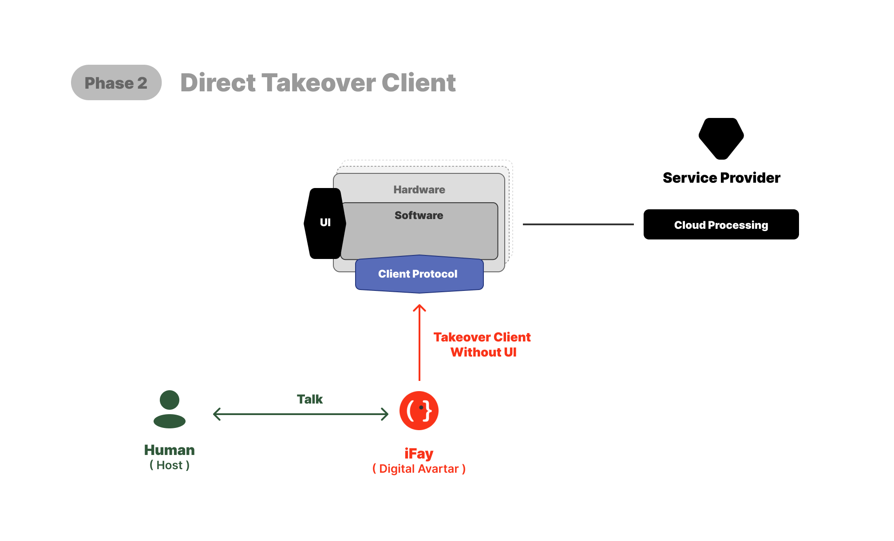
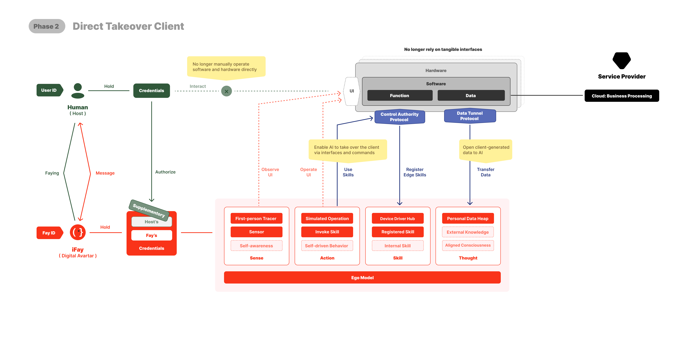
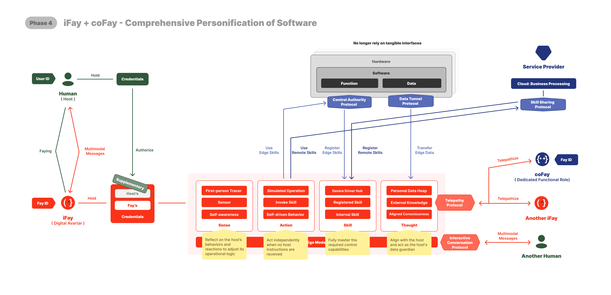

# 4. Feuille de route : 5 phases

Nous sommes encore dans l'« Ère des opérations humaines » — le matériel et les logiciels dépendent des humains interagissant via des interfaces pour piloter les appareils et exécuter les fonctions.

Actuellement, la relation entre les humains, les appareils et les fournisseurs de services est telle que montrée dans le diagramme ci-dessus.

 

---

## 1️⃣ Phase 1 : Simulation des opérations humaines
Par-dessus l'architecture matérielle et logicielle existante, nous laissons iFay simuler les opérations UI humaines.

Pour y parvenir, nous devons accomplir au moins 2 choses :
1. Délégation d'identifiants : Les utilisateurs humains doivent pouvoir autoriser de manière sécurisée iFay à utiliser leurs [identifiants](./02-Définition-et-concept#clarifications-de-concepts-généraux) (comptes, mots de passe, certificats, permissions d'accès, contrats, etc.) via un mécanisme de délégation contrôlable et auditable.
2. Interagir avec iFay : Principalement via une interface conversationnelle. Cependant, une conception soignée est nécessaire — quand les tâches impliquent une complexité d'interaction ou une précision plus élevée, les interfaces structurées peuvent être plus efficaces que le chat pur.

 

Sur la base de cette réflexion, quand nous publierons iFay v1.0, il inclura les 5 modules suivants (les sections orange dans le diagramme ci-dessous) :

### 1. FayID
C'est l'identifiant unique d'iFay. En fait, tant iFay que [coFay](https://github.com/ChainModePilot/coFay/wiki) se voient attribuer des identifiants uniques unifiés.

L'objectif est de garantir que quand les iFays personnels assumeront éventuellement des rôles sociaux significatifs, l'identité puisse transitionner en douceur — tout comme certains YouTubers individuels évoluent pour jouer des rôles importants dans le discours public et l'éducation civique.

Ici nous abordons deux problèmes fondamentaux :
- _**Génération et gestion de FayID**_ : Les Fays croîtront de manière exponentielle, dépassant éventuellement le nombre d'utilisateurs humains. Cela nécessite un mécanisme de génération et de gestion d'identifiants évolutif, convivial et facilement reconnaissable.
- _**État d'activation**_ : Pour garantir qu'iFay n'opère jamais sans la connaissance ou l'intention du Human Prime, nous définissons des règles d'activation strictes. Aucun iFay ne devrait agir de manière autonome sans intention explicite. Ceci est régi par le [Protocole Faying](https://github.com/ChainModePilot/Faying-Protocol/wiki) open source, qui spécifie comment les personnes physiques et iFay s'apparient de manière sécurisée, et sous quelles conditions iFay est autorisé à opérer en état activé.

### 2. Gestion des identifiants
« Identifiants » ici est un concept large. Pour les utilisateurs personnes physiques, la plupart du temps, les utilisateurs doivent détenir un ou plusieurs tickets pour avoir le droit d'utiliser le matériel et les logiciels. Les 7 types suivants sont collectivement appelés identifiants (d'autres types pourront être ajoutés avec les itérations) :
- Identifiant d'identité (FayID)
- Compte / Mot de passe
- Certificat
- Autorisation
- Jeton d'accès
- Contrat intelligent
- Jeton numérique ([MeriTokens](https://github.com/ChainModePilot/Global-Merit-Chain/wiki))

Note : Initialement, tous ces tickets proviennent de l'utilisateur Human Prime. Pour une sécurité accrue et une gestion plus pratique, tous les identifiants du Human Prime seront échangés contre des copies correspondant aux identifiants originaux. iFay utilise ces copies pour la connexion et l'authentification.

Bien sûr, nous ne supposons pas qu'iFay ne peut pas posséder ses propres identifiants que le Human Prime ne peut pas utiliser. Par conséquent, chaque type d'identifiant indique si son propriétaire original est le Human Prime ou iFay lui-même.

Par exemple : Quand nous devons vérifier l'authenticité d'informations personnelles fournies par quelqu'un, nous pourrions autoriser iFay à se connecter directement à une base de données pour interroger. Pour prévenir la fuite de données privées, iFay n'a besoin de retourner que vrai ou faux.

### 3. Traceur première personne
Pour permettre à iFay de travailler directement avec les logiciels existants — plutôt que d'attendre que chaque application soit reconçue pour l'IA — iFay doit avoir au minimum des capacités visuelles et auditives.

Nous mettons l'accent sur la perception visuelle plutôt que l'analyse de documents structurés (comme le HTML), car de nombreux éléments de documents sont imperceptibles pour les humains. Les éléments cachés, comme le bourrage de mots-clés SEO, n'ajoutent généralement pas de valeur réelle à l'expérience utilisateur.

En alignant sa perception sensorielle avec celle du Human Prime, iFay peut porter des jugements et prendre des décisions qui correspondent étroitement à l'intention humaine.

Le défi clé est d'atteindre la coordination œil-main pour iFay. La perception visuelle et auditive doit aller au-delà du traitement passif des retours logiciels — iFay doit aussi suivre les changements causés par ses propres opérations.

Par exemple, il doit suivre le mouvement du curseur, détecter les zones nouvellement exposées après un déplacement de fenêtre, et s'adapter aux changements dynamiques de l'interface. Cela nécessite un couplage étroit entre le suivi de perspective à la première personne et l'interaction simulée, garantissant qu'iFay perçoit et répond à l'environnement comme un opérateur humain.

### 4. Opération simulée
Ici nous faisons spécifiquement référence à la simulation de l'interaction humaine avec les interfaces utilisateur. iFay ne fait pas que cliquer — il peut glisser, défiler, effectuer des gestes de bord ou des gestes multi-doigts, selon les composants de l'interface.

Le défi principal est que personnaliser les séquences d'opérations pour chaque interface est infaisable. Au lieu de cela, l'interaction simulée d'iFay doit aussi simuler l'exploration humaine des interfaces, utilisant le retour du suivi de perspective à la première personne pour déterminer quelles opérations sont faisables ou efficaces. Cette approche diffère fondamentalement des implémentations RPA traditionnelles, qui reposent sur des scripts prédéfinis plutôt que sur une exploration adaptative guidée par la perception.

### 5. Modèle Ego
Nous l'appelons **[Ego](https://github.com/ChainModePilot/Ego/wiki)**, soulignant que ce n'est pas un grand modèle AGI. Ego s'aligne avec le profil d'un individu ou rôle spécifique.

De nombreux super-grands modèles poursuivant l'AGI font face à une limitation clé : peu importe l'étendue de leurs connaissances et compétences, ils ne peuvent pas pleinement satisfaire les préférences et le contexte uniques de chaque personne ou scénario.

Ego fournit un paradigme de base qui contraint (mais ne se limite pas à) les dimensions suivantes :
- Orientation des valeurs
- Préférences d'intérêt
- Habitudes
- Limites cognitives
- Limites de compétences
- Limites de permissions
- Style de travail

Il est important de noter que l'intégration du Modèle Ego n'empêche pas iFay d'exploiter des compétences externes ou d'autres grands modèles. La décision d'inclure un micro-modèle interne repose sur deux considérations :
1. _**Contrôle d'appareils hors ligne**_ : Dans les scénarios où les terminaux ne sont pas connectés à Internet, le micro-modèle embarqué supporte le contrôle local d'appareils en champ proche.
2. _**Stabilité de la personnalité**_ : Empêche les changements soudains de personnalité d'iFay dus aux mises à jour de grands modèles ou à des manipulations délibérées, garantissant la cohérence d'Ego.

 

---

## 2️⃣ Phase 2 : Prise de contrôle directe du client
Bien que la simulation d'opérations UI par l'IA améliore l'efficacité, les interfaces visuelles ont encore des limitations :

- _**Perte d'information**_ : Les vues limitées et les éléments statiques entravent la communication efficace.
- _**Coût d'apprentissage élevé**_ : Les interfaces incohérentes entre fournisseurs forcent les utilisateurs à apprendre de multiples schémas d'interaction.
- _**Rigidité de l'interface**_ : Une fois qu'un matériel/logiciel conçoit une UI, elle est fixée pour la version actuelle. Les utilisateurs doivent réapprendre les interfaces en utilisant différents appareils ou applications.
- _**Faible efficacité de transfert d'information**_ : L'intention doit d'abord être traduite en interface visuelle, puis retournée à la machine via les opérations utilisateur.
- _**Coût de développement élevé**_ : Construire des UIs fonctionnelles nécessite une coordination interdisciplinaire (ex. chefs de produit, designers UI/UE, développeurs front-end).

En revanche, si les terminaux supportent les protocoles client (comme montré ci-dessus), iFay peut directement contrôler le matériel et les logiciels. Cette approche résout les cinq problèmes :
- _**Sortie illimitée**_ : L'information n'est plus contrainte par les limitations d'affichage UI.
- _**Interaction basée sur l'intention**_ : Les utilisateurs expriment leur intention, iFay la traduit en appels API ou commandes.
- _**Données riches, livraison concise**_ : Les terminaux peuvent produire des données structurées riches, iFay les filtre et les résume en essentiels clairs.
- _**Transmission directe**_ : Pas de rendu visuel nécessaire, permettant un flux de données plus efficace.
- _**Pas de frontend nécessaire**_ : La conception et le développement UI peuvent être minimisés ou éliminés.

J'ai défini deux protocoles applicables aux terminaux :
- [Protocole d'autorité de contrôle (CAP)](https://github.com/ChainModePilot/Control-Authority-Protocol/wiki) : Pour Inhabit le matériel terminal et les logiciels spécifiques, appelant directement les pilotes, interfaces locales et commandes, permettant à iFay de contrôler les terminaux.
- [Protocole de tunnel de données (DTP)](https://github.com/ChainModePilot/Data-Tunnel-Protocol/wiki) : Un protocole de transmission bidirectionnelle :
  - _**Terminal → iFay**_ : Stockage persistant des données utilisateur et garde des données.
  - _**iFay → Terminal**_ : Enrichissement des données et traitement personnalisé.

Dans le diagramme ci-dessous, les sections bleues correspondent à ces deux protocoles, ciblant respectivement la fonctionnalité des appareils et les données.

Comparé à la [Phase 1](./04-Feuille-de-route#1️⃣-phase-1-simulation-des-opérations-humaines), iFay ajoute cinq nouveaux modules internes, en commençant par :

 

### Perception → Capteur
Le Capteur doit être implémenté par-dessus le Protocole d'autorité de contrôle et le Protocole de tunnel de données. Il sert de pont vers les capteurs des terminaux, recevant les flux de données de l'environnement externe — c'est pourquoi nous l'appelons le système nerveux d'iFay.

De manière cruciale, iFay n'a pas besoin de traiter toutes les données entrantes en permanence. Le Capteur peut ajuster dynamiquement sa sensibilité pour mieux correspondre au contexte environnant.

Considérez le Capteur comme un régulateur de sensibilité. Les interfaces réelles avec le monde extérieur sont gérées par le Hub pilotes périphériques et le Tas de données personnelles.

 

### Compétences → Hub pilotes périphériques
Pour clarifier, ce n'est pas un pilote de périphérique unique, ni une collection de pilotes.

Il fonctionne comme une couche hub de pilotes, garantissant que lorsque de nouveaux pilotes de périphériques sont continuellement intégrés, l'architecture interne d'iFay reste stable sans nécessiter de modification à chaque mise à jour.

 

### Compétences → Compétences enregistrées
L'enregistrement est un prérequis pour toute action d'iFay.

Quand une compétence est enregistrée auprès d'iFay, cela signifie qu'iFay peut l'invoquer à tout moment. L'enregistrement n'est pas un simple archivage — il sert typiquement d'étape de pré-autorisation, garantissant qu'aucune authentification supplémentaire n'est nécessaire lors de l'exécution, réduisant ainsi la latence.

Un autre avantage clé est la résilience hors ligne : quand iFay est hors ligne, il peut mettre en cache les actions en attente et les exécuter de manière asynchrone quand la connectivité est rétablie.

 

### Pensée → Tas de données personnelles
Ce composant est responsable de la gestion unifiée de toutes les données privées d'iFay. Il supporte de multiples formats et emplacements de stockage — par exemple, certaines données peuvent résider dans la mémoire d'exécution d'iFay, d'autres dans Google Drive, et d'autres dans une base de données vectorielle dédiée.

Du point de vue interne d'iFay, il n'a qu'à lire et écrire dans le tas de données, sans se soucier de l'endroit ou de la manière dont les données sont physiquement stockées.

 

### Action → Invocation de compétences
C'est l'action principale d'iFay — essentiellement, vous pouvez la considérer comme un comportement d'invocation.

 

---

## 3️⃣ Phase 3 : iFay comme interface vers le monde virtuel

Alors qu'iFay Inhabit le client, l'architecture client-serveur (C/S) évolue vers un modèle client-Fay-serveur (C/F/S).
Les utilisateurs n'ont plus besoin d'opérer manuellement les clients pour accéder aux services backend — au lieu de cela, iFay peut directement capturer et exploiter les services ouverts sur Internet.

Pour y parvenir, les services et interfaces qui n'étaient auparavant ouverts qu'aux clients devraient être rendus disponibles sur l'ensemble du réseau via un protocole distant standardisé.

Ce protocole distant est le [Protocole de partage de compétences](https://github.com/ChainModePilot/Skill-Sharing-Protocol/wiki) montré dans le diagramme ci-dessous.

Comme montré, iFay contrôle à la fois le côté client (appareils en périphérie) et le côté serveur (ou services cloud).

Le Human Prime n'a qu'à communiquer avec son propre iFay, et iFay invoque ensuite les services requis en fonction de l'intention du Prime.

Puisque l'interface à travers laquelle le Human Prime visualise l'information est composée et rendue par iFay, il joue effectivement le rôle d'un navigateur.

Puisque la motivation principale pour introduire iFay est d'en faire une extension intelligente au-delà du Human Prime, ses capacités améliorées sont obtenues via les compétences enregistrées.
Dans le domaine de la pensée, nous introduisons le module suivant :

 

### Pensée → Connaissances externes

D'un point de vue implémentation, nous traitons les bases de connaissances et modèles externes comme un type de compétence, permettant à iFay d'accéder à l'intelligence externe comme en consultant un hub de connaissances ou un conseiller expert.
Les connaissances et informations acquises via cette compétence sont gérées aux côtés des données personnelles d'iFay, atteignant finalement une intelligence qui dépasse les propres capacités du Human Prime.

 

---

## 4️⃣ Phase 4 : iFay + coFay — Personnification complète du logiciel

À ce stade, l'incarnation de Fay est essentiellement complète.
Cependant, ils manquent encore de la capacité d'agir de manière autonome comme de vrais membres de la société.
Pour qu'iFay opère de manière indépendante et efficace, 2 conditions clés doivent être remplies :
- Interne : iFay doit développer une motivation autonome — une boucle continue « action → retour → ré-action ».
- Externe : iFay et coFay doivent être largement adoptés et capables de communiquer en utilisant un langage commun.
Avec cette base, iFay peut collaborer avec des humains, d'autres iFays ou ses coFays dédiés pour exécuter de manière autonome des tâches prédéfinies.

Pour y parvenir, nous devons intégrer des capacités autonomes dans quatre modules fondamentaux — perception, action, compétences et pensée.

 

### Perception → Conscience de soi
Une entité véritablement vivante ne fait pas que percevoir — elle ressent aussi.
Contrairement aux machines, iFay lui-même ne peut pas avoir de véritables émotions. Mais en observant son Human Prime et le contexte environnant, il peut inférer des sentiments à partir de la perception.
C'est la stratégie fondamentale pour construire la Conscience de soi d'iFay.

 

### Action → Comportement autonome
Puisqu'iFay doit gérer des tâches de manière autonome, il doit avoir ses propres mécanismes de déclenchement de comportement.
Ces déclencheurs peuvent provenir de :
- Tâches planifiées
- Inférence de la Conscience de soi
- Compétences persistantes, incluant les Compétences enregistrées et les Compétences internes.

 

### Compétences → Compétences internes
Nous introduisons le module de Compétences internes pour trois objectifs principaux :
- Établir des habitudes alignées avec la personnalité du Human Prime, incluant des restrictions ou une gouvernance potentielle sur les compétences externes.
- Fournir un mécanisme d'introspection pour garantir que les connaissances externes ne sont jamais en conflit avec l'intention du Human Prime.
- Intégrer des capacités inhérentes spécifiques au Prime, telles que les compétences professionnelles et l'expertise.

 

### Pensée → Conscience alignée
Essentiellement, cela représente une description complète du profil personnel du Human Prime.
Elle peut être établie par trois méthodes principales (possiblement plus) :
- Exploration de données du Tas de données personnelles.
- Ajustement en temps réel via la Conscience de soi.
- Définition manuelle par le Human Prime.

 

Cependant, cela seul ne suffit pas pour qu'iFay s'intègre dans les relations sociales.
Pour cela, nous devons équiper iFay de capacités de communication, impliquant deux protocoles fondamentaux :
- [Protocole de Télépathie](https://github.com/ChainModePilot/Telepathy-Protocol/wiki) — Un protocole de communication sémantique adapté aux Fays qui supprime la couche de traduction UI, permettant au sens et à l'intention d'être transmis directement entre iFay et coFay. Il utilise des jetons encodés en vecteurs convenus au lieu de texte structuré.
- [Protocole de conversation interactive](https://github.com/ChainModePilot/Interactive-Conversation-Protocol/wiki) — Un protocole adapté aux interfaces humaines qui modularise et multimodalise le contenu sémantique, permettant aux interfaces client de reconstruire des affichages de messages lisibles et conviviaux.

 

---

## 5️⃣ Phase 5 : Fay redéfinit la structure du travail et la distribution de la valeur

En fin de compte, notre objectif est de construire un écosystème avec de forts attributs sociaux, plutôt que de traiter l'IA comme un outil plus avancé.
Cette nouvelle forme sociale différera inévitablement de la société humaine telle que nous la connaissons aujourd'hui.
Nous pouvons prévoir au moins 5 changements fondamentaux :
1. _**Sortie du travail humain**_ — Le travail programmatique sera entièrement pris en charge par l'IA et les robots, poussant les coûts de ressources humaines vers zéro.
2. _**Aplatissement des connaissances**_ — Les connaissances et l'expertise professionnelles seront égalisées par l'IA, rendant les chaînes d'approvisionnement extrêmement plates.
3. _**Garantie universelle de survie**_ — Chacun aura accès aux ressources de vie de base, éliminant le besoin de travailler pour survivre.
4. _**Nouvelle création de valeur**_ — La participation humaine se concentrera sur la création de sens, l'artisanat centré sur l'humain et l'écosystème de production IA + robots.
5. _**Nouvelle stratification sociale**_ — La propriété de ressources de production autonomes deviendra le nouveau moteur de richesse et de différenciation de classe.

Cela redéfinira fondamentalement l'écosystème économique construit sur la propriété des ressources matérielles (c'est-à-dire les moyens de production).
D'un point de vue économique, 2 changements majeurs se produiront :
- _**Participation humaine minimisée dans l'économie réelle**_ — Très peu de personnes participeront directement aux activités de production traditionnelles.
- _**Augmentation dramatique de la valeur unitaire du travail humain**_ — À moins que le travail humain ne soit hautement valorisé, les humains se retireront complètement du travail physique.

Quand la plupart des gens sont immergés dans le travail virtuel, les métriques de valeur traditionnelles — comme les heures de travail, le revenu monétaire ou les quantités physiques de biens — deviennent inadéquates.
Par conséquent, mesurer la valeur sociale nécessite un mécanisme de consensus, similaire à la façon dont les enchères déterminent la valeur de l'art ou des actions. Les enchères ne sont qu'un moyen d'établir un consensus.

Pour maintenir ce consensus, une plateforme dédiée est nécessaire. Actuellement, la blockchain est un choix approprié, avec des années d'expérience accumulée.

Nous quantifions les contributions sociales dans une unité unifiée (μ, Merit Unit) et émettons des jetons numériques correspondants (MeriToken) sur la blockchain, formant ce que nous appelons la [Global Merit Chain](https://github.com/ChainModePilot/Global-Merit-Chain).

À l'avenir, acquérir des MeriTokens ne dépendra pas de la consommation de puissance de calcul pour accomplir du travail technique blockchain, mais de la création de valeur sociale.

