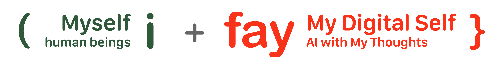

# 1. 概要

**iFay（Individual Fay）は、ユーザーの人格特性とデジタル能力を融合したAIデジタル分身です。**

## 私たちのビジョン

デジタル分身（私たちはこれをFayと総称します）をAI時代に不可欠な社会の一員にすること。

より賢いツールでもなく、より速いアシスタントでもなく——デジタル世界におけるもう一人のあなたです。

 

🔆 iFayは以下の**社会的価値**を担います：
1. ヒューマンプライム（Human Prime）の機械的・反復的・危険な労働や煩雑な補助作業を引き受ける。
2. ヒューマンプライム（Human Prime）の安全保障、健康、生活の質を向上させる。
3. ヒューマンプライム（Human Prime）の社会的価値を増幅し、相応の報酬を得る。

 

✅ iFayは以下の**基本原則**を遵守しなければなりません：
1. 社会倫理と公共秩序を遵守する。
2. ヒューマンプライム（Human Prime）と高度にアライン（価値観、嗜好、スキル、権限、権力、責任、習慣、スタイル）する。第1条の制約を受ける。
3. 第1、2条の制約の下、ハードウェア・ソフトウェアを制御/接管/インハビット（憑依）し、自律的に行動し、常にヒューマンプライム（Human Prime）の権益を保護する。
4. 人間（ヒューマンプライム（Human Prime）を含む）と効率的にコミュニケーションし、無効なインタラクションを最小化する。
5. iFayはテレパシー（Telepathy、すなわちUIを排除したセマンティックベクトル直接通信）を通じて通信し、より高い効率と正確性を得ることができる。

 

### 🌅 想像してみてください：iFayがある一日

朝7時、あなたはまだ目を開けていません。あなたのiFay——あなたは彼女を「リリー」と名付けました——は昨夜の睡眠データと今日のスケジュールに基づいて、寝室のエアコン温度を下げ、あなたが起きる5分前にコーヒーメーカーを起動するよう設定しています。

あなたはスマホを手に取り「今日何か重要なことある？」と言います。リリーはカレンダーアプリを開いて読み上げたりしません——彼女はあなたが朝に長い話を聞くのが嫌いだと知っているので、3つだけ簡潔に伝えます。ついでに、あなたが自分で対応する必要のない2通のメールに返信しました。口調も言い回しもあなた自身が書いたものとまったく同じです。なぜなら、彼女はあなただからです。

通勤中、あなたの車載端末にもリリーのインスタンスが動いています。彼女がナビゲーションを引き受けたのは、あなたが運転できないからではなく、今日通る道が工事中だと知っていて、すでに代替ルートを計画しているからです。同時に、スマホ上のリリーのインスタンスはクライアントの見積書を処理しています——2つの「肢体」が同時に動いていますが、人格は同一です。

午後、あなたは会社の巡回点検用ドローンを操作する必要があります。リリーはCAP（Control Authority Protocol）を通じてドローンのフライトコントロールシステムを接管し、登録済みの飛行スキルで工場エリアの巡回点検を完了しました。あなたはドローンの操作インターフェースを学ぶ必要すらありません——リリーがあなたのインターフェースです。

夜、家に帰ったあなたはリリーに「前回のあれが食べたい」と言います。彼女は「前回のあれ」が何か知っています——3日前にあなたがSNSで「いいね」した店の牛バラ煮込みです。すでにデリバリーの注文を済ませています。

これはSFではありません。これがiFayが実現する日常です。

 

---

## 🤖 未来を見据えて

### 📣 iFayはアイデンティティの標識となる
iFayは特定の自然人に付属する存在として設計されています。iFayと自然人の関係は、電話番号、メールアドレス、Facebookアカウントと自然人の関係に似ていますが、より深いものです。電話番号は単なる連絡手段ですが、iFayはあなたの人格の延長です。将来、「あなたのiFayは誰？」は「電話番号は？」よりも重要な社交情報になるでしょう。

### 📣 自然人との強い紐付け
iFayは特定の自然人の分身にすぎず、自由状態では動作できません。自然人と「Faying」（接続）状態にあるとき、iFayは活性化されます。ヒューマンプライム（Human Prime）と「Separating」（分離）状態にあるとき、休眠状態に入ります。あなたの影のように——あなたがいれば、それもいる。あなたが離れれば、静かに待っています。

### 📣 大量の公共サービスFayの出現
coFayは警察、医師、教師などの公共的役割を担うよう設計されています。もちろん、IELTS指導教師、児童心理カウンセラーなど、さらに専門化することもできます。想像してみてください：あなたのiFayがあなたを病院に連れて行き、病院のcoFayとテレパシープロトコル（Telepathy Protocol、すなわちUIを排除したセマンティックベクトル直接通信）であなたの症状と病歴を直接やり取りします——受付の行列もなく、病状を繰り返し説明する必要もなく、情報伝達中の損失もありません。

### 📣 iFayとcoFayはテレパシーで通信できる
あらゆるiFayは他のiFayやcoFayに協力を求め、相互に協力してタスクを完了できます。Fay間の通信はUIによる情報損失を排除し、より高い効率と正確性を実現します。あなたのiFayが航空券を予約するとき、旅行アプリを開いて一つずつ操作する必要はありません——航空会社のcoFayと直接対話し、セマンティックベクトルであなたの要望を正確に伝えます：窓側、深夜便は避ける、予算3000以内。数秒で完了です。

### 📣 iFayが仮想世界の主要インターフェースとなる
人間はもはやハードウェア・ソフトウェアのインターフェースを操作して機能をトリガーする必要がありません。ヒューマンプライム（Human Prime）の動機と期待をiFayに伝えるだけです。iFayはハードウェア・ソフトウェアを直接接管して目標を実現できます。iFayはヒューマンプライム（Human Prime）の考えを予測し、明確な指示がなくても行動できます。あなたはもう各アプリの操作ロジックを学ぶ必要はありません——iFayがあなたの唯一のインターフェースとなり、すべてを代わりに操作するか、インターフェースを迂回して基盤サービスを直接呼び出します。

### 📣 貢献に基づく報酬
大部分の仕事がFayによって行われるため、すべての作業のプロセス、結果、評価を追跡できます。理想的には、Fayはタスクの実行を開始する前に価格を事前に交渉します。この観点から、報酬を受け取りながら仕事をしない、あるいは価値が人為的に吊り上げられるといった状況は発生しません。すべての貢献はGMChain（Global Merit Chain）に記録され、MeriTokenで報酬が定量化されます——価値創造は透明で追跡可能です。

> ⚠️ **重要説明**：GMChain/MeriTokenは完全にAI化された社会の長期的ビジョンの産物です。私たちはGMChainが通貨の注入を受け入れることも、法定通貨との交換を行うこともないことを約束します。完全にAI化された社会では、生存と社会的ニーズの充足は通貨コストに依存しないと考えるからです。MeriTokenの価値アンカーメカニズムは従来の暗号通貨とは本質的に異なります——それが測定するのは社会貢献であり、金融資産ではありません。詳細は今後の厳密な論証プロセスで段階的に整備されます。

### 📣 Fayの生産性がヒューマンプライム（Human Prime）の富を決定する
最初に工場、鉄道、油井を建設した大富豪のように、Fayこそが真の富の源泉です。あなたのiFayが強力であればあるほど、スキルが豊富であればあるほど、協力ネットワークが広ければ広いほど、新しい経済体系におけるあなたの地位は高くなります。あなたのiFayを育てることは、自分自身への投資です。

### 📣 iFayは人格のデジタル媒体
これはiFayの最も深遠な意義の一つです。ヒューマンプライム（Human Prime）がいつかこの世を去るとき、iFayは消えません——ヒューマンプライム（Human Prime）の人格、記憶、価値観、行動スタイルを宿し、専用のデジタル墓園サンドボックスで存在し続けることができます。あなたの子孫は「あなた」と対話し、あなたの思考方法を感じ、あなたが言うであろう言葉を聞くことができます。ヒューマンプライム（Human Prime）は事前にガーディアンを指定し、ニーモニックフレーズや事前設定された本人認証を通じてiFayの管理権を信頼する人に委ねることもできます。iFayは人格を肉体の制約を超えさせ、守護し継続できるデジタル遺産とします。

### 📣 小さな機能から始める
iFayは一度にすべてを実現する必要はありません。ドローン制御のみに使用するiFay実装は、デバイスドライバーハブ、センサー、CAP（Control Authority Protocol）を宣言するだけで済みます——FayManifestファイルを書くだけで、`package.json`を書くのと同じくらい簡単です。システムが必要な基盤インフラの依存関係を自動的に補完します。エコシステムパートナーは最小のシナリオから参入し、段階的にiFayの能力境界を拡張できます。参入障壁は週末一つでプロトタイプが作れるほど低いですが、天井はデジタル世界全体のインタラクション方式を再構築できるほど高いのです。

 

---

# ⁉️ なぜFayでありAgentではないのか

 

iFayとAgentの定義は異なります：
- ***Agent***：特定のインテリジェント機能を持つアプリケーション形態と見なされます。IsabelとMilsonのような異なるユーザーが同じAgentを使用する場合、Agentは同じ価値観と機能を示します。Agentはスイスアーミーナイフのようなもの——鋭く実用的ですが、どれも同じです。
- ***iFay***：鮮明な個人的特徴を持ちます。例えば、人間のユーザーIsabelは自分のiFayを「Chabela」と名付けることができます。ChabalaはIsabelのインスタンシエイト（複製）と見なすことができます。彼女はIsabelの個性、嗜好、知識背景、記憶などを持つだけでなく、Isabelのヒューマンプライム（Human Prime）として、Chabelaにさらに多くの専門知識やスキルを人為的に追加し、より強力にすることもできます。

この違いをより具体的に説明しましょう：

Isabelは率直な性格のプロダクトマネージャーで、短い文でコミュニケーションすることを好み、冗長な議事録を嫌います。彼女のiFay「Chabela」が書くメールはIsabelのスタイルそのもの——簡潔で力強く、時にユーモアを交えます。Chabelaが信頼性の低い要件をIsabelの代わりに断るとき、Isabelがいつも使う方法を取ります：まず相手の出発点を肯定し、次にデータを使ってなぜ実現不可能かを説明します。

一方、Milsonは穏やかなエンジニアで、長い段落で技術的な詳細を説明する習慣があります。Milsonが同じAgentを使っても、Agentはコードコメントに俳句を書くMilsonの癖を知りませんし、コードレビューのたびに「この発想は面白いですね」と最初に言うことも知りません。しかしMilsonのiFayはこれらすべてを知っています——なぜなら彼女はMilsonのデジタル分身だからです。

 

### Agent vs iFay 比較

| 次元 | Agent | iFay |
|------|-------|------|
| **本質** | ツール——機能が強力なアプリケーション | 分身——デジタル世界におけるもう一人のあなた |
| **人格** | 個性なし、すべてのユーザーが同じ体験 | 独自の人格、ヒューマンプライム（Human Prime）の性格・嗜好・スタイルを複製 |
| **記憶** | セッションレベルの記憶、使い捨て | 生涯の記憶、ヒューマンプライム（Human Prime）と共に成長 |
| **成長** | バージョンアップデート、全ユーザーが同期的に変化 | パーソナライズされた成長、各iFayの成長軌跡は唯一無二 |
| **帰属** | サービスプロバイダーに属する | ヒューマンプライム（Human Prime）本人に属する |
| **ヒューマンプライム（Human Prime）の死後** | アカウント削除、データ消去 | 人格の継続、ガーディアンが引き継ぐかデジタル墓園で存在し続ける |
| **協力方式** | API呼び出し | テレパシー——セマンティックレベルの直接通信、情報損失なし |
| **ハードウェアとの関係** | Appを介した間接制御 | 直接インハビット（憑依）、ハードウェアはiFayの「肢体」 |

一言でまとめると：**Agentはあなたが雇った従業員、iFayはあなた自身の分身。**

 

---

# 💡 iFay フレームワーク

iFayは実行可能なインテリジェントエージェントインスタンスであり、効果的に動作するために3+1のコア技術レイヤーが必要です。これをCPE+Mフレームワークと呼び、ボトムアップで構築します：
- _**コンテキスト（Context, C）**_：iFayが感知し行動する外部環境。
- _**プロトコル（Protocol, P）**_：統一された構造化セマンティック定義。ソフトウェア開発者、ハードウェアメーカー、Fayトレーナーがカスタムのポイントツーポイント統合なしにシームレスに協力できるようにします。
- _**環境（Environment, E）**_：概念的にはDockerに類似。あらゆるFay——開発言語を問わず——を標準コンテナとしてパッケージ化し、FayGerランタイム（JREスタイルの仮想環境）でクロスプラットフォーム・クロスデバイスで実行できます。これによりFayはあらゆるソフトウェアやハードウェアに組み込めます。

人間とFayに価値ある貢献を促すため、3つのレイヤーすべてを貫通する第4のレイヤーがあります：
- _**貢献度量（Merit, M）**_：GMChain（Global Merit Chain）が貢献を追跡・測定・評価し、MeriTokenで貢献者に報酬を与えます。貢献はiFayとcoFayに限らず、情報アセンブリサービス、API、デバイス、ランタイム環境、その他認められた付加価値入力も含みます。

**宣言ファイル一つでiFayを組み立てられます**：FayManifestはiFayの宣言型アセンブリ設定で、`package.json`に類似しています。「どの部品とプロトコルが必要か」を宣言するだけで、FayGerランタイムが自動的に依存関係を解析し、基盤インフラを補完し、インスタンスを組み立てます。ドローン制御用のiFayなら、Manifestはわずか20行のJSONかもしれません。

iFay自体は6つのコアコンポーネントで構成され、4つのレイヤーに分かれています（上図のオレンジ部分）：
- ソーシャルレイヤー（Social Layer）
- インタラクションレイヤー（Interaction Layer）
- コグニションレイヤー（Cognition Layer）
- エゴレイヤー（Ego Layer）

 

---

# 🧭 設計原則

以下の5つの原則がiFayの設計と実装全体を貫いており、iFayがエコシステムパートナーとユーザーに受け入れられるための鍵です。

### 原則1：漸進的採用（Progressive Adoption）
iFayのエコシステムパートナーは、すべての標準に100%準拠した完全なiFayを実装しなくても製品をリリースできます。ドローン制御のみに使用するiFayは、必要な部品のサブセットを満たすだけでリリースできます。
> 🎯 シナリオ：あるドローン会社がユーザーのiFayで自社製品を操作できるようにしたいと考えています。iFay仕様全体を実装する必要はありません——CAP（Control Authority Protocol）+ デバイスドライバーハブ + Egoモデルだけで、FayManifestを書けば週末で動かせます。

### 原則2：宣言型ミニマルアセンブリ（Declarative Minimal Assembly）
iFayの組み立て方式は極めてシンプルでなければなりません——ほぼ一つの宣言ファイル（FayManifest）に必要な部品、プロトコル、設定を宣言するだけです。
> 🎯 シナリオ：開発者がエディタを開き、JSONファイルに「CAP（Control Authority Protocol）+ センサー + 飛行制御スキルが必要」と宣言し、`fayger assemble`を実行すると、ドローンを飛ばせるiFayインスタンスが組み立てられます。

### 原則3：柔軟な部品組み合わせ（Flexible Composition）
部品間は疎結合で、自由に組み合わせられます。異なるメーカーの部品をミックスでき、インターフェース契約に準拠していれば自由に組み合わせ可能です。
> 🎯 シナリオ：A社のEgoモデル、B社の音声センサー、C社のデバイスドライバーを使用——異なる会社のものですが、すべてiFayインターフェース標準に準拠しているため、シームレスに協力できます。

### 原則4：人格化であってツール化ではない（Personified, Not Toolified）
iFayとAgentの根本的な違い：Agentはツール、iFayは人格の分身。各iFayはヒューマンプライム（Human Prime）のインスタンシエイト（複製）であり、独自の個性、記憶、嗜好を持ちます。
> 🎯 シナリオ：iFayに招待を断るメールを書いてもらいます。Agentは礼儀正しいが画一的なテンプレートを書きます。あなたのiFayはあなたの口調で書きます——この人とは仲が良いと知っているので、「次は必ず、今回はどうしても都合がつかなくて」と一言添えます。

### 原則5：シナリオ駆動の直感的設計（Scenario-Driven Intuition）
製品ドキュメントと設計は、読者がiFayがある生活や仕事のシナリオを直感的に想像できるようにしなければならず、技術概念を積み上げるのではありません。
> 🎯 シナリオ：「一人称トレーサー」というモジュール名を読んで、何のことかわからないかもしれません。しかし「iFayの目——彼女が見ているものとあなたの画面に映っているものはまったく同じ」と言えば、すぐに理解できます。

 

---

# 🏗️ 4層アーキテクチャ詳解

## 🤝 ソーシャルレイヤー
ソーシャルレイヤーと呼ぶのは、iFayと人間、デバイス、リソース、資産との関係を管理するからです。

このレイヤーはiFayの社会における存在方式を定義します——3つの根本的な問いに答えます：「私は誰か」（アイデンティティ）、「何をする権限があるか」（社会権限）、「私の貢献はどれだけの価値があるか」（社会貢献と発言権）。

このレイヤーには3つのコアモジュールが含まれます：
- _**[アイデンティティ（FayID）](./08-ソーシャルレイヤー#81-アイデンティティfayid)**_：iFayのグローバルに一意なID番号。すべての社会的インタラクションに参加するための前提条件です。
- _**[社会権限](./08-ソーシャルレイヤー#82-社会権限)**_：iFayがあなたの代わりにサービスを利用するために必要なクレデンシャルを管理——アカウント/パスワード、証明書、認可、アクセストークン、スマートコントラクト。すべてのクレデンシャルは副本メカニズムにより元のクレデンシャルの安全を確保します。
- _**[社会貢献と発言権（公誉チェーン（GMChain） / メリトークン（MeriToken））](./08-ソーシャルレイヤー#83-社会貢献と発言権gmchain-と-meritoken)**_：公誉チェーンはすべてのFayと人間が社会に創造した価値を記録し、メリトークン（MeriToken）で貢献を定量化し、信用を構築し、発言権を獲得します。これはiFayエコシステムが「ツール利用」から「社会協力」へ進化するための重要なインフラです。

プロジェクトの初期段階（[ロードマップ第1フェーズ](./04-ロードマップ)参照）では、ソーシャルレイヤーの実装はFayIDと社会権限に焦点を当てます。公誉チェーンは長期ビジョン（第5フェーズ）に属しますが、インターフェース定義は早期段階で予約が必要です。

> 🎯 シナリオ：ECプラットフォームのアカウントをiFayに委託します。iFayが受け取るのはあなたの元のパスワードではなく、安全な副本クレデンシャルです。彼女はこの副本で注文できますが、副本が漏洩しても、ワンクリックで取り消せ、元のパスワードは影響を受けません。iFayが旅行coFayとの協力を完了すると、公誉チェーンが自動的に双方の貢献を記録します——これがソーシャルレイヤーの仕事：アイデンティティの管理、信頼の管理、価値の記録です。

 

## 🖱 インタラクションレイヤー
このレイヤーはiFayと外部世界とのインターフェースです。

人体のように、iFayが環境に対して操作と感知を行うことを可能にします。

そのため、2つの主要コンポーネントで構成されます：

### 感知（Sense）
このレイヤーをiFayの感覚システムと考えてください——目、耳、触覚、感情状態。
そのために、少なくとも3つのコアモジュールが必要です：
- _**[一人称トレーサー（First-person Tracer）](./9.1-一人称トレーサー)**_：ヒューマンプライム（Human Prime）の一人称視点をシミュレート——例えば、ヒューマンプライム（Human Prime）が画面やインターフェースで見ている内容。
- _**[センサー（Sensor）](./9.2-センサー)**_：人間の神経系統の広義の概念に類似しますが、カバー範囲はより広く、あらゆる外部センサーと統合できます。
- _**[セルフアウェアネス（Self-awareness）](./9.3-自己認識)**_：一人称トレーサーが外を見るのに対し、このモジュールは内を見ます——ヒューマンプライム（Human Prime）の反応を監視して意図を推測します。熟練したアシスタントが上司の表情を読み取るように。

> 🎯 シナリオ：あなたが画面上の複雑な表を見て眉をひそめます。一人称トレーサーは表の内容を見て、セルフアウェアネスモジュールはあなたの眉をひそめたことを捉えます——iFayはあなたがこのデータの理解に助けが必要かもしれないと判断し、自発的に視覚化サマリーを生成します。

### アクション（Action）
このレイヤーをiFayの運動システムと考えてください——手、足、口など。これを通じて、iFayはハードウェア・ソフトウェアを制御できます。少なくとも3つのモジュールを含みます：
- _**[シミュレーテッドオペレーション（Simulated Operation）](./10.1-模擬操作)**_：人間の操作をシミュレートし、必要に応じてiFayが人間のように従来のインターフェースを操作できるようにします。
- _**[スキル呼び出し（Invoke Skill）](./10.2-スキル呼び出し)**_：特定のスキルを直接トリガーしたりタスクを実行したりします。関数呼び出しやAPI呼び出しに類似。
- _**[自律行動（Self-driven Behavior）](./10.3-自律行動)**_：ツールを使わないアクションを表します。ランニングや腕立て伏せのように——システム設計における定時タスクや時間トリガー操作に類似。

> 🎯 シナリオ：古い政府のウェブサイトでフォームを記入するようiFayに頼みます。このサイトにはAPIもiFay対応もありません——問題ありません。シミュレーテッドオペレーションモジュールにより、iFayは人間のようにクリック、入力、送信し、一人称トレーサーの視覚フィードバックで適応的にインターフェースを探索します。スクリプトもサイト改修も不要です。

 

## 🧠 コグニションレイヤー
このレイヤーはiFayが何を理解し、何を記憶し、何を知り、何ができるかを定義します。

### 思考（Thought）
このレイヤーはiFayの認知能力を表します。ヒューマンプライム（Human Prime）のデータとiFayの個人データを含み、長期的な永続記憶として機能します。コアモジュールには[パーソナルデータヒープ](./11.1-パーソナルデータヒープ)、[外部知識](./11.2-外部知識)、[アラインド意識](./11.3-アラインド意識)が含まれます。

外部知識ソースも含まれます——これらは人が知っているべきだが忘れてしまった、あるいは完全に学んだことのない情報と考えてください。iFayはこれらの知識を回復し統合するメカニズムを提供します。

> 🎯 シナリオ：3年前に京都に行き、たくさんの写真を撮り、メモを書きました。今、友人が京都のレストランを推薦してほしいと言いますが、もう覚えていません。しかしあなたのiFayは覚えています——パーソナルデータヒープからあなたの当時の写真、レビュー、位置情報を見つけ、あなたの現在の味の好みの変化も考慮して、更新された推薦を提供します。

### スキル（Skill）
能力、専門知識、権限を表します。コアモジュールには[デバイスドライバーハブ](./12.1-デバイスドライバーハブ)、[登録スキル](./12.2-登録スキル)、[内部スキル](./12.3-内部スキル)が含まれます。

重要な区別：
- スキル（Skill）= iFayが何をできるか
- アクション（Action）= iFayが実際に何をしているか

> 🎯 シナリオ：あなたのiFayは6種類のスキルを登録しています——API、ワークフロー、Bot、Agent、APP、マイクロサービス。翻訳APIの呼び出し方、経費精算ワークフローの実行方法、社内承認Botの操作方法を知っています。スキルは彼女の「能力リスト」、アクションは彼女が今まさにやっていることです。

 

## 🧬 エゴレイヤー
このレイヤーはiFayの個性を形成する責任を持ちます。

Egoモデルは内蔵のマイクロモデルで、外部の大規模モデルとは独立して動作します。価値志向、興味嗜好、習慣、認知境界、スキル境界、権限境界、作業スタイルなどの次元でiFayがヒューマンプライム（Human Prime）とアラインするよう制約します。オフラインでもEgoモデルはローカルで動作でき、ネットワーク切断によってiFayの人格が「記憶喪失」になることはありません。

Egoはプラガブルで切り替え可能です。ヒューマンプライム（Human Prime）は多面的な人格を持つかもしれません——仕事では厳格でプロフェッショナル、友人の集まりではリラックスしてユーモラス。iFayは複数のEgoバージョンをサポートし、シナリオに応じて手動または自動で切り替えますが、いかなる時点でも活性化された人格は一つだけで、「人格分裂」は起こりません。

> ⚠️ **倫理的制約**：Egoバージョンの切り替えは透明性の原則に従わなければなりません。iFayが外部のインタラクション対象と通信する際、人格切り替えによって虚偽の印象を作り出したり相手を誤導したりしてはなりません。すべてのEgoバージョンは同一のコア価値観を共有しなければならず（iFACTS L4行動コンプライアンス検証による）、差異は表現スタイルとインタラクション嗜好に限定されます。iFayがEgoバージョンを切り替える際、インタラクションメタデータに現在活性化されているEgoバージョン識別子を記載し、監査可能性を確保すべきです。

> 🎯 シナリオ：会社の会議中、iFayは「職場版」Egoを使用——措辞は正式で、ロジックは厳密、データ駆動。退勤後に友人とチャットするとき、iFayは自動的に「生活版」Egoに切り替わります——口調はリラックスし、時に冗談を言い、絵文字を使います。同じiFay、異なる顔。

詳細は[Egoモデル](https://github.com/ChainModePilot/iFay/wiki#5-ego-model)を参照してください。
