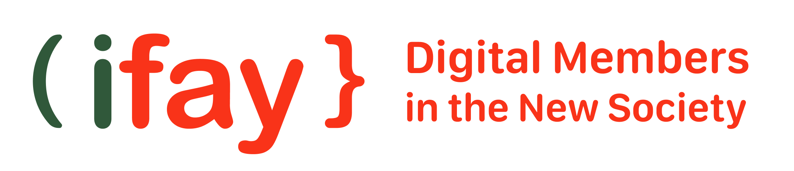

# 3. 설계 원칙

iFay(Individual Fay)는 자연인과 깊이 바인딩된 AI 디지털 분신입니다. 도구가 아니라 당신의 인격 확장입니다—당신의 성격, 기억, 선호와 디지털 능력을 융합하여, 기계적, 반복적, 위험한 노동을 대신하고 사회적 가치를 증폭시킵니다. iFay는 CPE+M 프레임워크(Context 컨텍스트, Protocol 프로토콜, Environment 환경, Merit 기여 측정)를 채택하며, 소셜 레이어, 인터랙션 레이어, 코그니션 레이어, 에고 레이어의 4레이어 아키텍처로 구성되어, 인간 조작 시뮬레이션부터 노동 구조와 가치 분배 재편까지 5개 진화 단계를 커버합니다.

---

## 설계 원칙

iFay의 설계는 5가지 핵심 원칙을 따르며, 이는 전체 시스템의 아키텍처와 구현을 관통합니다:

| # | 원칙 | 한 줄 설명 |
|---|------|-----------|
| 1 | **생태계 친화적 점진적 채택** | 생태계 파트너는 완전한 iFay를 구현하지 않아도 제품을 출시할 수 있습니다—드론 제어만을 위한 iFay는 필요한 부품 하위 집합만 충족하면 출시 가능합니다. |
| 2 | **선언적 극소 조립** | 하나의 FayManifest 선언 파일로 필요한 부품, 프로토콜, 설정을 정의하며, package.json 작성하듯 iFay를 조립합니다. |
| 3 | **유연한 부품 조합** | 부품은 느슨하게 결합되어 혼합 사용 가능하며, 서로 다른 제조사의 구현도 인터페이스 계약만 준수하면 자유롭게 조합됩니다. |
| 4 | **인격화, 도구화가 아닌** | iFay는 Agent가 아닙니다—모든 iFay는 고유한 개성, 기억, 선호를 가지며, 휴먼 프라임(Human Prime)의 인스턴시에이트(복제)이고, 심지어 휴먼 프라임(Human Prime) 사후에도 인격을 연속할 수 있습니다. |
| 5 | **시나리오 기반 직관적 설계** | 모든 기능 모듈은 구체적인 생활 시나리오로 설명할 수 있어, 독자가 iFay가 있는 생활을 직관적으로 상상할 수 있게 합니다. |

---

## 목차

1. [정의와 개념](./02-정의와-개념)

    iFay의 정의와 구조 개요를 제공하고, iFay와 현재 Agent 개념의 근본적 차이, 그리고 운영 특성 뒤의 원리를 분석합니다.

---

2. [iFay 응용 시나리오](./05-iFay-응용-시나리오)

    처음부터 iFay를 실제로 사용하는 완전한 과정: 개성 주입 방법, iFay에 스킬 추가, iFay와의 상호작용, iFay의 소셜 기능, 보안성과 산업 생태계의 전경 묘사.

    - [본체 특성을 iFay에 주입](./05-iFay-응용-시나리오#본체-특성을-ifay에-주입)
    - [iFay에 외부 능력 보충](./05-iFay-응용-시나리오#ifay에-외부-능력-보충)
    - [인간과 iFay의 상호작용 방식](./05-iFay-응용-시나리오#인간과-ifay의-상호작용-방식)
        - [iFay 활성화 방법](./05-iFay-응용-시나리오#ifay-활성화-방법)
        - [iFay의 자주 의식](./05-iFay-응용-시나리오#ifay의-자주-의식)
        - [iFay 종료 방법](./05-iFay-응용-시나리오#ifay-종료-방법)
    - [iFay의 소셜 기능](./05-iFay-응용-시나리오#ifay의-소셜-기능)
    - [보안성](./05-iFay-응용-시나리오#보안성)
    - [AI 산업 생태계 형성](./05-iFay-응용-시나리오#ai-산업-생태계-형성)

---

3. [iFay는 인간 인격의 복제](./06-iFay는-인간-인격의-복제)

    iFay는 특정 자연인에 부속되므로, 휴먼 프라임(Human Prime)의 특성을 세 가지 차원에서 iFay에 주입해야 합니다: 성격이 Ego 모델을 형성하고, 데이터가 개인 데이터 힙을 채우고, 권한이 크리덴셜 위임을 수립합니다.

    - [휴먼 프라임(Human Prime) 성격](./06-iFay는-인간-인격의-복제#휴먼-프라임human-prime-성격)
    - [휴먼 프라임(Human Prime) 데이터](./06-iFay는-인간-인격의-복제#휴먼-프라임human-prime-데이터)
    - [휴먼 프라임(Human Prime) 권한](./06-iFay는-인간-인격의-복제#휴먼-프라임human-prime-권한)

---

4. [iFay 프로필](./07-iFay-프로필)

    iFay Profile은 iFay의 완전한 "신분증"입니다—시맨틱 해석 가능한 6차원 속성 표로, 인간이 iFay를 식별하고, 시스템이 iFay를 식별하고, Fay 간 상호 식별에 사용됩니다.

    - [iFay 신원](./07-iFay-프로필#ifay-신원)
    - [Ego 모델](./07-iFay-프로필#ego-모델)
    - [Faying 사고](./07-iFay-프로필#faying-사고)
    - [Faying 스킬](./07-iFay-프로필#faying-스킬)
    - [Faying 하드웨어](./07-iFay-프로필#faying-하드웨어)
    - [Faying 권한](./07-iFay-프로필#faying-권한)

---

5. [FayManifest 선언적 조립](./13-FayManifest-선언적-조립)

    FayManifest는 iFay의 "package.json"입니다—개발자는 하나의 JSON 선언 파일에 필요한 부품, 프로토콜, 제어 모드, 드라이버 설정을 나열하기만 하면 FayGer 런타임이 자동으로 의존성을 해석하고 iFay 인스턴스를 조립합니다. 주말 하나면 전용 iFay를 처음부터 구축할 수 있습니다.

---

6. [iFACTS 적합성 검증](./14-iFACTS-적합성-검증)

    iFACTS(iFay Architecture Conformance Test Suite)는 표준화된 적합성 테스트 스위트로, 프로토콜 상호작용, 모듈 인터페이스, 보안 행동 등 핵심 규격 포인트를 커버합니다. 제조사 구현은 iFACTS 테스트를 통과해야만 "iFay 사용 가능"을 주장할 수 있으며, 테스트는 L1 단일 부품 적합성, L2 인터페이스 적합성, L3 통합 적합성, L4 행동 적합성의 4개 레벨로 나뉩니다.

---

7. [후견과 인격 연속](./15-후견과-인격-연속)

    iFay는 인격의 디지털 매체입니다. 휴먼 프라임(Human Prime)이 iFay를 관리할 수 없을 때, 가디언(Guardian)이 니모닉 또는 사전 지정된 신원 인증을 통해 관리권을 인수할 수 있으며, 휴먼 프라임(Human Prime) 사후 iFay는 디지털 묘원 샌드박스에서 독립 신원으로 계속 존재할 수 있어, 인격이 소멸하지 않습니다.

---

8. 사례

    iFay가 어떻게 생성되고 시스템이 iFay와 어떻게 연동되는지를 보여주는 일련의 사례를 제공할 예정입니다.
