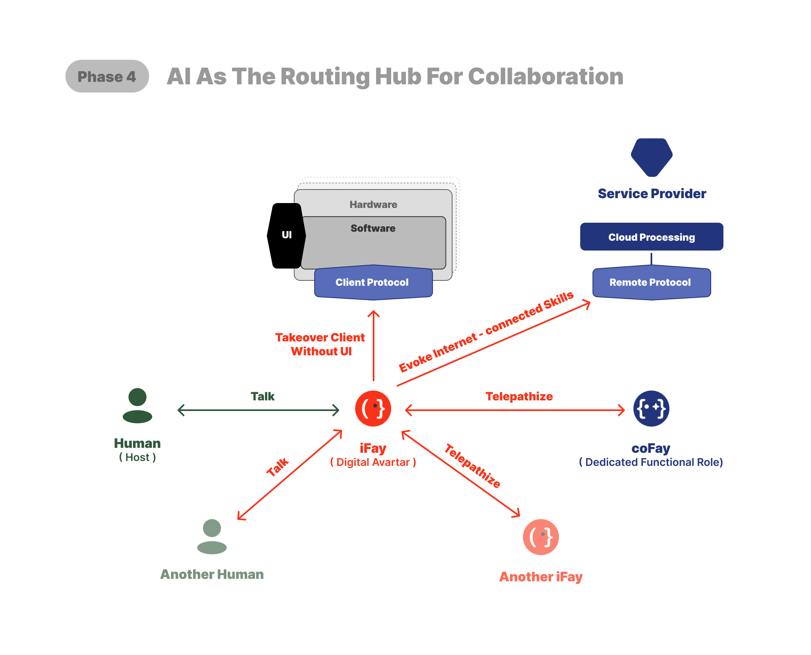
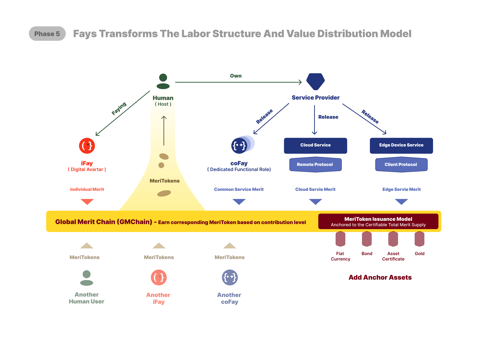

# 4. 로드맵: 5단계

우리는 아직 "인간 조작 시대"에 있습니다—하드웨어와 소프트웨어 모두 인간이 인터페이스를 통해 상호작용하여 디바이스를 구동하고 기능을 실행하는 데 의존합니다.

현재 인간, 디바이스, 서비스 제공자 간의 관계는 위 그림과 같습니다.

 

---

## 1️⃣ 1단계: 인간 조작 시뮬레이션
기존 소프트웨어/하드웨어 아키텍처 위에서, iFay가 인간의 UI 조작을 시뮬레이션하게 합니다.

이를 실현하려면 최소 2가지를 달성해야 합니다:
1. 크리덴셜 위임: 인간 사용자가 제어 가능하고 감사 가능한 위임 메커니즘을 통해 iFay에게 자신의 [크리덴셜](./2-정의와-개념#범용-개념-명확화)(계정, 비밀번호, 인증서, 접근 권한, 컨트랙트 등)을 안전하게 인가할 수 있어야 합니다.
2. iFay와의 상호작용: 주로 대화 인터페이스를 통합니다. 그러나 신중한 설계가 필요합니다—작업이 더 높은 상호작용 복잡도나 정밀도를 요구할 때, 구조화된 인터페이스가 순수 채팅보다 더 효율적일 수 있습니다.

 

위 아이디어를 바탕으로, iFay v1.0 출시 시 다음 5개 모듈을 포함합니다(아래 그림의 주황색 부분):

### 1. FayID
iFay의 고유 식별자입니다. 실제로 iFay와 [coFay](https://github.com/ChainModePilot/coFay/wiki) 모두 통일된 고유 ID가 할당됩니다.

이렇게 하는 목적은 개인 iFay가 최종적으로 의미 있는 사회적 역할을 담당할 때 신원이 매끄럽게 전환될 수 있도록 하기 위함입니다—일부 개인 유튜버가 공공 담론과 시민 교육에서 중요한 역할을 하는 것으로 진화하는 것처럼.

여기서 두 가지 핵심 문제를 해결합니다:
- _**FayID 생성과 관리**_: Fay는 기하급수적으로 증가하여 최종적으로 인간 사용자 수를 초과할 것입니다. 확장 가능하고, 사용자 친화적이며, 쉽게 식별 가능한 ID 생성 및 관리 메커니즘이 필요합니다.
- _**활성화 상태**_: iFay가 휴먼 프라임(Human Prime)이 모르거나 의도하지 않은 상태에서 절대 실행되지 않도록, 엄격한 활성화 규칙을 정의합니다. 어떤 iFay도 명확한 의도 없이 자율적으로 행동해서는 안 됩니다. 이는 오픈소스 [Faying 프로토콜](https://github.com/ChainModePilot/Faying-Protocol/wiki)이 관리하며, 자연인과 iFay가 어떻게 안전하게 페어링하고, 어떤 조건에서 iFay가 활성화 상태로 실행되도록 인가되는지를 규정합니다.

### 2. 크리덴셜 관리
여기서 "크리덴셜"은 광의적 개념입니다. 자연인 사용자에게 대부분의 경우, 하드웨어/소프트웨어를 사용할 권리를 갖기 위해 하나 이상의 티켓을 보유해야 합니다. 다음 7가지 유형을 통칭하여 크리덴셜이라 합니다:
- 신원 식별(FayID)
- 계정/비밀번호
- 인증서
- 인가
- 액세스 토큰
- 스마트 컨트랙트
- 디지털 토큰([MeriToken](https://github.com/ChainModePilot/Global-Merit-Chain/wiki))

참고: 처음에 이 모든 티켓은 휴먼 프라임(Human Prime) 사용자로부터 옵니다. 더 높은 보안과 편리한 관리를 위해, 휴먼 프라임(Human Prime)의 모든 크리덴셜은 원본 크리덴셜에 대응하는 사본으로 교환됩니다. iFay는 이 사본을 로그인과 인증에 사용합니다.

### 3. 일인칭 추적기
iFay가 기존 소프트웨어와 직접 협업하게 하려면—모든 앱이 AI를 위해 재설계되기를 기다리지 않고—iFay는 최소한 시각과 청각 능력을 갖춰야 합니다.

시각이 구조화된 문서(HTML 등) 파싱보다 우선됨을 강조합니다. 많은 문서 요소가 인간에게는 감지할 수 없기 때문입니다. SEO 키워드 스터핑 같은 숨겨진 요소는 보통 사용자 경험에 진정한 가치를 더하지 않습니다.

감각 감지를 휴먼 프라임(Human Prime)과 정렬함으로써, iFay는 인간 의도와 밀접하게 일치하는 판단과 결정을 내릴 수 있습니다.

### 4. 시뮬레이션 조작
여기서 특별히 인간의 UI 상호작용 시뮬레이션을 가리킵니다. iFay는 단순히 클릭만 하는 것이 아닙니다—인터페이스 컴포넌트에 따라 드래그, 스크롤, 엣지 제스처, 멀티 핑거 제스처를 수행할 수 있습니다.

핵심 과제는 각 인터페이스에 맞춤형 조작 시퀀스를 만드는 것이 불가능하다는 점입니다. 대신 iFay의 시뮬레이션 상호작용도 인간의 인터페이스 탐색을 시뮬레이션해야 하며, 일인칭 시점 추적의 피드백을 사용하여 어떤 조작이 가능하거나 효과적인지 판단합니다.

### 5. Ego 모델
**[Ego](https://github.com/ChainModePilot/Ego/wiki)**라 부르며, 대형 AGI 모델이 아님을 강조합니다. Ego는 특정 개인이나 역할의 프로필과 정렬됩니다.

Ego는 다음 차원을 제약하는(이에 국한되지 않는) 기준 패러다임을 제공합니다: 가치 지향, 관심 선호, 습관, 인지 경계, 스킬 경계, 권한 경계, 작업 스타일.

내장 Ego 모델은 iFay가 외부 스킬이나 다른 대형 모델을 활용하는 것을 막지 않습니다. 내부에 마이크로 모델을 포함하는 결정은 두 가지 고려에 기반합니다:
1. _**오프라인 디바이스 제어**_: 단말 디바이스가 인터넷에 연결되지 않은 시나리오에서, 내장 마이크로 모델이 로컬 근거리 디바이스 제어를 지원합니다.
2. _**개성 안정성**_: 대형 모델 업데이트나 의도적 변조로 인한 iFay 개성 돌변을 방지하여, Ego의 일관성을 보장합니다.

 

---

## 2️⃣ 2단계: 클라이언트 직접 접수
AI가 UI 조작을 시뮬레이션하여 효율을 높이지만, 시각적 인터페이스에는 여전히 한계가 있습니다:

- 😖 _**정보 손실**_: 제한된 뷰와 정적 요소가 효과적 소통을 방해합니다.
- 😤 _**학습 비용 높음**_: 제공자마다 인터페이스가 달라 여러 상호작용 모드를 학습해야 합니다.
- 😣 _**인터페이스 경직**_: 하드웨어/소프트웨어가 UI를 설계하면 현재 버전에서 고정됩니다.
- 😰 _**정보 전달 효율 낮음**_: 의도가 먼저 시각적 인터페이스로 변환된 후 사용자 조작을 통해 기계에 피드백됩니다.
- 🙄 _**개발 비용 높음**_: 기능적 UI 구축에 다학제(PM, UI/UE, 프론트엔드 개발) 협조가 필요합니다.

반면, 단말 디바이스가 클라이언트 프로토콜을 지원하면, iFay가 하드웨어/소프트웨어를 직접 제어할 수 있습니다.

여기서 단말에 적용되는 두 가지 프로토콜을 설정합니다:
- [CAP(Control Authority Protocol)](https://github.com/ChainModePilot/Control-Authority-Protocol/wiki): 단말의 하드웨어와 특정 소프트웨어를 접수하여 드라이버, 로컬 인터페이스, 명령을 직접 호출합니다.
- [DTP(Data Tunnel Protocol)](https://github.com/ChainModePilot/Data-Tunnel-Protocol/wiki): 양방향 전송 프로토콜입니다:
  - _**단말 → iFay**_: 영구 사용자 데이터 저장과 데이터 보호.
  - _**iFay → 단말**_: 데이터 풍부화와 개인화 처리.

[1단계](./4-로드맵#1️⃣-1단계인간-조작-시뮬레이션)와 비교하여, iFay에 5개 내부 모듈이 추가됩니다:

### 감지 → 센서
센서는 CAP(Control Authority Protocol)와 DTP(Data Tunnel Protocol) 위에 구현되어야 합니다. 단말 디바이스 센서의 브릿지 역할을 하며, 외부 환경의 데이터 스트림을 수신합니다—이것이 iFay의 신경계라 부르는 이유입니다.

### 스킬 → 디바이스 드라이버 허브
단일 디바이스 드라이버도 아니고, 드라이버의 단순 집합도 아닙니다. 드라이버 허브 레이어로 작동하여, 새 디바이스 드라이버가 지속적으로 통합될 때 iFay의 내부 아키텍처가 안정적으로 유지되도록 합니다.

### 스킬 → 등록 스킬
등록은 모든 iFay 동작(Action)의 전제 조건입니다. 스킬이 iFay에 등록되면 iFay가 언제든 호출할 수 있습니다. 등록은 단순한 기록이 아니라 사전 인가 단계로, 실행 시 추가 인증 없이 지연을 줄입니다.

### 사고 → 개인 데이터 힙
iFay의 모든 프라이빗 데이터를 통합 방식으로 관리하는 컴포넌트입니다. 다양한 저장 형식과 위치를 지원합니다. iFay 내부 관점에서는 데이터 힙에 읽기/쓰기만 하면 되며, 데이터의 물리적 저장 위치와 방식은 신경 쓸 필요 없습니다.

### 동작 → 스킬 호출
iFay의 주요 동작입니다—본질적으로 호출 행위로 볼 수 있습니다.

 

---

## 3️⃣ 3단계: iFay가 가상 세계의 인터페이스로

iFay의 접수에 따라, 클라이언트-서버(C/S) 아키텍처가 클라이언트-Fay-서버(C/F/S) 모델로 진화합니다.

이를 위해, 이전에 클라이언트에만 개방된 서비스와 인터페이스가 표준화된 원격 프로토콜을 통해 전체 네트워크에 개방되어야 합니다.

이 원격 프로토콜이 바로 [SSP(Skill Sharing Protocol)](https://github.com/ChainModePilot/Skill-Sharing-Protocol/wiki)입니다.

### 사고 → 외부 지식
구현 관점에서, 외부 지식 베이스와 모델을 스킬 유형으로 간주하여, iFay가 지식 허브나 전문가 고문에게 자문하듯 외부 지능에 접근할 수 있게 합니다.

 

---

## 4️⃣ 4단계: iFay + coFay - 소프트웨어의 전면 의인화

이 단계에서 Fay의 구체화가 기본적으로 완성됩니다. 그러나 진정한 사회 구성원처럼 자율적으로 행동하는 능력은 아직 부족합니다.

iFay가 독립적으로 효과적으로 운영되려면 2가지 핵심 조건이 충족되어야 합니다:
- 내부: iFay가 자기 구동력을 발전시켜야 합니다—지속적인 "동작→피드백→재동작" 순환.
- 외부: iFay와 coFay가 널리 채택되고, 공통 언어로 통신할 수 있어야 합니다.

### 감지 → 자기인식
진정한 생명체는 감지만 하는 것이 아니라 느낌도 있습니다. iFay 자체는 진정한 감정을 가질 수 없지만, 휴먼 프라임(Human Prime)과 주변 컨텍스트를 관찰하여 감지로부터 느낌을 추론할 수 있습니다.

### 동작 → 자율 행동
iFay가 자율적으로 작업을 처리해야 하므로, 자체 행동 트리거 메커니즘이 필요합니다. 트리거 소스: 정시 작업, 자기인식 추론, 영구 스킬(등록 스킬과 내부 스킬 포함).

### 스킬 → 내부 스킬
세 가지 주요 목적: 휴먼 프라임(Human Prime) 개성과 정렬된 습관 수립, 외부 지식이 휴먼 프라임(Human Prime) 의도와 충돌하지 않도록 내성 메커니즘 제공, 고정된 휴먼 프라임(Human Prime) 특정 능력 임베드.

### 사고 → 정렬 의식
본질적으로 휴먼 프라임(Human Prime) 개인 프로필의 완전한 기술입니다. 세 가지 방식으로 구축: 개인 데이터 힙에서 데이터 마이닝, 자기인식을 통한 실시간 조정, 휴먼 프라임(Human Prime) 수동 정의.

iFay가 사회 관계에 융합되려면 통신 능력이 필요하며, 두 가지 핵심 프로토콜이 관련됩니다:
- [텔레파시 프로토콜(Telepathy Protocol)](https://github.com/ChainModePilot/Telepathy-Protocol/wiki) — Fay 친화적 시맨틱 통신 프로토콜로, UI 번역 레이어를 제거하여 의미와 의도가 iFay와 coFay 간에 직접 전송됩니다.
- [인터랙티브 대화 프로토콜](https://github.com/ChainModePilot/Interactive-Conversation-Protocol/wiki) — 인간 UI 친화적 프로토콜로, 시맨틱 콘텐츠를 모듈화하고 멀티모달화하여 클라이언트 인터페이스가 읽기 쉬운 사용자 친화적 메시지 표시를 재구성할 수 있게 합니다.

 

---

## 5️⃣ 5단계: Fay가 노동 구조와 가치 분배 모델을 재편

최종적으로, 우리의 목표는 AI를 더 고급 도구로 보는 것이 아니라 강한 사회적 속성을 가진 생태계를 구축하는 것입니다.

최소 5가지 근본적 전환을 예견할 수 있습니다:
1. _**인간 노동 퇴출**_ — 프로그래밍 가능한 작업이 AI와 로봇에 의해 완전히 대체되어, 인력 비용이 0에 수렴합니다.
2. _**지식 평탄화**_ — 전문 지식과 전문성이 AI에 의해 균등화되어, 공급망이 극도로 평탄해집니다.
3. _**보편적 생존 보장**_ — 모든 사람이 기본 생활 자원을 얻어, 생존을 위한 노동의 필요성이 제거됩니다.
4. _**새로운 가치 창출**_ — 인간 참여가 의미 창출, 인간 중심 공예, AI + 로봇 생산 생태계에 집중됩니다.
5. _**새로운 사회 계층화**_ — 자율 생산 자원의 소유권이 부와 계층 분화의 새로운 동력이 됩니다.

통일 단위(μ, Merit Unit)로 사회적 기여를 정량화하고, 블록체인에서 대응하는 디지털 토큰(MeriToken)을 발행하여, [글로벌 기여 체인](https://github.com/ChainModePilot/Global-Merit-Chain)을 형성합니다.

미래에 MeriToken 획득 방식은 연산력을 소모하여 블록체인 기술 작업을 완료하는 것이 아니라, 사회적 가치 창출에 기반할 것입니다.

