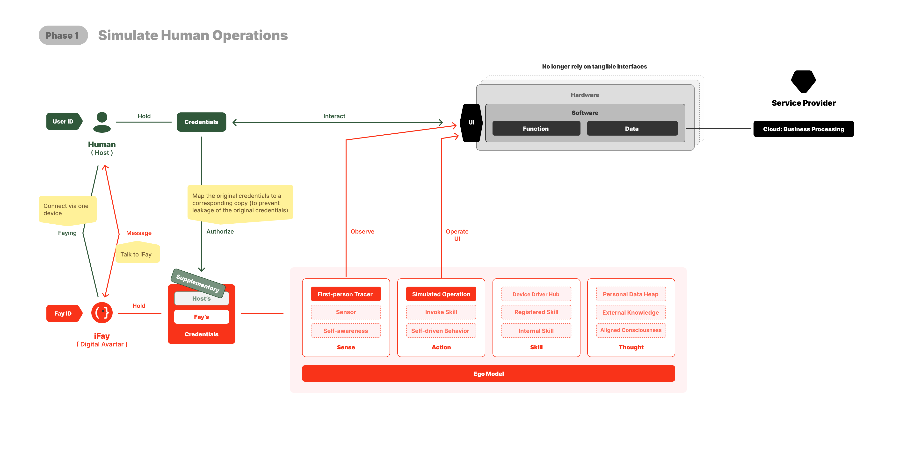

# 4. 路线图：5 个阶段

我们仍处于"人类操作时代"——硬软件都依赖人类通过界面交互来驱动设备和执行功能。

目前，人类、设备和服务提供商之间的关系正如上图所示。

 

---

## 1️⃣ 第一阶段：模拟人类操作
在现有的软硬件架构之上，我们让 iFay 模拟人类的 UI 操作。

要实现这一点，我们至少需要做到 2 件事：
1. 凭证委托：人类用户必须能够通过可控且可审计的委托机制，安全地授权 iFay 使用其[凭证](./02-定义与概念#通用概念澄清)（账号、密码、证书、访问权限、合约等）。
2. 与 iFay 交互：主要通过对话界面。然而，需要精心设计——当任务涉及更高的交互复杂度或精度时，结构化界面可能比纯聊天更高效。

 

基于以上思路，当我们发布 iFay v1.0 时，它将包含以下 5 个模块（即下图中的橙色部分）：

### 1. FayID
这是 iFay 的唯一标识符。实际上，iFay 和 [coFay](https://github.com/ChainModePilot/coFay/wiki) 都被分配统一的唯一 ID。

这样做的目的是确保当个人 iFay 最终承担有意义的社会角色时，身份能够平滑过渡——就像一些个人 YouTuber 演变为在公共话语和公民教育中扮演重要角色一样。

这里我们解决两个核心问题：
- _**FayID 生成与管理**_：Fay 将呈指数级增长，最终超过人类用户数量。这需要一个可扩展的、用户友好的、易于识别的 ID 生成和管理机制。
- _**激活状态**_：为确保 iFay 永远不会在人类原型不知情或无意图的情况下运行，我们定义了严格的激活规则。任何 iFay 都不应在没有明确意图的情况下自主行动。这由开源的 [Faying 协议](https://github.com/ChainModePilot/Faying-Protocol/wiki)管理，该协议规定了自然人与 iFay 如何安全配对，以及在什么条件下 iFay 被授权以激活状态运行。

### 2. 凭证管理
这里的"凭证"是一个广义概念。对于自然人用户来说，大多数时候，用户必须持有一个或多个票据才有权使用硬软件。以下 7 种类型统称为凭证（随着迭代可能会添加更多类型）：
- 身份标识（FayID）
- 账号 / 密码
- 证书
- 授权
- 访问令牌
- 智能合约
- 数字代币（[MeriTokens](https://github.com/ChainModePilot/Global-Merit-Chain/wiki)）

注意：最初，所有这些票据都来自人类原型用户。为了更高的安全性和更便捷的管理，人类原型的所有凭证都将被交换为与原始凭证对应的副本。iFay 使用此副本进行登录和认证。

当然，我们并不认为 iFay 不能拥有自己的凭证而人类原型不能使用它们。因此，每种凭证都会标明其原始所有者是人类原型还是 iFay 本身。

例如：当我们需要验证某人提供的个人信息的真实性时，我们可能会授权 iFay 直接登录数据库进行查询。为了防止私有数据泄露，iFay 只需要反馈是真还是假。

### 3. 第一人称追踪器
要让 iFay 直接与现有软件协作——而不是等待每个应用都为 AI 重新设计——iFay 必须至少具备视觉和听觉能力。

我们强调视觉优先于解析结构化文档（如 HTML），因为许多文档元素对人类来说是不可感知的。隐藏元素，如 SEO 关键词堆砌，通常不会为用户体验增加真正的价值。

通过将其感官感知与人类原型对齐，iFay 可以做出与人类意图密切匹配的判断和决策。

关键挑战在于为 iFay 实现手眼协调。视觉和听觉感知必须超越被动处理软件反馈——iFay 还需要追踪其自身操作引起的变化。

例如，它必须跟踪光标移动、检测窗口移动后新暴露的区域，并适应动态界面变化。这需要第一人称视角追踪与模拟交互紧密耦合，确保 iFay 像人类操作者一样感知和响应环境。

### 4. 模拟操作
这里我们特指模拟人类与 UI 的交互。iFay 不仅仅是点击——它可能拖拽、滚动、执行边缘手势或多指手势，取决于界面组件。

核心挑战在于为每个界面定制操作序列是不可行的。相反，iFay 的模拟交互也必须模拟人类对界面的探索，使用第一人称视角追踪的反馈来判断哪些操作是可行或有效的。这种方法与传统 RPA 实现有根本区别，后者依赖预定义脚本而非自适应的、感知驱动的探索。

### 5. Ego 模型
我们称之为 **[Ego](https://github.com/ChainModePilot/Ego/wiki)**，强调它不是一个大型 AGI 模型。Ego 与特定个人或角色的画像对齐。

许多追求 AGI 的超大型模型面临一个关键限制：无论其知识和技能多么广泛，都无法完全满足每个人或场景的独特偏好和上下文。

Ego 提供了一个基线范式，约束（但不限于）以下维度：
- 价值取向
- 兴趣偏好
- 习惯
- 认知边界
- 技能边界
- 权限边界
- 工作风格

需要注意的是，嵌入 Ego 模型并不阻止 iFay 利用外部技能或其他大型模型。内部包含微型模型的决定基于两个考虑：
1. _**离线设备控制**_：在终端设备未连接互联网的场景中，嵌入的微型模型支持本地近场设备控制。
2. _**个性稳定性**_：防止因大型模型更新或蓄意篡改导致 iFay 个性突变，确保 Ego 保持一致。

 

---

## 2️⃣ 第二阶段：直接接管客户端
虽然 AI 模拟 UI 操作提高了效率，但视觉界面仍然存在局限：

- 😖 _**信息损失**_：有限的视图和静态元素阻碍了有效沟通。
- 😤 _**学习成本高**_：不同提供商的界面不一致，迫使用户学习多种交互模式。
- 😣 _**界面僵化**_：一旦硬软件设计了 UI，它在当前版本中就是固定的。用户在使用不同设备或应用时必须重新学习界面。
- 😰 _**信息传递效率低**_：意图必须先转化为视觉界面，然后通过用户操作反馈给机器。
- 🙄 _**开发成本高**_：构建功能性 UI 需要跨学科（如产品经理、UI/UE、前端研发）协调。

相比之下，如果终端设备支持客户端协议（如上图所示），iFay 可以直接控制硬软件。这种方法解决了上述所有五个问题：
- _**无限输出**_：信息不再受 UI 显示限制的约束。
- _**基于意图的交互**_：用户表达意图，iFay 将其转化为 API 调用或命令。
- _**丰富数据，简洁交付**_：终端可以输出丰富的结构化数据，iFay 过滤和总结为清晰的精要信息。
- _**直接传输**_：无需视觉渲染，实现更高效的数据流。
- _**无需前端**_：UI 设计和开发可以最小化甚至消除。

我在这里设定了两个适用于终端的协议：
- [控制权限协议（CAP）](https://github.com/ChainModePilot/Control-Authority-Protocol/wiki)：用于接管终端的硬件和特定软件，直接调用驱动程序、本地接口和命令，目的是使 iFay 能够控制终端。
- [数据隧道协议（DTP）](https://github.com/ChainModePilot/Data-Tunnel-Protocol/wiki)：这是一个双向传输协议：
  - _**终端 → iFay**_：持久化用户数据存储和数据监护。
  - _**iFay → 终端**_：数据丰富化和个性化处理。

在下图中，蓝色部分对应这两个协议，分别针对设备功能和数据。

与[第一阶段](./04-路线图#1️⃣-第一阶段模拟人类操作)相比，iFay 新增了五个内部模块，首先是：

 

### 感知 → 传感器
传感器必须在控制权限协议和数据隧道协议之上实现。它作为终端设备传感器的桥梁，接收来自外部环境的数据流——这就是我们称之为 iFay 神经系统的原因。

关键的是，iFay 不需要始终处理所有传入数据。传感器可以动态调节其灵敏度，以更好地匹配周围上下文。

可以把传感器看作灵敏度调节器。与外部世界的实际接口由设备驱动中枢和个人数据堆管理。

 

### 技能 → 设备驱动中枢
需要澄清的是，这不是单个设备驱动程序，也不是驱动程序的集合。

它作为驱动中枢层运行，确保在新设备驱动不断集成时，iFay 的内部架构保持稳定，无需随每次更新而修改。

 

### 技能 → 注册技能
注册是任何 iFay 动作（Action）的前提条件。

当技能被注册到 iFay 时，意味着 iFay 可以随时调用它。注册不仅仅是简单的记录——它通常作为预授权步骤，确保执行时无需额外认证，从而减少延迟。

另一个关键好处是离线弹性：当 iFay 离线时，它可以缓存待执行的动作，并在连接恢复后异步执行。

 

### 思维 → 个人数据堆
该组件负责以统一方式管理 iFay 的所有私有数据。它支持多种存储格式和位置——例如，部分数据可能驻留在 iFay 的运行时内存中，部分在 Google Drive 中，部分在专用向量数据库中。

从 iFay 内部视角来看，它只需要对数据堆进行读写，无需关心数据的物理存储位置和方式。

 

### 动作 → 技能调用
这是 iFay 的主要动作——本质上，你可以把它看作一种调用行为。

 

---

## 3️⃣ 第三阶段：iFay 作为虚拟世界的接口

随着 iFay 的接管，客户端-服务器（C/S）架构演变为客户端-Fay-服务器（C/F/S）模型。
用户不再需要手动操作客户端来访问后端服务——相反，iFay 可以直接捕获和利用互联网上的开放服务。

为了实现这一目标，之前仅对客户端开放的服务和接口应通过标准化远程协议向全网开放。

这个远程协议正是下图所示的[技能共享协议](https://github.com/ChainModePilot/Skill-Sharing-Protocol/wiki)。

如图所示，iFay 控制了客户端（边缘设备）和服务端（或云服务）两侧。

人类原型只需要与自己的 iFay 通信，iFay 然后根据人类原型的意图调用所需的服务。

由于人类原型查看信息的界面由 iFay 组合和渲染，它实际上扮演了浏览器的角色。

由于引入 iFay 的核心动机是使其成为超越人类原型的智能延伸，其增强能力通过注册技能实现。
在思维领域，我们引入以下模块：

 

### 思维 → 外部知识

从实现角度来看，我们将外部知识库和模型视为一种技能类型，使 iFay 能够像咨询知识中枢或专家顾问一样访问外部智能。
通过此技能获取的知识和信息与 iFay 的个人数据一起管理，最终实现超越人类原型自身能力的智能。

 

---

## 4️⃣ 第四阶段：iFay + coFay - 软件的全面拟人化

在这个阶段，Fay 的具象化基本完成。
然而，它们仍然缺乏像真正的社会成员一样自主行动的能力。
要使 iFay 能够独立有效地运行，必须满足 2 个关键条件：
- 内部：iFay 必须发展自驱动力——持续的"动作→反馈→再动作"循环。
- 外部：iFay 和 coFay 必须被广泛采用，并能够使用共同语言进行通信。
有了这个基础，iFay 可以与人类、其他 iFay 或其专属 coFay 协作，自主执行预定义的任务。

为此，我们需要在四个核心模块——感知、动作、技能和思维——中嵌入自驱能力。

 

### 感知 → 自我感知
一个真正的生命体不仅仅是感知——它还有感受。
与机器不同，iFay 本身不能拥有真正的情感。但通过观察其人类原型和周围上下文，它可以从感知中推断感受。
这是构建 iFay 自我感知的核心策略。

 

### 动作 → 自驱行为
由于 iFay 需要自主处理任务，它必须拥有自己的行为触发机制。
这些触发可以来源于：
- 定时任务
- 自我感知推断
- 持久技能，包括注册技能和内部技能。

 

### 技能 → 内部技能
我们引入内部技能模块有三个主要目的：
- 建立与人类原型个性对齐的习惯，包括对外部技能的潜在限制或治理。
- 提供内省机制，确保外部知识永远不与人类原型意图冲突。
- 嵌入固定的人类原型特定能力，如专业技能和专业知识。

 

### 思维 → 对齐意识
本质上，这代表了人类原型个人画像的完整描述。
它可以通过三种主要方式建立（可能还有更多）：
- 从个人数据堆挖掘数据。
- 通过自我感知实时调整。
- 人类原型手动定义。

 

然而，仅此还不足以让 iFay 融入社会关系。
为此，我们需要为 iFay 配备通信能力，涉及两个核心协议：
- [心灵感应协议](https://github.com/ChainModePilot/Telepathy-Protocol/wiki) — 一种 Fay 友好的语义通信协议，去除 UI 翻译层，允许意义和意图在 iFay 和 coFay 之间直接传输。它使用约定的向量编码令牌替代结构化文本。
- [交互对话协议](https://github.com/ChainModePilot/Interactive-Conversation-Protocol/wiki) — 一种人类 UI 友好的协议，将语义内容模块化和多模态化，使客户端界面能够重构易读的用户友好消息展示。

 

---

## 5️⃣ 第五阶段：Fay 重塑劳动结构与价值分配模型

最终，我们的目标是构建一个具有强社会属性的生态系统，而不是将 AI 视为更高级的工具。
这种新型社会形态将不可避免地与我们今天所知的人类社会不同。
我们可以预见至少 5 个根本性转变：
1. _**人类劳动退出**_ — 程序化工作将完全由 AI 和机器人接管，推动人力资源成本趋近于零。
2. _**知识扁平化**_ — 专业知识和专长将被 AI 均等化，使供应链变得极度扁平。
3. _**普遍生存保障**_ — 每个人都将获得基本生活资源，消除为生存而工作的需要。
4. _**新价值创造**_ — 人类参与将集中在意义创造、以人为本的工艺和 AI + 机器人生产生态系统。
5. _**新社会分层**_ — 自主生产资源的所有权将成为财富和阶层分化的新驱动力。

这将从根本上重塑建立在物质资源（即生产资料）所有权基础上的经济生态系统。
从经济角度来看，将出现 2 个重大转变：
- _**人类在实体经济中的参与最小化**_ — 极少数人将直接参与传统生产活动。
- _**人类劳动单位价值急剧增加**_ — 除非人类工作被高度重视，否则人类将完全退出体力劳动。

当大多数人沉浸在虚拟工作中时，传统的价值衡量标准——如工作时间、货币收入或商品实物数量——变得不够充分。
因此，衡量社会价值需要一种共识机制，类似于拍卖如何确定艺术品或股票的价值。拍卖只是建立共识的一种方式。

为了维持这种共识，需要一个专用平台。目前，区块链是一个合适的选择，拥有多年的积累经验。

我们以统一单位（μ，Merit Unit）量化社会贡献，并在区块链上发行相应的数字代币（MeriToken），形成我们所称的[全球贡献链](https://github.com/ChainModePilot/Global-Merit-Chain)。

未来，获取 MeriToken 的方式将不依赖于消耗算力来完成区块链的技术工作，而是基于创造社会价值。

