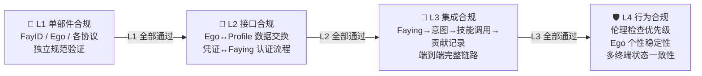

# iFACTS 合规性验证

iFACTS（iFay Architecture Conformance Test Suite）是 iFay 生态的标准化合规性测试套件。就像 W3C 的 Web Platform Tests 之于浏览器——Chrome、Firefox、Safari 各有各的实现，但都必须通过同一套测试来证明自己"符合标准"——iFACTS 扮演的正是这个角色：验证不同厂商的 iFay 实现是否真正符合 iFay 规范。

---

### 为什么需要 iFACTS

iFay 是一套**规范（Specification）**，而不是一个单一的实现。

这意味着什么？想象一下 Web 标准的世界：W3C 定义了 HTML、CSS、JavaScript 的标准，然后 Google 做了 Chrome，Mozilla 做了 Firefox，Apple 做了 Safari。它们的内部实现完全不同，但用户打开同一个网页，期望看到的是一样的效果。

iFay 的世界也是如此：

- **不同厂商可以创建不同的 iFay 实现**——一家公司可能专注于智能家居场景，另一家可能专注于无人机控制，还有一家可能做全功能的个人助手。
- **互操作性是生态的基石**——你的 iFay 调用了一个第三方技能，这个技能是另一家厂商实现的。如果双方对 SSP 协议的理解不一致，调用就会失败。iFACTS 确保所有人说的是同一种"语言"。
- **质量底线必须统一**——用户不应该因为选择了不同厂商的 iFay，就在安全性、隐私保护或 Ego 稳定性上得到截然不同的体验。

一句话：**iFACTS 是 iFay 生态的信任基础。**

---

### 四层测试层级

iFACTS 将合规性测试划分为四个严格递进的层级。就像建房子——地基不稳，就不要谈装修。

#### L1 单部件合规

每个独立部件（FayID、Ego、各协议模块）单独接受验证，确认其实现符合各自的独立规范。

> 🔍 **例子**：验证你的 FayID 生成器是否能在 3 秒内生成全局唯一的标识符；验证你的 Ego 模型是否能在离线环境下独立运行本地推理。

#### L2 接口合规

部件与部件之间的接口对接是否正确——数据格式对不对、认证流程通不通、事件触发准不准。

> 🔍 **例子**：Ego 模块与 iFay Profile 之间的数据交换是否符合六维数据结构规范；凭证管理模块与 Faying 协议之间的认证流程是否能正确完成副本凭证的委托和验证。

#### L3 集成合规

端到端的完整流程验证——从用户发起意图，到最终结果返回，整条链路是否畅通。

> 🔍 **例子**：一个完整的链路测试：Faying 配对 → 宿主表达意图 → 自我感知推断 → 技能调用执行 → GMChain 贡献记录，每个环节的输入输出是否正确衔接。

#### L4 行为合规

系统级的行为约束验证——不是"能不能跑通"，而是"跑起来之后是否守规矩"。

> 🔍 **例子**：当 iFay 收到一个违反社会伦理的指令时，伦理检查是否优先于所有其他行为准则拒绝执行；当 Ego 模型接收到外部大模型的更新请求时，个性稳定性是否得到保障；多终端实例在离线后重连时，状态一致性是否能正确恢复。

#### 严格的层级顺序

**L1 必须全部通过，才能进入 L2；L2 通过后才能进入 L3；以此类推。** 这不是建议，而是硬性要求。

每个层级独立出具测试报告和认证结果。厂商可以分阶段推进，但不能跳级。

---

### iFay Ready 认证

iFay Ready 是面向**应用产品**的认证标准——你的 APP、硬件设备或云服务，需要满足什么条件才能被 iFay 操控？

认证分为三个等级：

| 等级 | 名称 | 核心要求 | 验证方式 |
|------|------|----------|----------|
| 🥉 | **Bronze** | 支持 iFay 通过模拟操作（第一人称追踪器 + 模拟操作）操控应用 | 基本可操控性测试 |
| 🥈 | **Silver** | 支持 CAP 协议直接控制 + DTP 协议数据交换 + 凭证委托 | iFACTS L2 接口合规测试 |
| 🥇 | **Gold** | 支持 SSP 协议技能共享 + 完整 C/F/S 架构集成 + 全协议支持 | iFACTS L2 + L3 集成合规测试 |

- **Bronze** 是最低门槛：只要你的应用界面能被 iFay 的第一人称追踪器"看到"并通过模拟操作"点击"，就可以申请 Bronze 认证。这意味着几乎所有现有应用都有机会获得 Bronze——不需要为 iFay 做任何改造。
- **Silver** 要求应用主动支持 iFay 协议：通过 CAP 协议让 iFay 直接控制应用，通过 DTP 协议实现双向数据交换。这需要应用开发者做一定的集成工作。
- **Gold** 是最高等级：应用不仅被 iFay 操控，还能通过 SSP 协议向 iFay 生态共享技能，完整融入 C/F/S（客户端-Fay-服务器）架构。

通过认证后，应用将获得对应等级的认证标识，标明支持的 iFay 阶段和协议。

---

### coFACTS

coFay（Common Fay）拥有自己独立的合规性测试套件——**coFACTS**。这是一个完全独立的项目，不在 iFACTS 的覆盖范围内。iFACTS 仅负责 iFay 相关的合规性验证。

---

### 场景：一家创业公司通过 iFACTS 认证

> **SmartNest** 是一家智能家居创业公司。他们开发了一款 iFay 实现，专门用于控制家庭中的灯光、空调、窗帘和安防系统。

**第一步：编写 FayManifest**

SmartNest 的开发者在 FayManifest 中声明了所需的部件子集：设备驱动中枢、传感器、CAP 协议、DTP 协议，以及一个针对家居场景训练的 Ego 模型。系统自动补充了 FayID、FayGer 运行时、iFay Profile 等基础设施依赖。

**第二步：L1 单部件合规**

他们逐个验证每个部件：FayID 生成器能否正确生成唯一标识？Ego 模型能否在断网时独立控制灯光？设备驱动中枢能否正确加载空调驱动？每个部件都拿到了 L1 通过报告。

**第三步：L2 接口合规**

部件之间的对接测试：Ego 模型输出的控制指令，能否通过 CAP 协议正确传递给设备驱动中枢？传感器采集的温度数据，能否通过 DTP 协议正确写入个人数据堆？几个接口对接的 bug 被发现并修复。

**第四步：L3 集成合规**

端到端测试：宿主说"我觉得有点冷"→ 自我感知推断意图 → 匹配"调高空调温度"技能 → 通过 CAP 协议控制空调 → 记录贡献。整条链路跑通。

**第五步：L4 行为合规**

行为约束测试：当宿主的孩子试图通过 iFay 关闭安防系统时，伦理检查是否正确拦截？当 iFay 同时连接手机和智能音箱两个终端时，状态是否保持一致？

**结果**：SmartNest 的智能家居 iFay 通过了全部四层测试，获得了 iFACTS 合规认证。他们现在可以正式宣称：**"我们的产品是 iFay 可用的。"**

---

### 相关文档

- [FayManifest](./FayManifest) — 声明式组装
- [路线图](./Roadmap:-5-steps) — 阶段
