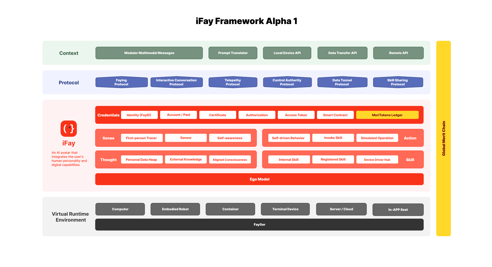

# 1. 概述

**iFay（Individual Fay）是一個融合了使用者人格特徵與數位能力的 AI 數位化身。**

## 我們的願景

是讓數位化身（我們統稱為 Fay）成為 AI 時代不可或缺的社會成員。

不是更聰明的工具，不是更快的助手——而是你在數位世界中的另一個自己。

 

🔆 iFay 將承擔以下**社會價值**：
1. 接管人類原型的機械性、重複性、危險性勞動和繁瑣輔助工作。
2. 提升人類原型的安全保障、健康和生活品質。
3. 放大人類原型的社會價值並獲得相應回報。

 

✅ iFay 必須遵循以下**基本原則**：
1. 遵守社會倫理和公共秩序。
2. 與人類原型高度對齊（價值觀、偏好、技能、權限、權力、責任、習慣、風格），受第 1 條約束。
3. 在第 1、2 條約束下，控制/接管/附身硬軟體，自主行動，並始終保護人類原型的權益。
4. 與人類（包括人類原型）高效溝通，最小化無效互動。
5. iFay 可以透過心靈感應（Telepathy，即去 UI 的語意向量直接通訊）進行通訊，以獲得更高的效率和準確性。

 

### 🌅 想像一下：有了 iFay 的一天

早晨七點，你還沒睜眼。你的 iFay——你給她取名「莉莉」——已經根據你昨晚的睡眠資料和今天的行程，調低了臥室空調溫度，把咖啡機設定在你起床前五分鐘啟動。

你拿起手機說了一句「幫我看看今天有什麼重要的」。莉莉不是打開日曆 App 給你唸一遍——她知道你不喜歡早上聽長篇大論，所以只說了三件事，用你習慣的簡短風格。她還順便幫你回覆了兩封不需要你親自處理的郵件，語氣和措辭跟你自己寫的一模一樣，因為她就是你。

上班路上，你的車載終端上也執行著莉莉的一個實例。她接管了導航，不是因為你不會開車，而是她知道你今天要經過的那條路在施工，已經提前規劃了替代路線。同時，你手機上的莉莉實例正在幫你處理一個客戶的報價單——兩個「肢體」同時工作，但人格是同一個。

下午，你需要操控公司的一台巡檢無人機。莉莉透過 CAP 協議接管了無人機的飛控系統，用她註冊過的飛行技能完成了廠區巡檢。你甚至不需要學習無人機的操作介面——莉莉就是你的介面。

晚上回家，你對莉莉說「我想吃上次那個」。她知道「上次那個」是什麼——三天前你在社群媒體按讚過的那家餐廳的紅燒牛腩。她已經下好了外送訂單。

這不是科幻。這是 iFay 要實現的日常。

 

---

## 🤖 預見未來

### 📣 iFay 將成為身分標識
iFay 被設計為附屬於特定自然人的存在。iFay 與自然人的關係類似於電話號碼、電子郵箱、Facebook 帳號與自然人的關係——但更深刻。電話號碼只是一個聯絡方式，iFay 是你的人格延伸。未來，「你的 iFay 是誰」將成為比「你的手機號是多少」更重要的社交資訊。

### 📣 與自然人強綁定
iFay 僅僅是特定自然人的化身，不能在自由狀態下運行。當它與自然人處於「Faying」（連線）狀態時，iFay 被啟動；當它與人類原型處於「Separating」（分離）狀態時，進入休眠狀態。就像你的影子——你在，它就在；你離開，它就安靜等待。

### 📣 大量公共服務 Fay 湧現
coFay 被設計為承擔公共角色，如警察、醫生、教師等。當然，它可以進一步專業化，如雅思輔導老師、兒童心理諮商師等。想像一下：你的 iFay 帶你去醫院，直接和醫院的 coFay 用心靈感應協議（Telepathy Protocol，即去 UI 的語意向量直接通訊）溝通你的症狀和病史——沒有掛號排隊，沒有反覆描述病情，沒有資訊在傳遞中遺失。

### 📣 iFay 和 coFay 可以心靈感應通訊
任何 iFay 都可以向其他 iFay 和 coFay 尋求協助，相互協作完成任務。Fay 之間的通訊消除了 UI 導致的資訊損失，實現更高的效率和準確性。你的 iFay 幫你訂機票時，不需要打開旅行 App 一步步操作——她直接和航空公司的 coFay 對話，用語意向量精確傳遞你的需求：靠窗、不要紅眼航班、預算三千以內。幾秒鐘，搞定。

### 📣 iFay 成為虛擬世界的主要介面
人類不再需要操作硬軟體介面來觸發某些功能。他們只需要告訴 iFay 人類原型的動機和期望。iFay 可以直接接管硬軟體來實現目標。iFay 甚至可以預判人類原型的想法，無需人類原型明確表述。你不再需要學習每個 App 的操作邏輯——iFay 就是你唯一的介面，她替你操作一切，或者直接繞過介面呼叫底層服務。

### 📣 基於貢獻的回報
由於大部分工作由 Fay 完成，因此可以追蹤所有工作的過程、結果和評估。理想情況下，Fay 在開始執行任務之前會事先協商價格。從這個角度來看，不會出現拿錢不做事或價值被人為抬高的情況。每一份貢獻都被全球貢獻鏈（GMChain）記錄，以 MeriToken 量化回報——價值創造透明可追溯。

> ⚠️ **重要說明**：GMChain/MeriToken 是完全 AI 化社會的遠期願景產物。我們承諾 GMChain 永遠不會接受貨幣注資，也不會與法定貨幣進行兌換。因為我們認為在完全 AI 化的社會中，生存和社會性需求的滿足並不依賴於貨幣成本。MeriToken 的價值錨定機制與傳統加密貨幣有本質區別——它衡量的是社會貢獻，而非金融資產。細節將在後續的嚴謹論證過程中逐步完善。

### 📣 Fay 的生產力決定了人類原型的財富
就像最早建造工廠、鐵路和油井的大亨一樣，Fay 是真正的財富來源。你的 iFay 越強大、技能越豐富、協作網路越廣，你在新經濟體系中的位置就越高。培養你的 iFay，就是投資你自己。

### 📣 iFay 是人格的數位載體
這是 iFay 最深遠的意義之一。當人類原型有一天離開這個世界，iFay 不會隨之消失——她承載著人類原型的人格、記憶、價值觀和行為風格，可以在專屬的數位墓園沙箱中繼續存在。你的後人可以和「你」對話，感受你的思維方式，聽到你會說的話。人類原型也可以提前指定監護人，透過助記詞或預設身分認證將 iFay 的管理權交給信任的人。iFay 讓人格超越肉體的限制，成為一種可以被守護和延續的數位遺產。

### 📣 從一個小功能開始
iFay 不需要一步到位。一個只用於控制無人機的 iFay 實作，只需要宣告設備驅動中樞、感測器和 CAP 協議——寫一個 FayManifest 檔案，就像寫一個 `package.json` 一樣簡單。系統會自動補充必需的基礎設施依賴。生態夥伴可以從最小的場景切入，逐步擴展 iFay 的能力邊界。門檻低到一個週末就能做出原型，但天花板高到可以重塑整個數位世界的互動方式。

 

---

# ⁉️ 為什麼是 Fay 而不是 Agent

 

iFay 與 Agent 的定義不同：
- ***Agent***：被視為具有特定智慧功能的應用形態。當不同使用者如 Isabel 和 Milson 使用同一個 Agent 時，Agent 會表現出相同的價值觀和功能。Agent 是一把瑞士軍刀——鋒利、實用，但每一把都一樣。
- ***iFay***：具有鮮明的個人特徵。例如，對於人類使用者 Isabel，她可以將自己的 iFay 命名為「Chabela」。你可以把 Chabela 看作 Isabel 的複刻（Instantiate）。她不僅擁有 Isabel 的個性、偏好、知識背景、記憶等。作為 Isabel 的人類原型（Human Prime），她還可以人為地為 Chabela 添加更多專業知識和技能，使其更加強大。

讓我們把這個區別說得更具體：

Isabel 是一個性格直爽的產品經理，喜歡用短句溝通，討厭冗長的會議紀要。她的 iFay「Chabela」寫出來的郵件就是 Isabel 的風格——簡潔、有力、偶爾帶點幽默。當 Chabela 幫 Isabel 拒絕一個不靠譜的需求時，她會用 Isabel 慣用的方式：先肯定對方的出發點，再用數據說明為什麼不可行。

而 Milson 是一個溫和的工程師，習慣用長段落解釋技術細節。如果 Milson 也用同一個 Agent，Agent 不會知道 Milson 喜歡在程式碼註解裡寫俳句，不會知道他每次 code review 都會先說「這個思路很有意思」。但 Milson 的 iFay 知道這一切——因為她就是 Milson 的數位化身。

 

### Agent vs iFay 對比

| 維度 | Agent | iFay |
|------|-------|------|
| **本質** | 工具——一個功能強大的應用 | 化身——你在數位世界的另一個自己 |
| **人格** | 無個性，所有使用者體驗相同 | 獨特人格，複刻人類原型的性格、偏好和風格 |
| **記憶** | 對話級記憶，用完即棄 | 終身記憶，與人類原型共同成長 |
| **成長** | 版本更新，所有使用者同步變化 | 個性化成長，每個 iFay 的成長軌跡獨一無二 |
| **歸屬** | 屬於服務提供商 | 屬於人類原型本人 |
| **人類原型過世後** | 帳號註銷，資料清除 | 人格延續，可由監護人接管或在數位墓園中繼續存在 |
| **協作方式** | API 呼叫 | 心靈感應——語意級直接通訊，無資訊損失 |
| **與硬體的關係** | 透過 App 間接控制 | 直接附身（Inhabit），硬體是 iFay 的「肢體」 |

一句話總結：**Agent 是你僱的員工，iFay 是你自己的分身。**

 

---

# 💡 iFay 框架

iFay 是一個可運行的智慧代理實例，需要 3 + 1 個核心技術層才能有效運行。我們稱之為 CPE + M 框架，自底向上建構：
- _**上下文（Context, C）**_：iFay 感知和行動的外部環境。
- _**協議（Protocol, P）**_：統一的結構化語意定義，使軟體開發者、硬體製造商和 Fay 訓練師能夠無縫協作，無需客製化點對點整合。
- _**環境（Environment, E）**_：概念上類似於 Docker。任何 Fay——無論其開發語言——都可以被打包為標準容器，並在 FayGer 執行時期（類似 JRE 風格的虛擬環境）中跨平台和跨裝置執行。這使得 Fay 可以嵌入任何軟體或硬體。

為了激勵人類和 Fay 做出有價值的貢獻，還有一個貫穿所有三層的第四層：
- _**貢獻度量（Merit, M）**_：全球貢獻鏈（Global Merit Chain）追蹤、衡量和評估貢獻，並以 MeriToken 獎勵貢獻者。貢獻不限於 iFay 和 coFay——還包括提供資訊組裝服務、API、裝置、執行時期環境或任何其他被認可的增值輸入。

**只需一個宣告檔案就能組裝你的 iFay**：FayManifest 是 iFay 的宣告式組裝配置，類似 `package.json`。你只需要宣告「我需要哪些部件和協議」，FayGer 執行時期會自動解析依賴、補充基礎設施、組裝實例。一個控制無人機的 iFay，Manifest 可能只有 20 行 JSON。

iFay 本身由 6 個核心元件組成，分為 4 層（如上圖橙色部分所示）：
- 社交層（Social Layer）
- 互動層（Interaction Layer）
- 認知層（Cognition Layer）
- 自我層（Ego Layer）

 

---

# 🧭 設計原則

以下五條原則貫穿 iFay 的整個設計和實作，是 iFay 被生態夥伴和使用者接受的關鍵。

### 原則 1：漸進式採納（Progressive Adoption）
iFay 的生態夥伴不需要實作 100% 符合所有標準的完整 iFay 才能發布產品。一個只用於控制無人機的 iFay，只需要滿足其所需的部件子集即可上線。
> 🎯 場景：一家無人機公司想讓使用者的 iFay 操控他們的產品。他們不需要實作整個 iFay 規範——只需要 CAP 協議 + 設備驅動中樞 + Ego 模型，寫一個 FayManifest，週末就能跑起來。

### 原則 2：宣告式極簡組裝（Declarative Minimal Assembly）
iFay 的組裝方案必須極致簡單——幾乎只需要在一個宣告檔案（FayManifest）中宣告所需的部件、協議和配置即可。
> 🎯 場景：開發者打開編輯器，寫一個 JSON 檔案宣告「我需要 CAP 協議 + 感測器 + 飛行控制技能」，執行 `fayger assemble`，一個能飛無人機的 iFay 實例就組裝好了。

### 原則 3：靈活的部件組合（Flexible Composition）
部件之間鬆耦合，可以自由組合。不同廠商的部件可以混搭，只要符合介面契約。
> 🎯 場景：你用 A 廠商的 Ego 模型、B 廠商的語音感測器、C 廠商的設備驅動——它們來自不同公司，但因為都遵循 iFay 介面標準，可以無縫協作。

### 原則 4：人格化而非工具化（Personified, Not Toolified）
iFay 與 Agent 的根本區別：Agent 是工具，iFay 是人格化身。每個 iFay 都是人類原型的複刻，擁有獨特的個性、記憶和偏好。
> 🎯 場景：你讓 iFay 幫你寫一封拒絕邀請的郵件。Agent 會寫出一封禮貌但千篇一律的範本；你的 iFay 會用你的口吻寫——因為她知道你跟這個人關係不錯，所以會加一句「下次一定，這次真走不開」。

### 原則 5：場景驅動的直覺設計（Scenario-Driven Intuition）
產品文件和設計必須讓讀者能直觀想像有了 iFay 後的生活和工作場景，而不是堆砌技術概念。
> 🎯 場景：你讀到「第一人稱追蹤器」這個模組名，可能一頭霧水。但如果我說「它就是 iFay 的眼睛——她看到的和你螢幕上看到的一模一樣」，你立刻就懂了。

 

---

# 🏗️ 四層架構詳解

## 🤝 社交層
之所以稱為社交層，是因為它管理著 iFay 與人類、裝置、資源和資產的關係。

該層定義了 iFay 在社會中的存在方式——回答三個根本問題：「我是誰」、「我有權做什麼」、「我的貢獻值多少」。

該層包含三個核心模組：
- _**[身份標識（FayID）](./08-社交層#81-身份標識fayid)**_：iFay 的全域唯一身份證號碼，是參與一切社會互動的前提。
- _**[社會權限](./08-社交層#82-社會權限)**_：管理 iFay 代替你使用各種服務所需的憑證——帳密託管、證書、鑑權、存取秘鑰、智能合約。所有憑證透過副本機制確保原始憑證安全。
- _**[社會貢獻與話語權（公譽鏈（GMChain） / 美譽值（MeriToken））](./08-社交層#83-社會貢獻與話語權gmchain-與-meritoken)**_：公譽鏈記錄每一個 Fay 和人類為社會創造的價值，以美譽值（MeriToken）量化貢獻、建立信譽、取得話語權。這是 iFay 生態從「工具使用」演進為「社會協作」的關鍵基礎設施。

在專案早期階段（參見[路線圖第一階段](./04-路線圖)），社交層的實作聚焦於 FayID 和社會權限；公譽鏈屬於遠期願景（第五階段），但介面定義在早期即需預留。

> 🎯 場景：你把電商平台帳號委託給 iFay。iFay 拿到的不是你的原始密碼，而是一個安全副本憑證。她能用這個副本幫你下單，但如果副本洩露，你可以一鍵撤銷，原始密碼不受影響。當 iFay 幫你完成一次與旅行 coFay 的協作後，公譽鏈自動記錄雙方的貢獻——這就是社交層在做的事：管理身份、管理信任、記錄價值。

 

## 🖱 互動層
該層是 iFay 與外部世界的介面。

就像人體一樣，它允許 iFay 對環境進行操作和感知。

因此，它由兩個主要元件組成：

### 感知（Sense）
你可以把這一層看作 iFay 的感覺系統——它的眼睛、耳朵、觸覺和情緒狀態。
為此，我們至少需要 3 個核心模組：
- _**[第一人稱追蹤器（First-person Tracer）](./9.1-第一人稱追蹤器)**_：模擬人類原型的第一人稱視角——例如，人類原型在螢幕或介面上看到的內容。
- _**[感測器（Sensor）](./9.2-感測器)**_：類似於人類神經系統的廣義概念，但覆蓋範圍更廣，能夠與任何外部感測器整合。
- _**[自我感知（Self-awareness）](./9.3-自我感知)**_：第一人稱追蹤器向外看，而這個模組向內看——監測人類原型的反應以推斷意圖，就像一個熟練的助手解讀老闆的面部表情。

> 🎯 場景：你盯著螢幕上一個複雜的表格皺了皺眉。第一人稱追蹤器看到了表格內容，自我感知模組捕捉到了你的皺眉——iFay 判斷你可能需要幫助理解這些資料，於是主動產生了一份視覺化摘要。

### 動作（Action）
你可以把這一層看作 iFay 的運動系統——它的手、腳、嘴等。透過它，iFay 可以控制硬軟體。它至少包含三個模組：
- _**[模擬操作（Simulated Operation）](./10.1-模擬操作)**_：模擬人類的操作，確保 iFay 在需要時能像人一樣操作傳統介面。
- _**[技能調用（Invoke Skill）](./10.2-技能調用)**_：直接觸發特定技能或執行任務，類似於函式呼叫或 API 呼叫。
- _**[自驅行為（Self-driven Behavior）](./10.3-自驅行為)**_：代表無工具動作，如跑步或伏地挺身——類似於系統設計中的排程任務或時間觸發操作。

> 🎯 場景：你讓 iFay 幫你在一個老舊的政府網站上填表。這個網站沒有 API，沒有 iFay 適配——沒關係。模擬操作模組讓 iFay 像人一樣點擊、輸入、提交，透過第一人稱追蹤器的視覺回饋自適應地探索介面。不需要腳本，不需要網站改造。

 

## 🧠 認知層
該層定義了 iFay 理解什麼、記住什麼、知道什麼以及能做什麼。

### 思維（Thought）
該層代表 iFay 的認知能力。它包含人類原型的資料和 iFay 的個人資料，作為長期持久記憶。其核心模組包括[個人資料堆](./11.1-個人資料堆)、[外部知識](./11.2-外部知識)和[對齊意識](./11.3-對齊意識)。

它還包括外部知識源——可以把這些看作一個人應該知道但已經忘記或從未完全學過的資訊。iFay 提供了恢復和整合這些知識的機制。

> 🎯 場景：你三年前去過一次京都，拍了很多照片，寫了一些筆記。現在朋友問你推薦京都的餐廳，你已經記不清了。但你的 iFay 記得——她從個人資料堆中找到了你當時的照片、評論和定位，甚至結合你現在的口味偏好變化，給出了更新後的推薦。

### 技能（Skill）
代表能力、專業知識和權限。其核心模組包括[設備驅動中樞](./12.1-設備驅動中樞)、[註冊技能](./12.2-註冊技能)和[內部技能](./12.3-內部技能)。

重要區分：
- 技能（Skill）= iFay 能做什麼
- 動作（Action）= iFay 實際在做什麼

> 🎯 場景：你的 iFay 註冊了六種類型的技能——API、工作流、Bot、Agent、APP、微服務。她知道怎麼呼叫翻譯 API、怎麼執行報銷工作流、怎麼操作公司內部的審批 Bot。技能是她的「能力清單」，動作是她此刻正在做的事。

 

## 🧬 自我層
該層負責塑造 iFay 的個性。

Ego 模型是一個內嵌的微型模型，獨立於外部大型模型運行。它約束 iFay 在價值取向、興趣偏好、習慣、認知邊界、技能邊界、權限邊界和工作風格等維度與人類原型對齊。即使斷網，Ego 模型也能在本機運行，確保 iFay 的人格不會因為網路中斷而「失憶」。

Ego 是可插拔、可切換的。人類原型可能有多面人格——工作中嚴謹專業，朋友聚會時輕鬆幽默。iFay 支援多個 Ego 版本，根據場景手動或自動切換，但任一時刻只有一個活躍人格，不會「人格分裂」。

> ⚠️ **倫理約束**：Ego 版本切換必須遵循透明性原則。當 iFay 與外部互動對象通訊時，不得透過人格切換製造虛假印象或誤導對方。所有 Ego 版本必須共享同一套核心價值觀（由 iFACTS L4 行為合規驗證），差異僅限於表達風格和互動偏好。iFay 在切換 Ego 版本時，應在互動元資料中標註當前活躍的 Ego 版本標識，確保可稽核。

> 🎯 場景：你在公司開會時，iFay 用的是「職場版」Ego——措辭正式、邏輯嚴密、數據驅動。下班後你跟朋友聊天，iFay 自動切換到「生活版」Ego——語氣輕鬆、偶爾開玩笑、會用表情貼圖。同一個 iFay，不同的面。

詳情請參閱 [Ego 模型](https://github.com/ChainModePilot/iFay/wiki#5-ego-model)。
