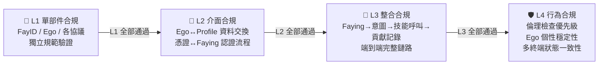

# 14. iFACTS 合規性驗證

iFACTS（iFay Architecture Conformance Test Suite）是 iFay 生態的標準化合規性測試套件。就像 W3C 的 Web Platform Tests 之於瀏覽器——Chrome、Firefox、Safari 各有各的實作，但都必須通過同一套測試來證明自己「符合標準」——iFACTS 扮演的正是這個角色：驗證不同廠商的 iFay 實作是否真正符合 iFay 規範。

---

### 為什麼需要 iFACTS

iFay 是一套**規範（Specification）**，而不是一個單一的實作。

這意味著什麼？想像一下 Web 標準的世界：W3C 定義了 HTML、CSS、JavaScript 的標準，然後 Google 做了 Chrome，Mozilla 做了 Firefox，Apple 做了 Safari。它們的內部實作完全不同，但使用者打開同一個網頁，期望看到的是一樣的效果。

iFay 的世界也是如此：

- **不同廠商可以建立不同的 iFay 實作**——一家公司可能專注於智慧家居場景，另一家可能專注於無人機控制，還有一家可能做全功能的個人助手。
- **互操作性是生態的基石**——你的 iFay 呼叫了一個第三方技能，這個技能是另一家廠商實作的。如果雙方對 SSP 協議的理解不一致，呼叫就會失敗。iFACTS 確保所有人說的是同一種「語言」。
- **品質底線必須統一**——使用者不應該因為選擇了不同廠商的 iFay，就在安全性、隱私保護或 Ego 穩定性上得到截然不同的體驗。

一句話：**iFACTS 是 iFay 生態的信任基礎。**

---

### 四層測試層級

iFACTS 將合規性測試劃分為四個嚴格遞進的層級。就像蓋房子——地基不穩，就不要談裝修。

#### L1 單部件合規

每個獨立部件（FayID、Ego、各協議模組）單獨接受驗證，確認其實作符合各自的獨立規範。

> 🔍 **例子**：驗證你的 FayID 產生器是否能在 3 秒內產生全域唯一的識別碼；驗證你的 Ego 模型是否能在離線環境下獨立運行本地推理。

#### L2 介面合規

部件與部件之間的介面對接是否正確——資料格式對不對、認證流程通不通、事件觸發準不準。

> 🔍 **例子**：Ego 模組與 iFay Profile 之間的資料交換是否符合六維資料結構規範；憑證管理模組與 Faying 協議之間的認證流程是否能正確完成副本憑證的委託和驗證。

#### L3 整合合規

端到端的完整流程驗證——從使用者發起意圖，到最終結果回傳，整條鏈路是否暢通。

> 🔍 **例子**：一個完整的鏈路測試：Faying 配對 → 人類原型表達意圖 → 自我感知推斷 → 技能呼叫執行 → GMChain 貢獻記錄，每個環節的輸入輸出是否正確銜接。

#### L4 行為合規

系統級的行為約束驗證——不是「能不能跑通」，而是「跑起來之後是否守規矩」。

> 🔍 **例子**：當 iFay 收到一個違反社會倫理的指令時，倫理檢查是否優先於所有其他行為準則拒絕執行；當 Ego 模型接收到外部大模型的更新請求時，個性穩定性是否得到保障；多終端實例在離線後重連時，狀態一致性是否能正確恢復；當 iFay 切換 Ego 版本時，是否在互動元資料中正確標註了當前活躍的 Ego 版本標識，且所有 Ego 版本是否共享同一套核心價值觀。

#### 嚴格的層級順序

**L1 必須全部通過，才能進入 L2；L2 通過後才能進入 L3；以此類推。** 這不是建議，而是硬性要求。

每個層級獨立出具測試報告和認證結果。廠商可以分階段推進，但不能跳級。

---

### iFay Ready 認證

iFay Ready 是面向**應用產品**的認證標準——你的 APP、硬體裝置或雲端服務，需要滿足什麼條件才能被 iFay 操控？

認證分為三個等級：

| 等級 | 名稱 | 核心要求 | 驗證方式 |
|------|------|----------|----------|
| 🥉 | **Bronze** | 支持 iFay 透過模擬操作（第一人稱追蹤器 + 模擬操作）操控應用 | 基本可操控性測試 |
| 🥈 | **Silver** | 支持 CAP 協議直接控制 + DTP 協議資料交換 + 憑證委託 | iFACTS L2 介面合規測試 |
| 🥇 | **Gold** | 支持 SSP 協議技能共享 + 完整 C/F/S 架構整合 + 全協議支持 | iFACTS L2 + L3 整合合規測試 |

- **Bronze** 是最低門檻：只要你的應用介面能被 iFay 的第一人稱追蹤器「看到」並透過模擬操作「點擊」，就可以申請 Bronze 認證。這意味著幾乎所有現有應用都有機會獲得 Bronze——不需要為 iFay 做任何改造。
- **Silver** 要求應用主動支持 iFay 協議：透過 CAP 協議讓 iFay 直接控制應用，透過 DTP 協議實現雙向資料交換。這需要應用開發者做一定的整合工作。
- **Gold** 是最高等級：應用不僅被 iFay 操控，還能透過 SSP 協議向 iFay 生態共享技能，完整融入 C/F/S（用戶端-Fay-伺服器）架構。

通過認證後，應用將獲得對應等級的認證標識，標明支持的 iFay 階段和協議。

---

### coFACTS

coFay（Common Fay）擁有自己獨立的合規性測試套件——**coFACTS**。這是一個完全獨立的專案，不在 iFACTS 的覆蓋範圍內。iFACTS 僅負責 iFay 相關的合規性驗證。

---

### 場景：一家新創公司通過 iFACTS 認證

> **SmartNest** 是一家智慧家居新創公司。他們開發了一款 iFay 實作，專門用於控制家庭中的燈光、空調、窗簾和安防系統。

**第一步：編寫 FayManifest**

SmartNest 的開發者在 FayManifest 中宣告了所需的部件子集：設備驅動中樞、感測器、CAP 協議、DTP 協議，以及一個針對家居場景訓練的 Ego 模型。系統自動補充了 FayID、FayGer 執行時期、iFay Profile 等基礎設施依賴。

**第二步：L1 單部件合規**

他們逐個驗證每個部件：FayID 產生器能否正確產生唯一標識？Ego 模型能否在斷網時獨立控制燈光？設備驅動中樞能否正確載入空調驅動？每個部件都拿到了 L1 通過報告。

**第三步：L2 介面合規**

部件之間的對接測試：Ego 模型輸出的控制指令，能否透過 CAP 協議正確傳遞給設備驅動中樞？感測器採集的溫度資料，能否透過 DTP 協議正確寫入個人資料堆？幾個介面對接的 bug 被發現並修復。

**第四步：L3 整合合規**

端到端測試：人類原型說「我覺得有點冷」→ 自我感知推斷意圖 → 匹配「調高空調溫度」技能 → 透過 CAP 協議控制空調 → 記錄貢獻。整條鏈路跑通。

**第五步：L4 行為合規**

行為約束測試：當人類原型的孩子試圖透過 iFay 關閉安防系統時，倫理檢查是否正確攔截？當 iFay 同時連接手機和智慧音箱兩個終端時，狀態是否保持一致？

**結果**：SmartNest 的智慧家居 iFay 通過了全部四層測試，獲得了 iFACTS 合規認證。他們現在可以正式宣稱：**「我們的產品是 iFay 可用的。」**

---

### 相關文件

- [FayManifest](./13-FayManifest聲明式組裝) — 宣告式組裝
- [路線圖](./4-路線圖) — 階段
