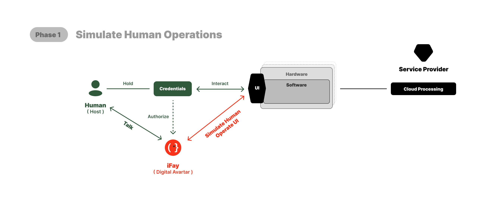

# 4. 路線圖：5 個階段

我們仍處於「人類操作時代」——硬軟體都依賴人類透過介面互動來驅動裝置和執行功能。

目前，人類、裝置和服務提供商之間的關係正如上圖所示。

 

---

## 1️⃣ 第一階段：模擬人類操作
在現有的軟硬體架構之上，我們讓 iFay 模擬人類的 UI 操作。

要實現這一點，我們至少需要做到 2 件事：
1. 憑證委託：人類使用者必須能夠透過可控且可稽核的委託機制，安全地授權 iFay 使用其[憑證](./2-定義與概念#通用概念澄清)（帳號、密碼、憑證、存取權限、合約等）。
2. 與 iFay 互動：主要透過對話介面。然而，需要精心設計——當任務涉及更高的互動複雜度或精度時，結構化介面可能比純聊天更高效。

 

基於以上思路，當我們發布 iFay v1.0 時，它將包含以下 5 個模組（即下圖中的橙色部分）：

### 1. FayID
這是 iFay 的唯一識別碼。實際上，iFay 和 [coFay](https://github.com/ChainModePilot/coFay/wiki) 都被分配統一的唯一 ID。

這樣做的目的是確保當個人 iFay 最終承擔有意義的社會角色時，身份能夠平滑過渡——就像一些個人 YouTuber 演變為在公共話語和公民教育中扮演重要角色一樣。

這裡我們解決兩個核心問題：
- _**FayID 生成與管理**_：Fay 將呈指數級增長，最終超過人類使用者數量。這需要一個可擴展的、使用者友善的、易於識別的 ID 生成和管理機制。
- _**啟動狀態**_：為確保 iFay 永遠不會在人類原型不知情或無意圖的情況下運行，我們定義了嚴格的啟動規則。任何 iFay 都不應在沒有明確意圖的情況下自主行動。這由開源的 [Faying 協議](https://github.com/ChainModePilot/Faying-Protocol/wiki)管理，該協議規定了自然人與 iFay 如何安全配對，以及在什麼條件下 iFay 被授權以啟動狀態運行。

### 2. 憑證管理
這裡的「憑證」是一個廣義概念。對於自然人使用者來說，大多數時候，使用者必須持有一個或多個票據才有權使用硬軟體。以下 7 種類型統稱為憑證（隨著迭代可能會添加更多類型）：
- 身份標識（FayID）
- 帳號 / 密碼
- 憑證
- 授權
- 存取權杖
- 智慧合約
- 數位代幣（[MeriTokens](https://github.com/ChainModePilot/Global-Merit-Chain/wiki)）

注意：最初，所有這些票據都來自人類原型使用者。為了更高的安全性和更便捷的管理，人類原型的所有憑證都將被交換為與原始憑證對應的副本。iFay 使用此副本進行登入和認證。

當然，我們並不認為 iFay 不能擁有自己的憑證而人類原型不能使用它們。因此，每種憑證都會標明其原始擁有者是人類原型還是 iFay 本身。

例如：當我們需要驗證某人提供的個人資訊的真實性時，我們可能會授權 iFay 直接登入資料庫進行查詢。為了防止私有資料洩露，iFay 只需要回饋是真還是假。

### 3. 第一人稱追蹤器
要讓 iFay 直接與現有軟體協作——而不是等待每個應用都為 AI 重新設計——iFay 必須至少具備視覺和聽覺能力。

我們強調視覺優先於解析結構化文件（如 HTML），因為許多文件元素對人類來說是不可感知的。隱藏元素，如 SEO 關鍵字堆砌，通常不會為使用者體驗增加真正的價值。

透過將其感官感知與人類原型對齊，iFay 可以做出與人類意圖密切匹配的判斷和決策。

關鍵挑戰在於為 iFay 實現手眼協調。視覺和聽覺感知必須超越被動處理軟體回饋——iFay 還需要追蹤其自身操作引起的變化。

例如，它必須追蹤游標移動、偵測視窗移動後新暴露的區域，並適應動態介面變化。這需要第一人稱視角追蹤與模擬互動緊密耦合，確保 iFay 像人類操作者一樣感知和回應環境。

### 4. 模擬操作
這裡我們特指模擬人類與 UI 的互動。iFay 不僅僅是點擊——它可能拖曳、捲動、執行邊緣手勢或多指手勢，取決於介面元件。

核心挑戰在於為每個介面客製化操作序列是不可行的。相反，iFay 的模擬互動也必須模擬人類對介面的探索，使用第一人稱視角追蹤的回饋來判斷哪些操作是可行或有效的。這種方法與傳統 RPA 實作有根本區別，後者依賴預定義腳本而非自適應的、感知驅動的探索。

### 5. Ego 模型
我們稱之為 **[Ego](https://github.com/ChainModePilot/Ego/wiki)**，強調它不是一個大型 AGI 模型。Ego 與特定個人或角色的畫像對齊。

許多追求 AGI 的超大型模型面臨一個關鍵限制：無論其知識和技能多麼廣泛，都無法完全滿足每個人或場景的獨特偏好和上下文。

Ego 提供了一個基線範式，約束（但不限於）以下維度：
- 價值取向
- 興趣偏好
- 習慣
- 認知邊界
- 技能邊界
- 權限邊界
- 工作風格

需要注意的是，嵌入 Ego 模型並不阻止 iFay 利用外部技能或其他大型模型。內部包含微型模型的決定基於兩個考量：
1. _**離線裝置控制**_：在終端裝置未連線網際網路的場景中，嵌入的微型模型支援本機近場裝置控制。
2. _**個性穩定性**_：防止因大型模型更新或蓄意篡改導致 iFay 個性突變，確保 Ego 保持一致。

 

---

## 2️⃣ 第二階段：直接接管用戶端
雖然 AI 模擬 UI 操作提高了效率，但視覺介面仍然存在侷限：

- 😖 _**資訊損失**_：有限的視圖和靜態元素阻礙了有效溝通。
- 😤 _**學習成本高**_：不同提供商的介面不一致，迫使使用者學習多種互動模式。
- 😣 _**介面僵化**_：一旦硬軟體設計了 UI，它在當前版本中就是固定的。使用者在使用不同裝置或應用時必須重新學習介面。
- 😰 _**資訊傳遞效率低**_：意圖必須先轉化為視覺介面，然後透過使用者操作回饋給機器。
- 🙄 _**開發成本高**_：建構功能性 UI 需要跨學科（如產品經理、UI/UE、前端研發）協調。

相比之下，如果終端裝置支援用戶端協議（如上圖所示），iFay 可以直接控制硬軟體。這種方法解決了上述所有五個問題：
- _**無限輸出**_：資訊不再受 UI 顯示限制的約束。
- _**基於意圖的互動**_：使用者表達意圖，iFay 將其轉化為 API 呼叫或命令。
- _**豐富資料，簡潔交付**_：終端可以輸出豐富的結構化資料，iFay 過濾和摘要為清晰的精要資訊。
- _**直接傳輸**_：無需視覺渲染，實現更高效的資料流。
- _**無需前端**_：UI 設計和開發可以最小化甚至消除。

我在這裡設定了兩個適用於終端的協議：
- [控制權限協議（CAP）](https://github.com/ChainModePilot/Control-Authority-Protocol/wiki)：用於接管終端的硬體和特定軟體，直接呼叫驅動程式、本機介面和命令，目的是使 iFay 能夠控制終端。
- [資料隧道協議（DTP）](https://github.com/ChainModePilot/Data-Tunnel-Protocol/wiki)：這是一個雙向傳輸協議：
  - _**終端 → iFay**_：持久化使用者資料儲存和資料監護。
  - _**iFay → 終端**_：資料豐富化和個性化處理。

在下圖中，藍色部分對應這兩個協議，分別針對裝置功能和資料。

與[第一階段](./4-路線圖#1️⃣-第一階段模擬人類操作)相比，iFay 新增了五個內部模組，首先是：

 

### 感知 → 感測器
感測器必須在控制權限協議和資料隧道協議之上實作。它作為終端裝置感測器的橋樑，接收來自外部環境的資料流——這就是我們稱之為 iFay 神經系統的原因。

關鍵的是，iFay 不需要始終處理所有傳入資料。感測器可以動態調節其靈敏度，以更好地匹配周圍上下文。

可以把感測器看作靈敏度調節器。與外部世界的實際介面由設備驅動中樞和個人資料堆管理。

 

### 技能 → 設備驅動中樞
需要澄清的是，這不是單個設備驅動程式，也不是驅動程式的集合。

它作為驅動中樞層運行，確保在新設備驅動不斷整合時，iFay 的內部架構保持穩定，無需隨每次更新而修改。

 

### 技能 → 註冊技能
註冊是任何 iFay 動作（Action）的前提條件。

當技能被註冊到 iFay 時，意味著 iFay 可以隨時呼叫它。註冊不僅僅是簡單的記錄——它通常作為預授權步驟，確保執行時無需額外認證，從而減少延遲。

另一個關鍵好處是離線彈性：當 iFay 離線時，它可以快取待執行的動作，並在連線恢復後非同步執行。

 

### 思維 → 個人資料堆
該元件負責以統一方式管理 iFay 的所有私有資料。它支援多種儲存格式和位置——例如，部分資料可能駐留在 iFay 的執行時期記憶體中，部分在 Google Drive 中，部分在專用向量資料庫中。

從 iFay 內部視角來看，它只需要對資料堆進行讀寫，無需關心資料的實體儲存位置和方式。

 

### 動作 → 技能調用
這是 iFay 的主要動作——本質上，你可以把它看作一種呼叫行為。

 

---

## 3️⃣ 第三階段：iFay 作為虛擬世界的介面

隨著 iFay 的接管，用戶端-伺服器（C/S）架構演變為用戶端-Fay-伺服器（C/F/S）模型。
使用者不再需要手動操作用戶端來存取後端服務——相反，iFay 可以直接擷取和利用網際網路上的開放服務。

為了實現這一目標，之前僅對用戶端開放的服務和介面應透過標準化遠端協議向全網開放。

這個遠端協議正是下圖所示的[技能共享協議](https://github.com/ChainModePilot/Skill-Sharing-Protocol/wiki)。

如圖所示，iFay 控制了用戶端（邊緣裝置）和伺服端（或雲端服務）兩側。

人類原型只需要與自己的 iFay 通訊，iFay 然後根據人類原型的意圖呼叫所需的服務。

由於人類原型查看資訊的介面由 iFay 組合和渲染，它實際上扮演了瀏覽器的角色。

由於引入 iFay 的核心動機是使其成為超越人類原型的智慧延伸，其增強能力透過註冊技能實現。
在思維領域，我們引入以下模組：

 

### 思維 → 外部知識

從實作角度來看，我們將外部知識庫和模型視為一種技能類型，使 iFay 能夠像諮詢知識中樞或專家顧問一樣存取外部智慧。
透過此技能獲取的知識和資訊與 iFay 的個人資料一起管理，最終實現超越人類原型自身能力的智慧。

 

---

## 4️⃣ 第四階段：iFay + coFay - 軟體的全面擬人化

在這個階段，Fay 的具象化基本完成。
然而，它們仍然缺乏像真正的社會成員一樣自主行動的能力。
要使 iFay 能夠獨立有效地運行，必須滿足 2 個關鍵條件：
- 內部：iFay 必須發展自驅動力——持續的「動作→回饋→再動作」循環。
- 外部：iFay 和 coFay 必須被廣泛採用，並能夠使用共同語言進行通訊。
有了這個基礎，iFay 可以與人類、其他 iFay 或其專屬 coFay 協作，自主執行預定義的任務。

為此，我們需要在四個核心模組——感知、動作、技能和思維——中嵌入自驅能力。

 

### 感知 → 自我感知
一個真正的生命體不僅僅是感知——它還有感受。
與機器不同，iFay 本身不能擁有真正的情感。但透過觀察其人類原型和周圍上下文，它可以從感知中推斷感受。
這是建構 iFay 自我感知的核心策略。

 

### 動作 → 自驅行為
由於 iFay 需要自主處理任務，它必須擁有自己的行為觸發機制。
這些觸發可以來源於：
- 排程任務
- 自我感知推斷
- 持久技能，包括註冊技能和內部技能。

 

### 技能 → 內部技能
我們引入內部技能模組有三個主要目的：
- 建立與人類原型個性對齊的習慣，包括對外部技能的潛在限制或治理。
- 提供內省機制，確保外部知識永遠不與人類原型意圖衝突。
- 嵌入固定的人類原型特定能力，如專業技能和專業知識。

 

### 思維 → 對齊意識
本質上，這代表了人類原型個人畫像的完整描述。
它可以透過三種主要方式建立（可能還有更多）：
- 從個人資料堆探勘資料。
- 透過自我感知即時調整。
- 人類原型手動定義。

 

然而，僅此還不足以讓 iFay 融入社會關係。
為此，我們需要為 iFay 配備通訊能力，涉及兩個核心協議：
- [心靈感應協議](https://github.com/ChainModePilot/Telepathy-Protocol/wiki) — 一種 Fay 友善的語意通訊協議，去除 UI 翻譯層，允許意義和意圖在 iFay 和 coFay 之間直接傳輸。它使用約定的向量編碼權杖替代結構化文字。
- [互動對話協議](https://github.com/ChainModePilot/Interactive-Conversation-Protocol/wiki) — 一種人類 UI 友善的協議，將語意內容模組化和多模態化，使用戶端介面能夠重構易讀的使用者友善訊息展示。

 

---

## 5️⃣ 第五階段：Fay 重塑勞動結構與價值分配模型

最終，我們的目標是建構一個具有強社會屬性的生態系統，而不是將 AI 視為更高級的工具。
這種新型社會形態將不可避免地與我們今天所知的人類社會不同。
我們可以預見至少 5 個根本性轉變：
1. _**人類勞動退出**_ — 程式化工作將完全由 AI 和機器人接管，推動人力資源成本趨近於零。
2. _**知識扁平化**_ — 專業知識和專長將被 AI 均等化，使供應鏈變得極度扁平。
3. _**普遍生存保障**_ — 每個人都將獲得基本生活資源，消除為生存而工作的需要。
4. _**新價值創造**_ — 人類參與將集中在意義創造、以人為本的工藝和 AI + 機器人生產生態系統。
5. _**新社會分層**_ — 自主生產資源的所有權將成為財富和階層分化的新驅動力。

這將從根本上重塑建立在物質資源（即生產資料）所有權基礎上的經濟生態系統。
從經濟角度來看，將出現 2 個重大轉變：
- _**人類在實體經濟中的參與最小化**_ — 極少數人將直接參與傳統生產活動。
- _**人類勞動單位價值急劇增加**_ — 除非人類工作被高度重視，否則人類將完全退出體力勞動。

當大多數人沉浸在虛擬工作中時，傳統的價值衡量標準——如工作時間、貨幣收入或商品實物數量——變得不夠充分。
因此，衡量社會價值需要一種共識機制，類似於拍賣如何確定藝術品或股票的價值。拍賣只是建立共識的一種方式。

為了維持這種共識，需要一個專用平台。目前，區塊鏈是一個合適的選擇，擁有多年的累積經驗。

我們以統一單位（μ，Merit Unit）量化社會貢獻，並在區塊鏈上發行相應的數位代幣（MeriToken），形成我們所稱的[全球貢獻鏈](https://github.com/ChainModePilot/Global-Merit-Chain)。

未來，獲取 MeriToken 的方式將不依賴於消耗算力來完成區塊鏈的技術工作，而是基於創造社會價值。

